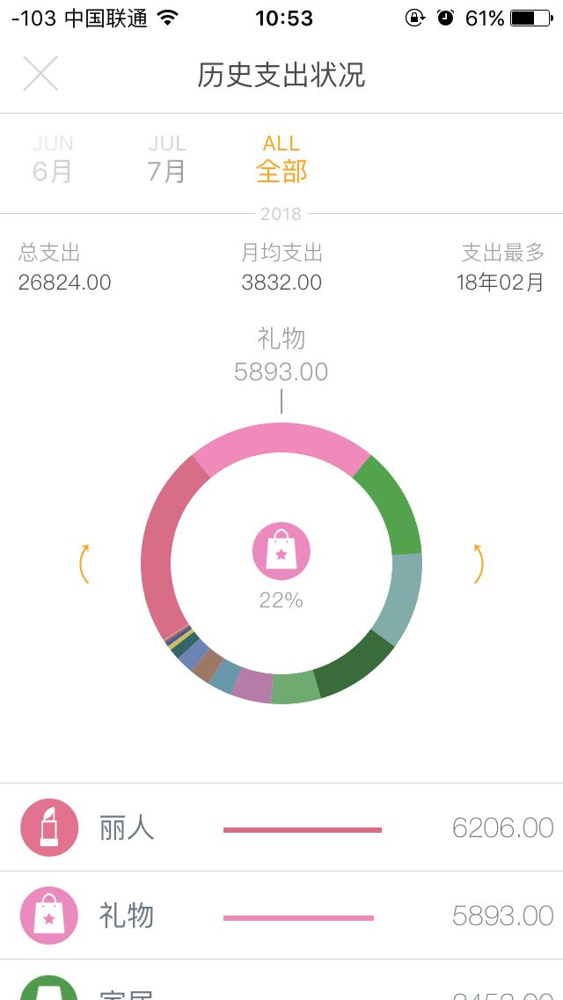

数据展现——>数据抽取——>数据存储——>数据清洗——>数据来源

pycharm——>sql语句——>数据库连接操作——>java类型判断转化——>[连接execl文件，读取内容]()

| 现状                                                         | 期待结果                                         | 差距、技术如何实现                |
| ------------------------------------------------------------ | ------------------------------------------------ | --------------------------------- |
| 数据记在execl表格里，每周为一张sheet，到了新的一周就得复制改名 | 直接生成一年的所有的周的sheet                    | 使用java生成一年所有所有周的sheet |
| 日期的写法为有小数点的数字，在4月10日，写成4.10后表格会直接判定为4.1，必须自己强制转换文件格式为文本才不会变化（不能强制小数点为两位，因为有4月3号这样的个位数日期） | 直接自动生成所有日期，格式统一为180712           | 同上                              |
| 数据的统计维度单一，就是求和后算出百分比，并且一次只统计一周的数据，想统计一个月的，就得把一个月的时间记录多次复制出来后汇总 | 直接使用程序语言来决定调哪个维度与哪段时间的数据 | 数据模型的确认与结果的对应核查    |

| 关于最终效果的想法                                 | 如何实现、工具、软件      |
| -------------------------------------------------- | ------------------------- |
| 展现使用图表，每周维度、每月唯独、不同行为之间维度 | pycharm                   |
| 数据结构用两种思维，一个是数据库，一个是数据标签   | mysql、另一种数据库？待定 |
|                                                    |                           |

| 序号 | 日期   | 特殊日子、生日 | 行为 | 时长  | 6：00起 | 23：30睡 | 坏习惯 | 颜色 | 星期 |
| ---- | ------ | -------------- | ---- | ----- | ------- | -------- | ------ | ---- | ---- |
| 1    | 180714 | 否             | 睡觉 | 6h    | 是      | 是       | 否     | 粉色 | 六   |
| 2    | 180714 |                | 运动 | 1h    |         |          |        |      |      |
| 3    | 180714 |                | 阅读 |       |         |          |        |      |      |
| 4    | 180714 |                | 工作 |       |         |          |        |      |      |
| 5    | 180714 |                | 写作 |       |         |          |        |      |      |
| 6    | 180714 |                | 其他 |       |         |          |        |      |      |
| 7    | 180713 |                | 睡觉 | 7h    |         |          |        |      |      |
| 8    | 180713 |                | 运动 | 50min |         |          |        |      |      |
| 9    | 180713 |                | 阅读 | 2h    |         |          |        |      |      |

### 初步分析数据

按一个数据库来存储是不合理的，比如有些是一天只会有一个字段，而行为却会有多个字段

改进如下：

#### 表1

| 序号 | 日期       | 星期       | 睡觉时长     | 阅读时长 | 运动时长 | 写作时长 | 工作时长 | 剩余时长 | 以前分类（娱乐、洗漱、单人休闲、多人休闲） |
| ---- | ---------- | ---------- | ------------ | -------- | -------- | -------- | -------- | -------- | ------------------------------------------ |
| 1    | 180713     | 五         | 7h           | 2h       | 50min    | 1h       | 6h       | ,,,      |                                            |
|      | 当年多少天 | 当年第几周 | 该周的第几天 | 心情颜色 | 坏习惯   | 成就     | 失误     | 教训     | 扩展1                                      |
|      |            |            |              |          |          |          |          |          |                                            |

这个表的字段可以继续列下去，一天就为一行数据。这样来设计数据库表是否可行？想想timi记账是怎么做的。

### 竞品分析-timi记账软件

1. 金额录入，类别可自定义，时间可选当天和以前，可写备注
2. 录入完后界面为当月明细支出，向下滑动可看每日明细
3. 所有类别都包含的按月、全年，还会有一个扇形图，表明每种类别的花费占多少
   1. 按月有：月支出、日均支出、对比上月增加还是减少具体多少金额
   2. 全年有：总支出、月支出、支出最多月份
4. 单独某个分类：
   1. 按月有：最大一笔、日均支出、对比上月，当月总数在下方
   2. 按年有：最大一笔、月均支出、支出最多月份，当年总数在下方

timi中我所缺少的功能：为了合理分配花销与计划支出要知道哪些信息？

1. 多个月的总数折线图或是柱状图的展示比较
2. 每个类别在每个月的支出柱状图或是折线图展示比较
3. 高支出日期汇总分析
4. 某类别大金额消费时间分析
5. ，买同类东西的规律，便于制定长期消费计划
6. 列出冲动大额消费，反思是否真的需要购买

#### timi数据库表构建猜想

| 序号 | 日期     | 类别1 | 类别1备注  | 类别1金额 | 类别2 | 类别2备注类别3 | 类别2金额 |
| ---- | -------- | ----- | ---------- | --------- | ----- | -------------- | --------- |
| 1    | 20180713 | 学习  | 亚马逊充值 | 50        | 用餐  | 外卖           | 24        |

所有类别都列在上面，默认金额为0。当某类别产生消费，则将0改为具体金额，备注可以为空。

类别单独存一张表，与金额记录表相关联。

#### 疑问

当把某类别删除时会发生什么？测试一下，先新建一个类别，然后在近两天里去记录支出，再把这个类别删掉/取消勾选，看看会发生什么。

结果：这笔消费仍然记录在案，只是再记录时，不会有这个类别可选择。删除是没有了这个选项，取消勾选是暂时没选让这个类别出场。

结论：类别分为自定义和固有的，固有的无法修改和删除，自定义的建完后也不能修改名称，只可以删除或者不显示。某个类别一但有了金额记录，即使删除这个类别，对于统计也是没有影响的。

#### 对于我的时间统计程序参考价值

所有的行为当作类别，可以扩展，不能修改名称。时长对应金额，是否对应0、1，心情颜色对应-1、0、1，时长存数字，用switch来定义每个数字代表了什么意思。

时长统一为分钟。

默认为做到了，未做到的特殊标记。比如早起，默认1是做到了；坏习惯，0是没有做。

#### 网络上数据库设计相关信息

> //规则1:表必须要有主键。
> //规则2:一个字段只表示一个含义。
> //规则3:总是包含两个日期字段:gmt_create(创建日期),gmt_modified(修改日期)，且这两个字段不应该包含有额外的业务逻辑。
> //规则4:MySQL中，gmt_create、gmt_modified使用DATETIME类型。
> //规则5:禁止使用复杂数据类型（数组，自定义类型等）。
> //规则6: MySQL中，附属表拆分后，附属表id与主表id保持一致。不允许在附属表新增主键字段。
> //规则7: MySQL中，存在过期概念的表，在其设计之初就必须有过期机制，且有明确的过期时间。过期数据必须迁移至历史表中。
> //规则8: MySQL中，不再使用的表，必须通知DBA予以更名归档。
> //规则9: MySQL中，线上表中若有不再使用的字段，为保证数据完整，禁止删除。
> //规则10: MySQL中，禁止使用OCI驱动，全部使用THI驱动。

### 在选择数据进行展示时：可以有以下维度：平均、总和、特殊个例、对比

1. 1月1日☞1月30日，各类别所用时间总和、平均折线图，一条线为一个类别
2. 1月1日☞7月31日，每天的阅读时间折线图，每个周、每个月的阅读总量
3. 1月1日☞7月31日，每周平均睡眠时间折线图
4. 1月1日☞7月31日，周六日仍在工作的天数
5. 1月1日☞7月31日，写作时长超过1小时的天数

到这里为止，已经有了最终的结果模型，倒推如何来做：

数据展现——>数据抽取——>数据存储——>数据清洗——>数据来源

pycharm——>sql语句——>数据库连接操作——>java类型判断转化——>连接execl文件，读取内容