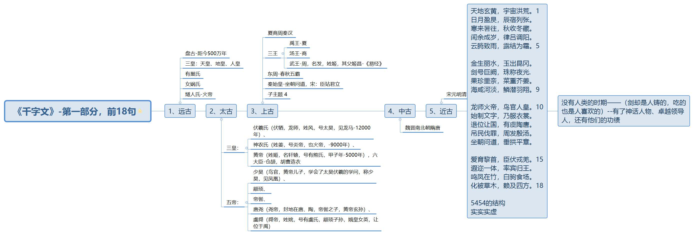

《千字文》由周兴嗣将一千个常用汉字次韵后重组而成。每小句4个字，一句8个字。总共125句。

> 千字文，由南北朝时期梁朝散骑侍郎、给事中[周兴嗣](https://baike.baidu.com/item/%E5%91%A8%E5%85%B4%E5%97%A3/4042636)编纂、一千个汉字组成的韵文（在隋唐之前，不押韵、不[对仗](https://baike.baidu.com/item/%E5%AF%B9%E4%BB%97/636601)的文字，被称为“笔”，而非“文”）。[梁武帝](https://baike.baidu.com/item/%E6%A2%81%E6%AD%A6%E5%B8%9D/872030)（502—549年）命人从[王羲之书法](https://baike.baidu.com/item/%E7%8E%8B%E7%BE%B2%E4%B9%8B%E4%B9%A6%E6%B3%95/3281341)作品中选取1000个不重复汉字，命员外散骑侍郎周兴嗣编纂成文。全文为四字句，对仗工整，条理清晰，[文采斐然](https://baike.baidu.com/item/%E6%96%87%E9%87%87%E6%96%90%E7%84%B6/855617)。《千字文》语句平白如话，易诵易记，并译有英文版、法文版、拉丁文版、意大利文版，是中国影响很大的儿童启蒙读物。

看完了它的注解，里面包含的知识和道理特别丰富，零碎的几句也能记忆，不过全文背诵一直做不到。**记忆的规则就是找关联、规律，通过一条线将事物串联起来，沿着这条线就能记起所有，而不是死记硬背。**

我的背诵过程也是循序渐进，每天多背三四句的同时巩固之前背下来的。并且根据内容的关联和转折来把句分为段，把段分为部分。

# 第一部分：18句

5454：表示头5句为一个主题，再4句一个主题，如此类推。

# 第二部分：33句

3333 332 3523

# 第三部分：30句

555 5735

# 第四部分：44句

3466 446 4232

