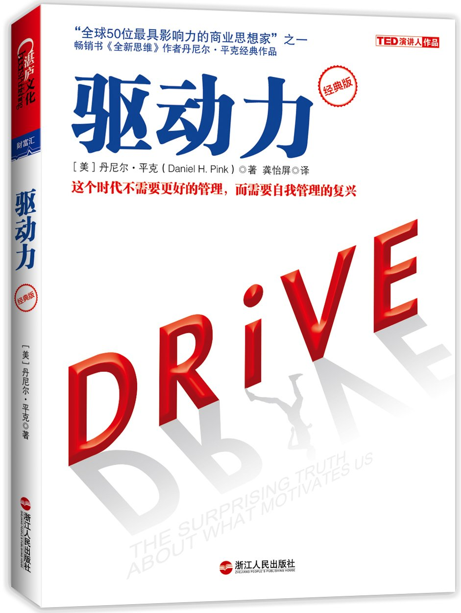

**书名：**《驱动力：在奖励与惩罚已全然失效的当下，如何焕发人的热情 》

**作者：**丹尼尔·平克，Daniel H. Pink，美国人。

驱动，可以理解为**动机**，究竟是什么在督促着我们每天工作、生活、言行举止、与人交往，我们做事的原因和理由是什么，我们又想得到什么。

这本书作者主要讨论了三种驱动方式：

>1. 生物本能驱动：饿了要去找吃的，渴了要找水喝，缺乏安全感要找同伴，基因繁殖的本能会去追求异性等。
>2. 奖励和惩罚驱动：就是外在动机，做出特定行为时环境会带来的奖励或惩罚。例如胡萝卜加大棒政策，做好了给奖赏，没做好给惩罚。
>3. 内在驱动：也就是因一件事很有趣、很具有挑战性、很令人着迷而去做的驱动力，对于高层次的创造力至关重要。完成一件事本身的愉悦感，例如心流体验，参与有宏大愿景、超脱个人成败得失的事业。

其中**内在驱动**是作者主要谈论的观点，分别从***为什么内在驱动是有效的、怎么利用内在驱动来激励自己和他人，以及奖励和惩罚这种最司空见惯的驱动力为什么会被逐渐淘汰***来做了介绍。先放一些摘抄，再谈谈自己的想法。

`摘抄是我2月份看这本书时在kindle上做的标记，通过clippings.io直接导出到印象笔记，然后复制过来的。我按照内容分了类，顺序并非和书里一样。`

# **部分摘抄：**

1. ## 为什么外在动机并非最好的驱动力：

> - 金钱奖励和金光闪闪的奖品一开始会带来强烈的愉悦感，但这种感觉很快会烟消云散。为了保持这种感觉，剂量必须越来越大，用药必须越来越频繁。大多数会让人上瘾的药物的机理是向伏隔核发射一连串多巴胺。开始服药时会感觉很快乐，随后这种感觉消散，之后就会需要另一剂药。
>
> - 究其本质，就是要对抗短视思维。委托人提供奖励，也就是向代理人暗示这个任务很让人不悦。
>
> - 管理不是解决办法，而是问题本身。这个时代不需要更好的管理，它需要自我管理的复兴。
>
> - 经济学家们终于意识到，我们是成熟的人类，而非一根弦的经济机器人.
>
> - 那些主要动机是金钱、名誉和美貌等这些外在因素的群体，心理健康状态较差。
>
> - 有条件的奖励——如果你做这个，那我就给你那个，会产生负面效果。为什么呢？因为这种“如果-那么”型的奖励要求人们放弃他们一部分自主权。那么短期内他会更勤奋，但是从长期来看他会失去兴趣。
>
> - 公正地给他们足够的报酬至关重要，因为这样他们就不再考虑金钱问题，而把注意力集中到工作本身。
>
> - 如果一个人感觉不到自己属于更伟大更长久的事物，他就无法过上真正出色的生活。
>
> - 成就高的人反而焦虑和抑郁，原因之一是他们没有良好的人际关系。他们忙于赚钱，到处应酬，这意味着他们的生活中留给爱、关心、照顾、同情这些真正重要的东西的空间变少了。
>
> - 工作让人崩溃的原因之一是人们必须做的事情和他们能够做的事情之间不匹配。如果他们必须做的事情超过了他们的能力范围，结果就会是焦虑。如果他们必须做的事情达不到他们的能力范围，结果就会是厌倦。
>
>   

2. ## 为什么内在动机是可行的：

> - 自主、专精和目的是超越国家和语言界限的概念。
> - 人类有“发现新奇事物、进行挑战、拓展并施展才能以及探索和学习的内在倾向”。但是，第三种驱动力比另外两种更脆弱，它只有在合适的环境下才能存在。
> - 如果我们天性中有什么东西是基础性的，那这个东西就是感兴趣的能力。人类有自主、独立、寻求归属感的内在动机。如果这个动机被释放出来，人们就能取得更多成就，就能生活得更加充实。
> - 当奖励就是活动本身的时候，比如深度学习、取悦客户、尽力做到最好，捷径就不存在了，达到目标的唯一方法就是走正道。
> - 我们天生就是玩家，而不是小兵；我们天生就是自主的个体，而不是机器人。
> - 自主动机能够促进思维，提高理解力，提升成绩，让人们在学习和运动时耐力增强，提高生产力，减少能量消耗，改善心理健康状况。
> - 研究已经证明，能感觉到的掌控感是一个人快乐的重要组成部分。

3. ## 如何用内在动机激励自己和他人：

> - 刻意练习是指：“为了改善在某个特定领域的成绩而进行的长达一生的努力。”
>
> - 确定自己是不是已经精通了某件事的最好方法就是，把它教给别人。
>
> - 人们在工作中更容易达到心流状态。工作通常具备自成目标体验结构：清晰的目标、即时的反馈以及与能力相匹配的挑战。
>
> - 你应该通过帮助他们看到大局改变这一局面。无论他们学的是什么，都要确保他们能回答这些问题：我为什么学这个？这和我现在所居住的世界有什么关系？然后再让他们走出教室，运用所学的知识。
>
> - 人们必须在以下4件事上能够自主：工作内容、工作时间、工作方法和工作团队。
>
> - 表扬他们的努力和采用的方法，而不是天分。
>
> - 接下来让我告诉你该怎么做：先弄清你的目标，其中大多数应该是学习目标，但也要有几个表现目标；然后，每个月把自己叫到自己的办公室，给自己一个评价。你的工作进展得如何？还有哪些不足？需要哪些工具、信息或者支持以便做得更好？
>
>   

# 我的读后感：

作者的观点非常明确，随着个人意志的苏醒和对自由的更多理解和渴望，传统的激励方法已经不足以作为动机了。仅仅为了钱、名誉、地位这些外在动机的欲望，正在逐步降低我们的幸福感。作者在书中描绘出了一副很理想的动机图景：

> 我们做一件事，是因为做这件事本身就让我们感到满足和幸福，而不是为了其他的原因而强迫自己去做。我们的天性中是有对万事万物感兴趣的能力的，所需要做的只是把这些激发出来而已。

这是一种很理想的状态，可就像作者自己提到的，*公正地给他们足够的报酬至关重要，因为这样他们就不再考虑金钱问题，而把注意力集中到工作本身*，虽然作者号召不要以外在动机来决定自己做什么与不做什么，可是一些基本的前提条件还是得先满足。

看完书后的思考：

1. 这是国外作者的思想，那国内的情况是什么样？
2. 古代对于动机又有什么样的看法，一些经典的著作中是否有提到过？
3. 作者在书里谈到外在动机时，提到它有不好的影响，也有好的影响，但是不好的地方居多，那有没有什么思想是认为外在动机好的影响更多呢？
4. 或者有没有哪种思想认为内在动机并没有那么有效果？
5. 看完书了解内在动机它的正面意义和作用，对自己的生活、工作、学习有什么帮助？
6. 书里提到的外在动机的负面影响，自己要怎么去进行规避？

先写到这里，这些疑问我会在自己的博客里逐步更新。

其实这些思考在看完每一本书时都应该问问自己，以**批判的观点和自我为中心**来阅读，而不要作者说什么就是什么，对书里的内容全盘接受或者嗤之以鼻。看完了多少书不是目的，而是看完后这本书对自己有什么作用。更够撼动自己原有观念的书是最好的书，因为它能够让你看到那些自以为正确的想法并不那么绝对正确，只有这样才能永葆思维的活力和弹性，而不是死守着固有的观点永不改变。

