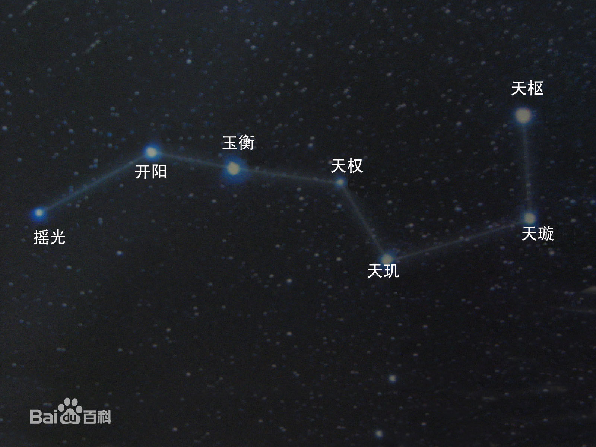

仰望星空时，美丽的星星，你们叫什么名字？夏夜将至，如果晚上想去看星星，可以先来找北极星和北斗七星，可它们的名字都是什么呢？大熊星座和小熊星座要怎么看呢？我把一些网络上的科普知识总结了一下，做成最简单的**识星攻略**。

关于北斗七星百度里是这么介绍的：

> 北斗七星是由[天枢](https://baike.baidu.com/item/%E5%A4%A9%E6%9E%A2/74749)、[天璇](https://baike.baidu.com/item/%E5%A4%A9%E7%92%87/6662488)、[天玑](https://baike.baidu.com/item/%E5%A4%A9%E7%8E%91/74750)、[天权](https://baike.baidu.com/item/%E5%A4%A9%E6%9D%83/5233911)、[玉衡](https://baike.baidu.com/item/%E7%8E%89%E8%A1%A1/75319)、[开阳](https://baike.baidu.com/item/%E5%BC%80%E9%98%B3/74748)、[瑶光](https://baike.baidu.com/item/%E7%91%B6%E5%85%89/9655135)七星组成的。古代中国人民把这七星联系起来想象成为古代舀酒的斗形。
>
> 从“天璇”通过“天枢”向外延伸一条直线，大约延长5倍多些，就可见到一颗和北斗七星差不多亮的星星,这就是北极星。

名字先认识一下：

1. 天枢是第一颗，也就是它正对着北极星，亮度也很高。想要记住它的名字，想想***枢密院***作为统领全局的机构，天枢也是如此。

2. 后面两颗构成勺底的星，名字合起来叫做***璇玑***，也就是天璇和天玑，诗词里一般用璇玑来代表整个北斗七星。

3. 再后面两颗是***权衡***，也就是天权和玉衡，其中天权是七颗星里亮度最低的。

4. 倒数第二颗叫做开阳，与贵阳市的开阳县同名。

5. 最后一颗叫做摇光，名字很好听。总让我想到《春江花月夜》的最后一句，*不知乘月几人归，落月摇情满江树*。同一个***摇***字，用得很传神。摇光还有一个名字叫*招摇*，就是招摇过市的那两个字。

   > 《礼记·曲礼上》中有这样的规定：“行，前朱雀而后玄武，左青龙而右白虎，招摇在上。”这里指的是军队出征时的仪仗。招摇旗居中而又高高在上，可以想象在这面旗帜的指引之下，千军万马浩浩荡荡开赴前线的盛况。
   >
   > 因此“招摇”被附会为破军星，又引申出张扬的意思，“招摇过市”自然就成了一种恢弘气势的象征。在漫长的语言演变中，“招摇”和“招摇过市”渐渐变成了一个贬义词，“招摇”的本义也就彻底被人们忘记了。

北斗七星属于大熊星座，它们是大熊的尾巴和后腰，**摇光**是尾巴尖，**天枢**是中腰，最暗的**天权**是尾巴和身体的连接点。如下图所示：

北斗七星所指的**北极星**属于小熊星座，这两个星座都是熊属，哪里相同呢？原来小熊星座也是七颗星组成了一个勺子的形状，被称为`小北斗`。北极星就是小熊尾巴尖上的那一颗。

现在把大熊倒过来，看小熊座。就能看到两把组成尾巴和后腰的勺子了。一把是北斗七星，一把直接构成小熊星座。

这样我们就知道了两只熊和8颗星的名字，你记住了吗？距我上次看到星星还是很久以前，希望下次看到星空的时候，可以找到这8颗星星。