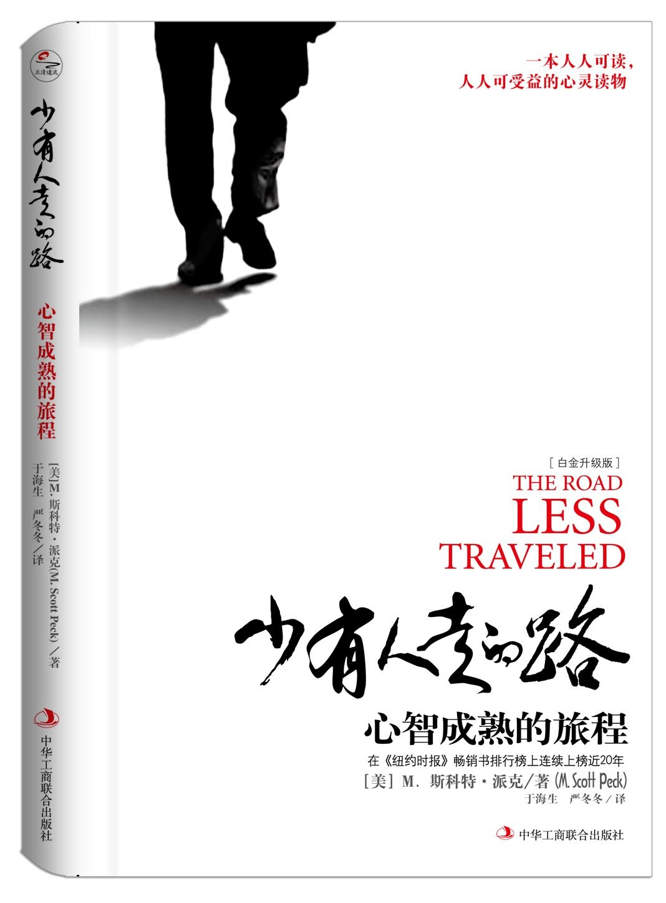
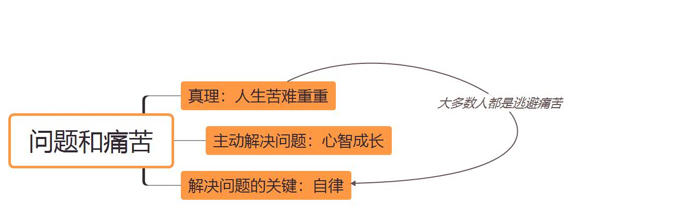

**书名：**《少有人走的路：心智成熟的旅程 》。这本书的英文原名是《The Road Less Traveled: *A New Psychology of Love, Traditional Values and Spiritual  Growth*》,副标题按照词语直接翻译过来是——*有关爱、传统价值观和心灵成长的新心理学*。

**作者：**M.斯科特•派克，M.Scott Peck，美国人。亚马逊网站对他的介绍：

> M.斯科特•派克毕业于哈佛大学，获得硕士和博士学位。他长期从事心理治疗实践，取得了卓著成绩，被誉为“我们这个时代杰出的心理医生”。 由于其巨大的影响力，他获得政府特许，进入政府心理治疗特殊小组，为越战士兵提供治疗。他还曾接受派遣，在美军驻日本冲绳基地担任心理医生。这些特殊的职业经历，成就了他伟大的著作《少有人走的路》系列，该书在《纽约时报》畅销书排行榜连续上榜近20年，被西方媒体誉为“来自上帝之手”的时代杰作，创造了出版史上的一大奇迹。

这本书听了很久，一直没有拜读，直到今年3月底才看完了这本书，当时是手写的读书笔记，现在做成电子版整理出来。

出版社的翻译——*心智成熟的旅程，*将这本书读完的预期作用写得很明白，就是让一个人的心智更加成熟一些。作者的观点也很明确，很多人按照年纪来看已经成年，可是心理上并没有成熟。或是像个孩子以为世界是他的游乐场，拒绝接受世界最伟大的真理；或是根本还不知晓——**爱**究竟是什么。

书里作者用了大量的真实案例来进行讲解，不是那种枯燥的说教，看起来非常轻松。就像讲一个故事，讲完之后给出的心得体会，明白易懂并且很有实际操作性，看完就可以自己拿来比照，是否也有这样的问题，通过作者给出的解决方法，要怎么去进行改正。

全书总共四个部分：

1. 自律：解决人生问题最重要的工具，也是消除人生痛苦最重要的方法。
2. 爱：是为了促进自己和他人心智成熟，而不断扩展自我界限，实现自我完善的一种意愿。
3. 成长与信仰：人人都有自己的信仰，对人生的认识和了解就属于信仰的范畴。
4. 恩典：我们之所以能具备爱的能力和成长的意愿，不仅取决于童年时父母爱的滋养，也取决于一生中我们对恩典的接纳。

看完第一部分，我就已经收获良多；当读第二部分，简直太值回票价——不论是这本书的金钱花费还是看这本书的时间花费，都太值得！还不停地后悔自己真是看得太晚。（上一本有这样感觉的书还是《如何阅读一本书》，第一次认识到十几年来自己的读书方法有多么错误和低效。）第三和第四部分与前两部分相比没有那么惊艳，特别是最后一章有关恩典的描述，有很多命运和玄理的讲述，看得不是很明白。如果你时间很紧张，看第一和第二部分就足够；如果你对爱怀有苦恼，可以直接看第二部分。

下面是我自己的一些总结：

# 第一部分：自律

作者首先提出了世界上最伟大的真理之一——**人生苦难重重**。我们在世间生活，首先要记住的就是这句话。生活一点也不轻松，大多数人都是在回避和逃避痛苦。因为人生苦难重重，我们就要不断地为解决问题而努力，只有在主动要求自己以积极的态度去面对痛苦、解决问题时，思想和心灵才能不断成长。

### **解决问题的关键就在于自律。**怎么做到自律作者提出了四个原则：推迟满足感、承担责任、忠于事实、保持平衡。 

自律不仅仅是避免做不该做的事，还要去做很痛苦但正确的事。比如不能贪图一时的安逸，要有耐心，不要希望问题会自行消失，我们必须承担起责任，对自己有控制能力，还要不断地接受现实，不能顽固地捍卫陈腐观念。童年时期的观念早已不符合成年，不要照搬童年的思维来面对成人的问题。

### 里面有几个定义很有意思，比如***观念地图***：

> 我们对现实的观念就像是一张地图，凭借这张地图，我们才能了解人生的地形、地貌和沟壑，指引自己的道路。他们的地图狭小、模糊、粗略而又肤浅，从而导致对现实的认知过于狭隘和偏激。
>
> 大多数人过了中年，就自认为地图完美无缺，世界观没有任何瑕疵，甚至自以为神圣不可侵犯，而对新的信息和资讯缺乏兴趣。抱着残缺的人生地图不放，与现实世界处处脱节，这是不少人的通病，也是造成诸多心理疾病的根源。
>
> 我们不得不对地图做大规模的修订，这些修订工作会给我们带来很大的痛苦，由此便成为了许多心理疾病的根源。一旦新的信息与过去的观念发生冲突，需要对地图大幅度修正，我们就会感到恐惧，宁可对新的信息视而不见。我们的态度也变得相当奇特——不仅抗拒新的信息，甚至指责新的信息混淆是非，说它们是异端邪说。

这与斯科特·杨《如何高效学习》里提到的*学科城市地图*的比喻非常相似。对一门学科越了解，就如同这门学科对应的城市，里面的主干道和胡同小道越清楚；面对一门不熟悉的学科，就像来到一座陌生的城市，什么方向也找不到。地图可以不断修订，当与旧的观念冲突时，找到那个对的，把错的给删掉。这个过程往往不那么自如，不仅要有勇气承认过去的自己错了，还要有能力吸收新的观念。”青春期“和”中年危机“就属于在更新观念地图的时候遇到了问题。

### 还有***移情***这个概念：

> 过时的地图，把童年时的认识和反应方式照搬到成年。

比如那些不停哭闹的孩子，他们认为只有苦恼这一种方法可以达成他们的愿望。一个成年人如果发生**移情**，他会认为这种方式也能帮他达成所愿，而不知道成年后还可以通过沟通、协商、谈判、交换等等这些方法来实现自己的愿望，还是只会进行情感绑架，其他人可不是他的父母，往往也不会答应他的要求，于是他就会感到自己处处碰壁。

### 还有***放弃***，作者的观念也很新颖：

> 保持平衡的最高原则就是“放弃”。但放弃固有的人格、根深蒂固的意识形态和行为模式，甚至整个人生理念，其痛苦之大则可想而知。一个人要想有所作为，在人生旅途上不断迈进，有些时候就必须要进行较大规模的放弃。
>
> 我在放弃了永远追求取胜的欲望后，一度感到异常消沉和抑郁。放弃某种心爱的事物——至少是自己熟悉的事物，必然会带来痛苦，但这也是心智成熟所必需的。只有放弃旧的、过时的观念和习惯，才能渡过危机，顺利进入人生的下一阶段。
>
> 人的一生需放弃的东西：
>
> - 无需对外界要求做出回应的婴儿状态
> - 无所不能的幻觉
> - 完全占有父亲或母亲(或二者)的欲望
> - 童年的依赖感
> - 自己心中被扭曲了的父母形象
> - 青春期的自以为是拥有无穷潜力的感觉
> - 无拘无束的自由
> - 青年时期的灵巧与活力
> - 青春的性吸引力
> - 长生不老的空想
> - 对子女的权威
> - 各种各样暂时性的权利
> - 身体永远健康
> - 最后，自我以及生命本身 

得与失，生与死，既如同硬币的两面相互对立，又如同太极的阴阳相互转化。不主动学会放弃，时间也会进行残酷的剥夺。心灵的成长不仅要接受人生苦难重重，还要接受我们终将一无所有，甚至包括生命本身。在生命的每个阶段，想要成长，就不能执着于那些必将失去的东西，越早放弃，才能越早开始人生的新阶段。

### 下面是作者一些其他我觉得很有启发的观点：

> 力图把责任推给别人或是组织，就意味着我们甘愿处于附属地位，把自由和权力拱手交给命运、社会、政府、独裁者和上司。作为成年人，他们一生都充满选择和决定的机会。接受这一事实，就会变成自由的人；无法接受这种事实，就会永远觉得自己是个牺牲品。
>
> 智慧意味着将思考与行动紧密结合起来。人之为人，就在于我们具有特殊的大脑额叶，使我们有着异于其他动物的反省能力。随着科学和文明的进步，我们昔日的态度似乎可以改变，我们意识到，自我反省对于我们的生存至关重要。
>
> 诗人西尔维亚·普拉斯笔下的“单间牢房”——反复呼吸自己释放的恶臭空气，越来越沉迷于自己的幻想。我们必须不断自我反省，确保我们的言语能够准确地表述出我们所认知的事实。在日常交往中，我们有时要开诚布公，有时则要抑制倾吐想法和感觉的欲望。

以上是第一部分自律的读书笔记。下一部分是作者有关爱的论述，先讨论了爱不是什么，接着揭示了爱究竟是什么。明日继续更新。