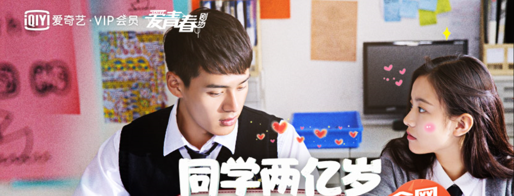

爱奇艺一直蹭朋友的会员，看剧的时候几乎没有广告，那次也不知道是什么机缘巧合，居然看到了《同学两亿岁》的预告片。国产片，有*星系大战、灵魂复生 、战舰元帅、两亿年等待*这些亮点，当时就很感兴趣，背景是高中校园。

看第一集，差点没看下去，一个花痴的高一女生明恋校草，各种被嘲笑被欺负，人设太脸谱化。在第一集结尾的时候终于被天蝎星系以灵魂体形式，沉睡了两亿年的阿布多瑞元帅附身，这是剧情才终于展开。

这位阿布多瑞元帅是女的，在天蝎星系一次外出作战时，基地被病毒占领后催毁，战舰也被损坏，只好降落到当时还没有人类的地球上，以灵魂体开始了长达两亿年的沉睡。直到这个高中女生唤醒了她。

被附身后的这个女孩子立马和以前不一样了，虽然常识缺乏，但是气度、言谈、动作都非常大气，站着也只有手背后和手放两侧两种动作，不说废话，不做多余表情，对于之前那个校草完全不屑一顾，力气也变大了，还有了超能力，隔空移物等等。以前是黏人小可爱风格，现在一下子成了高冷女王范儿，口头禅是“愚蠢的人类”。当然了，女主设定就是最后所有的男一号和男n号都要死心塌地爱她，这个剧当然也没免俗。

断断续续看了几集，一直还没有拍到怎么重建战舰或是黑洞跃迁，好回到元帅的家乡——天蝎星系。最期待的就是太空的剧情，一直还没有展开。随意说说看这个电视剧的一些感想。

# 关于鄙视链

这个现象很有意思，意思是喜欢某种事物的人，看不起喜欢同种事物另一类别的人和品味。举个例子，踢足球的看不起打篮球的，打篮球的看不起踢足球的，听古典音乐的看不起听流行音乐的，听流行音乐的看不起听古典音乐的，写c++的看不起写java的，写java的看不起写c++的，用iPhone的看不起用安卓的，用安卓的看不起用iphone的。。。

太多例子可以举了，这种鄙视的心态来自于对自己身份的确认，为了抬高自己就打压别人。不是所有人都有，希望你不要有。我以前就很爱看美剧，对于国产剧除了几部精良制作的以外，都是嗤之以鼻，什么家长里短、婆媳争斗、吵闹不休，就是我对国产剧的全部理解，经常吐槽干嘛要花时间看这些精神垃圾？

后来发现这是一种傲慢的体现，不够谦虚，用自己的标准去评判面对大众的产品，并不全面。我认为这些很低端，只是因为我不需要它们，所以就通过贬低它，来彰显我没有那些讨厌的特质。其实自己有没有呢？不知道，自己只是没有置身于剧里那样的环境中罢了，面对那种环境的人，尽管可悲，可他们的举动其实也是符合正常逻辑的。

# 关于实力与性格

拥有超能力的人能做什么？几乎是任何自己想做的事。所以超级英雄系列的电影永远火爆，谁内心还没有过自己也能飞、也有战甲、也有伙伴一起对抗世界邪恶这样的幻想呢。

成为元帅内核之后的女高中生，一举一动都充满了刚硬的军人之风，在这样一个小萝莉的外表下，简直是太可爱的反差萌。而性格比外表更能打动人，她的模样没有变，性格变化之后，本来讨厌他的校草开始迷恋她，本来讨厌他的哥哥也喜欢她。

要是她本来的性格就如此呢？不看那些超能力，要是她原有的性格就是专注于做自己的事，霸气、神秘，对学业和爱好投入所有关注，忙到对那个校草没有任何兴趣，她之前的生活就不会那么悲惨，充满了嘲笑和欺侮。可看人物设定，这并不是她要的生活和青春。

我们看戏的人觉得她很可悲，但是她自己并不这么觉得，反而非常乐在其中。要是我们作为旁观者去教育她、告诫她，只会被认为一点也不懂她。

就像《了不起的盖茨比》里这句最为人所知的一句：

> 每当你觉得想要批评什么人的时候，你切要记着，这个世界上的人并非都具备你所拥有的条件。 　　
>
> Whenever you feel like criticizing any one, just remember that all the people in this world haven't had the advantages that you've had.

自己开始写小说传作，才知道构思出一个完整的剧情有多难，嘲笑别人很简单，还是先问问自己能做到多少。用自己的业余者身份去评价专业者的工作，正应了那句“关公门前舞大刀”。古话早就告诉我们了，要谦虚，要谦虚，要谦虚，我们还得自己犯错后才能学到教训。