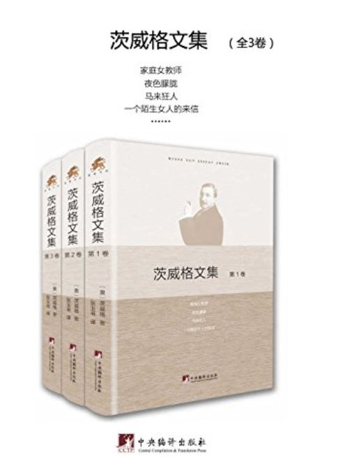

买这本书时亚马逊上在打折，7块5（kindle版价格），看着便宜，书又不错就买下了存着，准备以后看。近期看了太多理论书和专业书后，发现很久没有看过文学作品，就把这套书打开来看。

茨威格，奥地利人，生于1881，1942年巴西自杀身亡。生前与罗曼·罗兰，高尔基，还有弗洛伊德是好友。他所处的历史背景正是整个欧洲动荡不安的年代，作品里也有文章反映了对战争的控诉和反对。

他的小说里人物形象非常独特，甚至可以说扭曲，总是被一股奇特的激情所控制，做的事情也是常人不能理解的。茨威格作品的魅力就在于他让这些看起来不可理解的人物内心展示了出来，让他们可以被读者理解。

比如他最负盛名的短篇小说《一个陌生女人的来信》，整个故事以收到的一封厚厚的来信开始，整部故事就是这封信里的内容，讲述了一个女人深沉孤独的爱意，结局悲惨。在这部文集里还收录了《偿还旧债》，是作者未发表的遗稿，里面的开头和《来信》很相似，不过结局却大不相同，比较温暖人心。

两部小说一对比，可以发现作者写作也是在不断地打磨，把温吞吞的结局转变的异常突兀，把人物的境遇从得过且过转变成孤注一掷的冲动。这里面有很多创作手法值得学习。

关于战争的短篇小说有《十字勋章》、《日内瓦湖畔的一个插曲》、《看不见的珍藏》、《里昂的婚礼》、《象棋的故事》。

其中《象棋的故事》我最喜欢。里面讲到了当时的欧洲出现了一位象棋高手，他在各种国际比赛上未逢敌手。主人公乘坐的游轮他正好也在，按照计费下棋他们展开了对决。主人公和他的朋友们完全不是对手，被杀得很惨。

这时突然出现了一个中年人，年纪不大但看着很苍老。他就像那少林寺的扫地僧一般，不停地提醒主人公该走哪步，那个象棋高手又会走哪步，而他的预判总是准确的。

下完棋后主人公和他的朋友们简直不敢相信，这么厉害的人却籍籍无名，于是主人公和这个中年人攀谈了起来。原来这个中年人是为教会保管财物的负责人，盖世太保为了知道更多的秘密，把他囚禁了起来。没有把他送进纳粹的集中营，而是把他单独隔离了起来。平时见不到一个人，没有任何人可以说话，也没有书没有消遣。他一度都要崩溃，正准备跟盖世太保吐露一切好寻求解脱时，他偷到了一本象棋棋谱。

他没有下过象棋，开始根本看不懂那些数字和标记是什么意思，可是终于有了可以对抗虚无的工具，他投入了所有的精神来研究它。最终直到思考过多，行为开始没有意识，甚至有了癫狂的病症，他才被送去就医，而当时的政治风向开始改变，他也被放了出来。这次游轮上的象棋比赛，是他第一次看到真实的棋子和棋盘，被关起来时都是用床单和零碎物品替代的。

他也没有想到自己在被关的这段时间里，象棋的技术居然已经达到了世界最高水平。但在这时主人公也发现这个中年人的精神似乎有问题。他不能再下象棋，因为这会引发他的癫狂症，而这，正是纳粹手段对人心灵的残害。

还有《一个女人一生中的二十四小时》，这部小说我以前看过，但没记住名字，这次再看到里面对那个赌徒的手的描写，我就知道是它了。茨威格文笔的特征就在于描绘这些不可思议的细节的激情，一双手仿佛都有了独立的思想和表情。

以上是部分*短篇小说*读后的体会。这部文集还收录了茨威格的长篇小说《一个政治性人物的肖像》和《心灵的焦灼》，明天再写。

