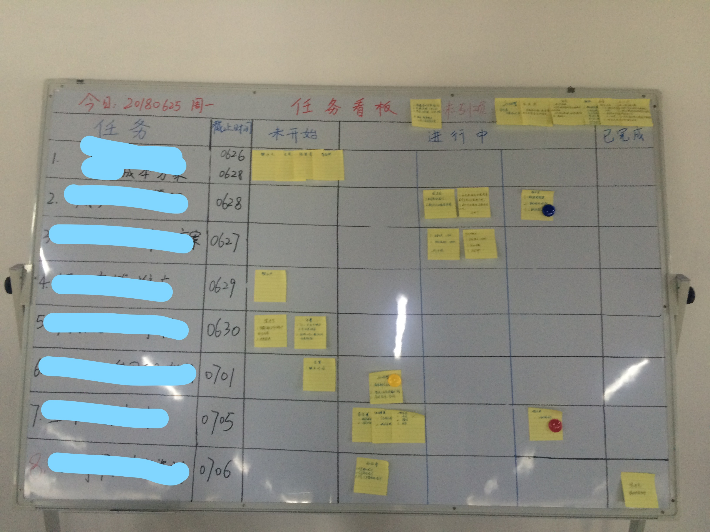
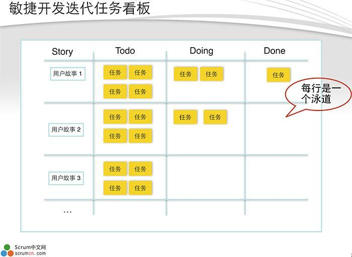
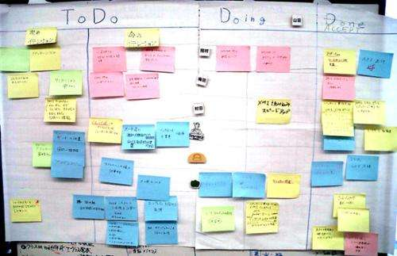
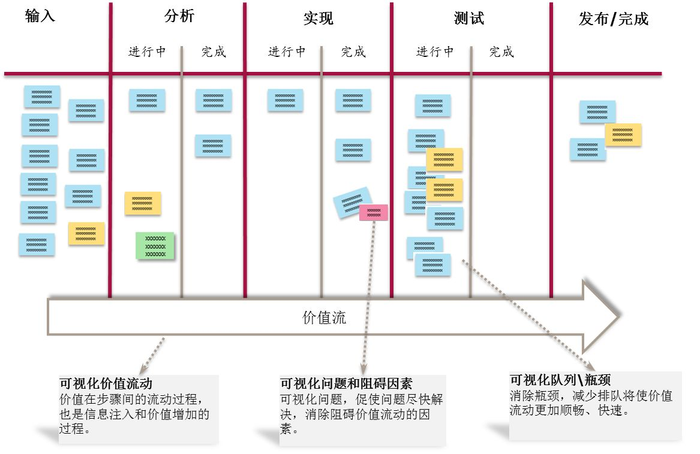
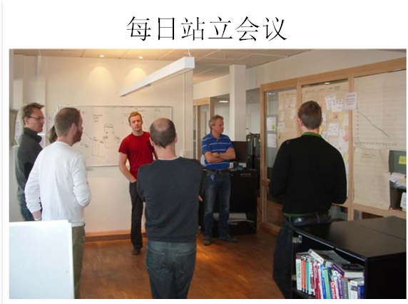
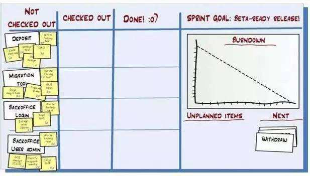
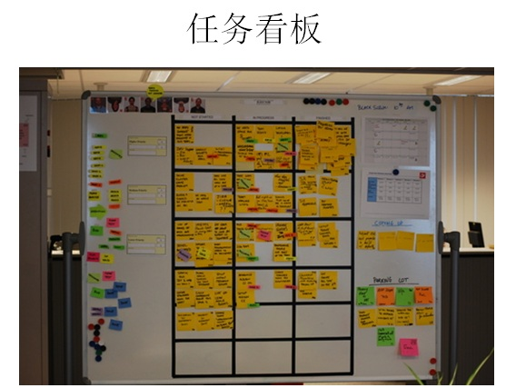
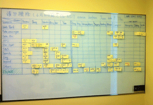
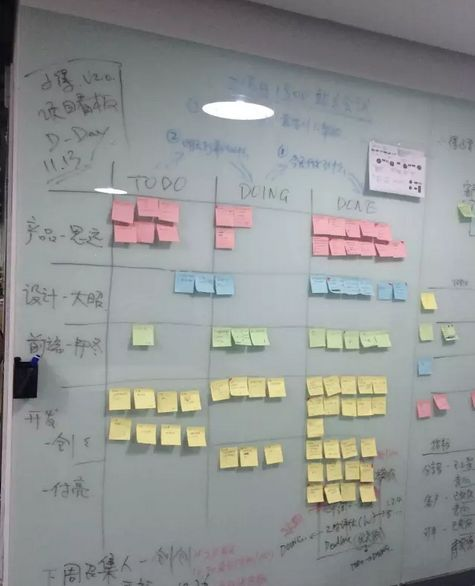

昨天开会时提到用黑板的方式展现每个人的工作进度，和樊哥讨论后，计划使用敏捷开发里的任务看板来进行展示。最后的成品图如下：

便利贴上写姓名和自己做这个任务的具体步骤安排，每做完一点，就往前挪一点，直到已完成。而每个人的进度清晰明了，也知道自己和其他人相比是否落后。

|              问题              |             解决方案             |
| :----------------------------: | :------------------------------: |
|         边线容易被擦掉         |    买了窄的彩色胶带，用作边线    |
|         便利贴容易掉落         | 买了圆圆的小磁贴，容易掉的可固定 |
|     进行中这一项还是太复杂     |     下次不区分30%，60%和90%      |
|         便利贴颜色单一         |         买了四种新的颜色         |
| 对于遇到的阻碍和需协调项未标出 |     统一为红色便利贴写此事项     |

# 怎么实现项目管理？

把这个看板制作出来，是为了实现项目管理，每次使用站立会议的方式，将某个任务的相关人员召集在看板前，每个人说下情况即可。这对于会议记录也有帮助，先列出每个项目，再列出该项目下涉及几个人，他们分别做什么。这样就容易知道每个人的工作情况。

---

# 以下是在网上找的一些看板图片，以作参考。

