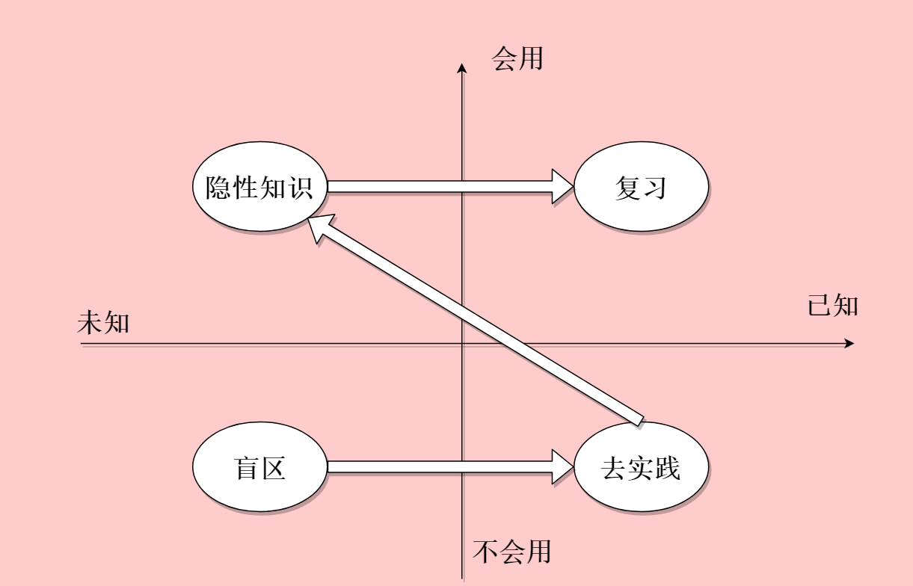

# 适合于个人的知识分类

从**知不知道**和**会不会用**，我将知识划为四个象限，这是适合于个人的分类方式。

- 知道+会用，当这样的知识进入大脑时，复习即可。

> 生活中一些常识，怎么开车，怎么收发快递，怎么用word

- 知道+不会用，去实际用一下。

> 以前只知道理论方面的，没有自己亲自实践过，比如一些小tips，看到过很多，有没有用不知道，白衬衣冻一下更白之类的。

- 不知道+会用，非常宝贵的隐性知识，要把它显性化，描写出来，归纳整理。

> 利用费曼原理，把一件事情说清楚，而并不是只在自己脑袋里盘旋。比如怎么找到阅读语感，怎么提高阅读速度，怎么理解编程，怎么记忆和背诵等。

- 不知道+不会用，这是自己的盲区，完全不懂的内容，也不知道自己不知道，很可怕，别人如果知道自己却不知道，就在最开始，比别人就差了很多。

> 一些社交礼仪和说话方式，还有不了解的行业规律等。

# 读后感要怎么写

|    书名    |  作者  |  自己读完体会  |          吴军读完体会          |      补充      |
| :--------: | :----: | :------------: | :----------------------------: | :------------: |
|  《庄子》  |  庄子  |  省着点用智慧  |            立意高远            |                |
|            | 茨威格 |   小说写得好   | 昨日世界值得回忆，是人生的基石 | 《昨日的世界》 |
| 《红楼梦》 | 曹雪芹 | 可怜的一群女子 | 林黛玉，用生命在作诗，精神力量 |                |

