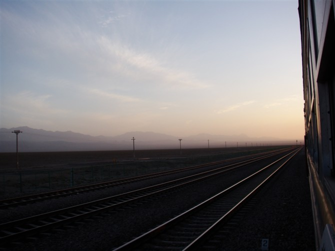

(2009年的7月戈壁)

道阻且长，行则将至。

# 运动时间

我是从2018年1月初开始锻炼的，看日记是2018年1月7日正式开始。

2018年6月6日开始找了教练学习游泳。

在这之前，2016年3月到5月，在健身房我有找过一个美女私教，上了8次课。

还有2016年夏天，早起到楼下公园跑步，大概坚持了有半个月。

2017年全年不记得有什么锻炼。

近三年的运动情况就是如此，其实我的起步很晚，之前也没什么基础，在健身房上的私教课当时没做记录，几乎全都忘记了。

# 原因和动力

因为从2017年9月开始长期在黔西南出差，每次回家休完假，再过来的时候都会生病。一个人在外地生病的滋味真是难受，所以想通过锻炼达到强身健体的作用，起码不要这么频繁病倒吧。

再就是每次坐飞机，自己都不能把行李箱放到行李架上去，我的还只是一个小行李箱，每次也没装多重，就是抬不起来。

我有一条很喜欢的levis紧身牛仔裤，2015年底买的，到2017年夏天已经穿不了了。我看起来很瘦，但是当时肚子上长了不少肉，后腰两侧也有两大块儿肉，腿估计也长粗了，反正就是穿不上去。

经常觉得无精打采，浑身没力气，多走两步也不愿意，能坐车就决不多走一步路。不仅仅是心理上懒，还因为身体就是没能量，无法支撑更多的活动。

情绪容易低落，经常不开心，看世界是灰色的，自己也很少笑。

# 运动装备

瑜伽垫一张，80元。

以前买的运动上衣、运动裤和运动鞋。

最开始是用装满水的500ml的矿泉水瓶充当哑铃。

练了半个月买了一对1.5kg的哑铃，30元。

用了快两个月，在三月的时候升级成了2kg的，40元。

又练了三个月，昨天刚刚升级成了3kg一个的，60元。

四月的时候新买了一条薄的运动裤，400元。

别的没买什么了。

# 运动内容

最开始我是跟着b站（哔哩哔哩动画）里一个叫做**周六野**的健身博主，她发的健身视频跟着做。链接：https://space.bilibili.com/62540916/#/

到3月份的时候我就没有再看了，开始跟着keep app里的训练来做运动。

周六野的视频很适合初学者，她教我最重要的一点就是**呼吸**，还有**运动前的热身**和**运动后的拉伸**，这三样和运动的重要性是一样的。并且她的每个视频一般不超过10分钟，都是针对单个身体部位的训练。

还有HIIT（高强度间歇性训练）我也是在她那里学会的，每次不超过25分钟，做完全身都会大量出汗，心脏狂跳。她的视频讲解清楚，第一次看过后，之后只用放着听就行，并且安排的内容循序渐进，自己找喜欢和合适的跟着做就行了。

在keep app里，可以自己定制训练计划，我选的训练周期是一个月的长度，锻炼的身体部位也是全选了，包括肩、背、胸、手臂、腹部、臀部和腿。它会自动安排每天练什么，练多久。

跑步我跑得比较少，5月连着跑了一两个星期，膝盖疼了好久，不知道是什么原因，不过本身我也不太喜欢跑步，就停下来了。后面计划还是去跑，每周不超过三次。

游泳我刚刚学会不带任何浮板自己游，换气、拨水、蹬腿，全靠自己的力量来做的时候，发现很容易累，一次只能游个十来米，就有点换不上气了。还需要继续学习，这个目前还没有锻炼的效果。

# 运动成果

跟着周六野的视频练到两个月的时候，马甲线就已经有了。我自己都没有想到会这么容易，后腰上的肉也没有了，不知不觉间消失的。可我一吃东西肚子就发胀，所以只有早上起床的时候看得到马甲线。

练腹部有一个好处，就是当时痛得要死，拉伸完一会儿就不疼了。不像胳膊和大腿，会酸好几天，所以腹部几乎可以天天练，很快就有效果。

因为做平板支撑，手肘两旁经常磨破皮渗血，可是着力点就在这里，所以一直都是带着伤在练，疼着疼着也就习惯了，现在已经磨出了一片痂皮，不再流血了。

背部练多了会有一种**背变厚了**的感觉，实际上可能并没有，不过可以感到背后有那么薄薄的一层肌肉。

肩膀的锻炼主要是可以缓解对着电脑太久的肩膀疼和脖子疼，肩部的肌肉在哪里我还没搞清楚。

胳膊，胳膊是我的痛，目前没有看出什么效果，还需继续锻炼。

臀部和腿的锻炼一般都是在一起，深蹲、弓步蹲都是最常见的动作，练完一般都是酸疼酸疼的，注意拉伸。

# 运动带来的其他好处

搬东西我都挑重的拿，提不起就扛着走，再也没被说过懒了，**自己能做的事情越来越多**，能尽量不麻烦别人。

**时间安排**注意要事优先。以前锻炼放在下午和傍晚，发现无法和工作做到平衡，放到早上后只能强制自己早起，于是晚上到了11点多就困得不行。不知不觉间形成了早睡早起模式。

**吃东西注意了**。以前我最爱的是烧烤和甜品，现在已经都戒掉了。并且不是那种很痛苦的戒掉，而是自然而然就没欲望了，吃完不会再是高兴，而是身体不舒服，胃都在自觉的反抗它们。

**好的精神状态**在线时长增加，运动可以让人更开心，这是真的。先是运动过程中，要专注于动作和呼吸，没多的注意力想别的事情；再是运动完后，出的汗越多会越有成就感，身体上的酸痛也成了自己的勋章，非常满足。

还有最近几个月**痘痘长得也少了**，估计和运动也有关系。

**精力更好**，用电池打个比方就是续航能力增强，可以投入做事的时间更长，不会很快就累，集中不了注意力。工作效率也有提高，每天能做的事情更多。

**休息的时间特别珍贵，过得很开心**。休息就是什么累的事情都不做，不看书，不运动，不思考。出去散步到处乱走，看看网络小说，看看幼稚电视剧，一边听歌一边想像自己开演唱会，查攻略玩刺客信条3，或者就躺着发呆看天花板，做这些事的时候不再有什么内疚的感觉，平时节省挣来的休闲时间，可以浪费得心安理得。

# 我的建议

- 要有信念，定下了今天要运动，没过24点前不吃饭不睡觉不洗漱都要先运动。
- 量力而行，每次锻炼时间别太长，热身和拉伸别省略。
- 坚持，练了一个星期，停两天，之前一个星期的苦白吃了；停三天，锻炼的效果就没了。
- 运动的种类很多，某一种坚持不下去就换别的。打球、骑行、跑步、快走、举哑铃、瑜伽、游泳、攀岩、徒步。。。内容不重要，动起来流汗就可以了。

# 写在最后

我看过一副运动海报，在哪里看的不记得了。

里面是一个上身赤裸的肌肉男，低着头在给自己的手掌缠纱布，看不清长相和表情，汗水在身上肆意流淌，肌肉颜色偏棕色。我最喜欢的是旁边配的那句话——“与其流泪，不如流汗”。整张图暴力与脆弱共存，力量与无助对比，张力十足。

“与其流泪，不如流汗”，与诸君共勉之。