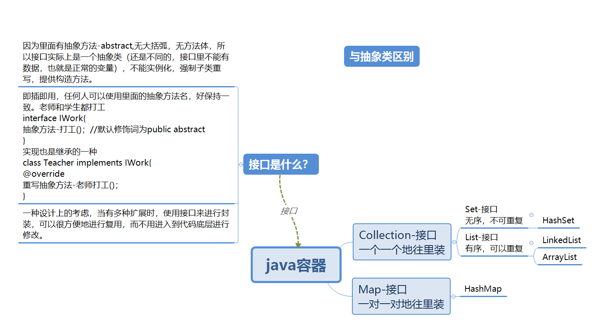
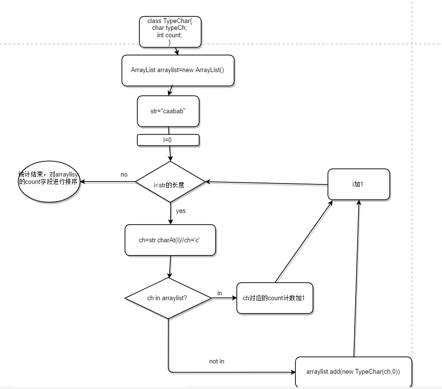
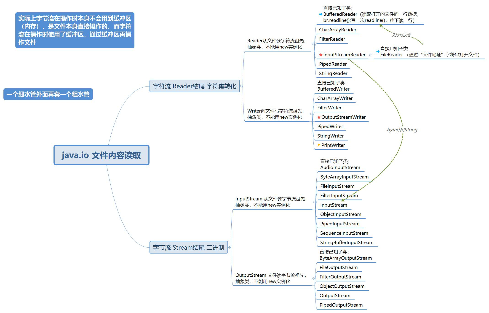
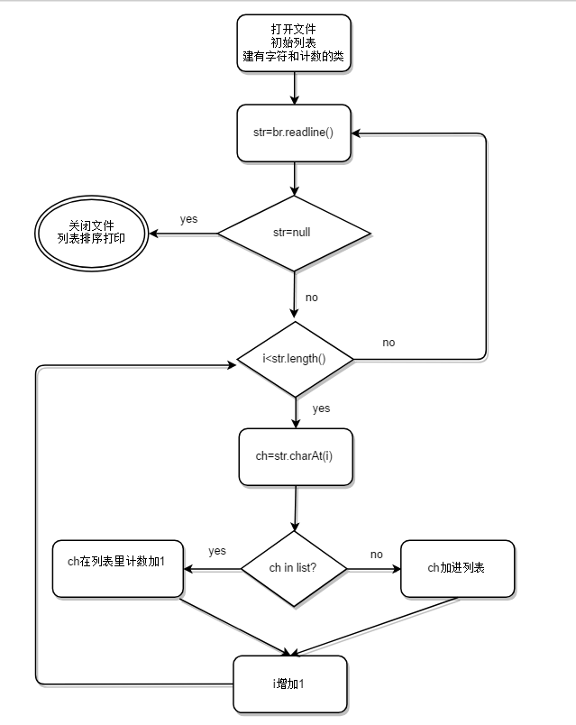

---
t
itle:  "Java程序-统计一首诗里哪个字出现的次数最多"
toc: true
permalink: /tech/java-shushu
tag: 技术
excerpt: "可变长度的数组-容器，排序和编码等"
last_modified_at: 2018-07-02T08:06:00-05:00
typora-copy-images-to: ..\assets\images
---

统计的这首诗叫做《长恨歌》，白居易写的七言诗，有关唐明皇和杨玉环的爱情故事。我用了4个早上把它背了下来。里面失眠的描写我写过一篇小小的博文：[白居易说失眠]()

[TOC]

# 按照故事的情节我把这首诗分为5个部分

| 故事情节                     | 包含多少句 | 总计             |
| ---------------------------- | ---------- | ---------------- |
| 相恋：最美的女人，最高的宠爱 | 15句       | 60句，一句14个字 |
| 死别：战乱起，美人抵罪       | 13句       | 共840个字        |
| 魂念：君王挂念，夜不成眠     | 9          |                  |
| 寻访：仙山画卷中的人         | 13         |                  |
| 寄词：也许某天会再见         | 10         |                  |

在背诵的过程中，我发现“春”这个字重复出现了很多次，我想知道具体的数值，但不想自己数，于是想到用Java写个小程序来统计。

# 程序最终的效果

~~~java
//共有多少字数
total：840

//不同的汉字共有多少个
different_total：700

//汉字按照出现的次数多少，从大到小进行排列
'春' ：10
'君'	：9 
'人'	：6
'六'	：2
~~~

# 设计思路

- 编辑器：Intellij IDEA

  - 一些快捷键的应用 Alt+Enter：智能提示，Ctrl+Alt+L：代码自动排版;Alt+Insert+Fn(联想小新要加Fn)，自动插入构造函数等

- 数据结构：容器

  

  

  - 容器里面用得比较熟悉的就是ArrayList，有序可重复，在后面进行添加
  - 每个汉字要带上一个计数器，首先想到字典的键值对 `{key:value},{汉字：次数}`，python里叫字典，Java里叫Map，容器的一种。
  - 容器我的理解就是数组的扩展，容器的大小是可变的，数组不行。
  - 分别用ArrayList和HashMap进行实现

- 排序算法：二分、冒泡算法选择，性能扩展，如果是84万字呢

# 问题分解

将这个任务从简单到复杂逐步迭代。

## 程序直接给出一串字符串，统计每个字母出现次数

~~~java
String  str="caabab";

//共有多少字符数
total：6

//不同的字母有多少个
different_total：3

//结果
'a' : 3
'b' : 2
'c' : 1
~~~

### 思考：

1. 虽然在这里str的长度是固定的，不过要把这个长度想象成非常长，不能人工数出来的那种长。

2. 总数就是字符串的长度。

3. 不同的字母有多少个，要计算种类的个数。

4. 结果的展现，表明要对重复的次数进行记录，一个字母要有一个计数器。

   1. 首先，这个结果是要存在某个数据里，不能仅仅只是打印出来。

   2. 方案1是使用面向对象思考，比如可以建一个类，叫做TypeChar，里面的两个成员变量，一个是char，一个是int，创建对象时就初始化字符和次数。

   3. 将这个有计数器的对象加入到列表里。需查看ArrayList的[Java API文档](%http://tool.oschina.net/apidocs/apidoc?api=jdk-zh%),它是在java.util包里。

      > 我第一次写的时候很笨，是把26个字母先全部添加到arraylist里， 作为str里字符比较的基础。比如说str里第一个字符是'a', 就遍历arraylist，'a'就在第一个，不再遍历了，把列表里'a'的计数器增1
      >
      > //重复26次，很有点笨，比较好的方法是每遍历到一个新的字母，就把这个字母赋值到对象的char属性，然后把这个对象加入到列表里来
      >
      > TypeChar a=new TyprChar('a',0)；
      >
      > arraylist.add(a);
      >
      > TypeChar b=new TyprChar('b',0)；
      >
      > arraylist.add(b);

      

      ~~~java
       public static void main(String[] args) {
              ArrayList arrayList = new ArrayList();
              //test(arraylist);
              String str = "caabab";
              System.out.println("total: "+str.length());
              for (int i = 0; i < str.length(); i++) {
                  char ch = str.charAt(i);
                  //判断列表中是否存在这个字母
                  if (charInList(ch, arrayList)) {
                      //存在，则将它的计数加1
                      chAddCount(ch, arrayList);
                  } else {
                      //遍历完成不存在，就把它加入到这个列表中
                      arrayList.add(new TypeChar(ch, 1));
                  }
      
              }
              System.out.println("different_total: "+arrayList.size());
           	//排序
              sort(arrayList);
              //打印
              print(arrayList);
          }
      --------------    
      //结果
      total: 6
      different_total: 3
      a:3
      b:2
      c:1
      ~~~

      ~~~java
      public static class TypeChar {
              char typeCh;
              int count;
      
              public TypeChar(char typeCh, int count) {
                  this.typeCh = typeCh;
                  this.count = count;
              }
      
              @Override
              public String toString() {
                  return typeCh + ":" + count;
              }
      
              public void setTypeCh(char typeCh) {
                  this.typeCh = typeCh;
              }
      
              public void setCount(int count) {
                  this.count = count;
              }
      
              public char getTypeCh() {
                  return typeCh;
              }
      
              public int getCount() {
                  return count;
              }
          }
      
          static void test(ArrayList arrayList) {
              arrayList.add(new TypeChar('z', 2));
              arrayList.add(new TypeChar('x', 4));
              print(arrayList);
          }
      
          //判断该字母是否存在于当前列表
          static boolean charInList(char ch, ArrayList arrayList) {
              int i = arrayList.size();
              for (int j = 0; j < i; j++) {
                  TypeChar tc = (TypeChar) arrayList.get(j);
                  if (ch == tc.getTypeCh()) {
                      return true;
                  }
              }
              return false;
          }
      
          //将该字母在列表里的计数加1
          static void chAddCount(char ch, ArrayList arrayList) {
              int i = arrayList.size();
              for (int j = 0; j < i; j++) {
                  TypeChar tc = (TypeChar) arrayList.get(j);
                  if (ch == tc.getTypeCh()) {
                      int newCount = tc.getCount() + 1;
                      tc.setCount(newCount);
                  }
              }
          }
      
          static class SortByCount implements Comparator {
              @Override
              public int compare(Object o1, Object o2) {
                  TypeChar s1 = (TypeChar) o1;
                  TypeChar s2 = (TypeChar) o2;
                  if (s1.getCount() > s2.getCount())
                      return -1;
                  return 1;
              }
          }
      
      
      
          //将列表按照计数大小，从大到小进行排列
          static void sort(ArrayList arrayList) {
              int i = arrayList.size();
              Collections.sort(arrayList, new SortByCount());
      
          }
      
          //将列表打印出来，每个字母对应一个计数
          static void print(ArrayList arrayList) {
              Iterator i = arrayList.iterator();
              while (i.hasNext()) {
                  //TypeChar tc= (TypeChar)i.next();
                  //System.out.println(tc.toString());
                  System.out.println(i.next());
              }
      
      
          }
      ~~~

      ### 代码中涉及到的知识点

      | 知识点                                                       | 疑问                                                         |
      | ------------------------------------------------------------ | ------------------------------------------------------------ |
      | 要读字符串中的单个字符，使用str.charAt(索引)，索引从0开始，将str看作一个一元数组 | 字符串最后一位是\0吗 不是 String str = "abc";等效于： char data[] = {'a', 'b', 'c'}; String str = new String(data); |
      | ArrayList是一个类，它实现了List接口（List实现了Collection接口），可以用a.get(索引)来取列表中这个索引位置的元素，类型是Object | List和Collection的方法包括哪些                               |
      | 元素取出来后进行转型，这个例子里是这样：TypeChar  tc= (TyprChar)a.get(0) | String s= (String)i;不可行                                   |
      | 类的构造，包括有参构造、toString()重写，Getter()、Setter()，fn+alt+insert快捷键 | 打印一个类时，调用了toString()                               |
      | test(arraylist)，是为了测试能否将一个字符直接作为对象的一个字段打包放进列表里 |                                                              |
      | print(arraylist),把列表里的元素按照a:3这样的格式打印，先是取出这个元素，再用类的toString()重写打印方法 |                                                              |
      | Iterator是一个游标，初始化后类似于指针，指向列表的第一个元素，i.next()取出这个元素 | 这里奇怪不用进行转型就能知道是TypeChar类的元素，可它只能调用toString()方法，其他类里的方法调不到 |
      | charInList(arraylist),判断一个字母是否在这个列表中，那么首先要把列表里的元素类中的字段值取出来，就用到了arraylist.get(索引)——>转型成TypeChar——>取出字段值 | 可以替代Iterator的一种方法                                   |
      | charAddCount(arraylist)，如果这个字母存在，则计数加1，同上一个函数很多重复，就是在取出元素的计数后，加1，再把更新后的计数放进去。 |                                                              |

      | 比较器                                                       | 难点                                                         |
      | ------------------------------------------------------------ | ------------------------------------------------------------ |
      | collections有一个sort(list,Comparator())方法，方法中的参数，一个是列表，一个是比较器 | Collections是啥，和Collection（接口）容器是什么关系？见下，Collections这个类里的方法特别多，sort()只是其中之一 |
      | 比较器自己写，也就是写一个类实现Comparator接口，重写里面的int compare(o1,o2)方法，返回一个整数 -1或1，大到小或者小到大 | 这就排好序了？具体过程是什么?                                |

      > **概念区分：** **java.util.Collection和java.util.Collections区别：**
      >
      >  
      >
      > 1、  java.util.Collection 是一个集合接口（集合类的一个顶级接口）。它提供了对集合对象进行基本操作的通用接口方法。Collection接口在Java  类库中有很多具体的实现。Collection接口的意义是为各种具体的集合提供了最大化的统一操作方式，其直接继承接口有List与Set。
      >
      >  
      >
      > 2、java.util.Collections  是一个包装类（工具类/帮助类）。它包含有各种有关集合操作的静态多态方法。此类不能实例化，就像一个工具类，用于对集合中元素进行排序、搜索以及线程安全等各种操作，服务于Java的Collection框架。

      | 运行中错误                                                   | 解决                                                         |
      | ------------------------------------------------------------ | ------------------------------------------------------------ |
      | 没有分文件，都写在一个Java文件里，在执行函数main()之上写类还有那些方法时，总是提示Error:(119, 9) java: 无法从静态上下文中引用非静态 方法 sort(java.util.ArrayList) | 必须要在这些方法前加上static关键字。static的作用是指在编译时就将类加载到方法区，有没有声明对象都不影响。 |
      | 静态上下文的理解，这个函数是在main()中调用的，因为main是static的，所以它包含的方法和类也必须得是static的 | 以前没有这个问题，怎么回事                                   |
      | 列表越界错误，在for循环中arraylist.get(l)索引写成了长度，一是不会发生遍历，而是长度放在索引里可不就是越界了吗 | 用for循环里的那个i，然后变量名定义要有意义，长度就用length，不要用i，太容易忘记，然后就有了小bug |

      

   4. 方案2是使用二元数组，这个不太熟悉，并且数组的长度是固定的，后面完全无法扩展，就直接没有考虑。


## 在一个文本文档里写一行英文字符串，统计每个字母出现次数

~~~java
//打开test.txt，里面写字符串，保存关闭
caabab

//共有多少字符数
total：6

//不同的字母有多少个
different_total：3

//结果
'a' : 3
'b' : 2
'c' : 1
~~~

### 思考：

1. 涉及到打开文件，然后读入文件一行内容，读完后关毕文件，java.io文档里查看文件读取相关内容，类的运用

   > 提问：使用字节流好还是字符流好？学习完字节流和字符流的基本操作后，已经大概地明白了操作流程的各个区别，那么在开发中是使用字节流好还是字符流好呢？
   >
   > 回答：使用字节流更好。
   >
   >  
   >
   > 在回答之前，先为读者讲解这样的一个概念，所有的文件在硬盘或在传输时都是以字节的方式进行的，包括图片等都是按字节的方式存储的，而字符是只有在内存中才会形成，所以在开发中，字节流使用较为广泛。

   

2. 取出一行字符串后，和第一个问题是一样的

   ~~~java
   public static void main(String[] args) {
           // 将反斜线\换成/斜线也可以打开文件，用反斜线\还得转义，就windows文件路径用反斜线
           //String filePath="C:/Users/Lenovo/Desktop/CharactorFrequcyStatistics.txt";
   
           String filePath="C:\\Users\\Lenovo\\Desktop\\CharactorFrequcyStatistics.txt";
           //异常的捕获，必备，手写一个 Excepion 包含所有的
           try{
               FileReader fr=new FileReader(filePath);
               BufferedReader br=new BufferedReader(fr);
               String str=br.readLine();
               System.out.println(str);
               br.close();
               fr.close();
           }catch(Exception e){
               e.printStackTrace();
           }
       }
   //结果
   aaaaaaaa
   ~~~

   

### 代码中涉及到的知识点

| 知识点                                                       | 疑问                                                         |
| ------------------------------------------------------------ | ------------------------------------------------------------ |
| 异常的捕获                                                   | 异常分哪些？                                                 |
| 文件reader和writer都是使用了系统资源，这种资源java不能自动回收，所以需要明确的指令来告诉系统，这个东西我不用了，给其他人用吧。 关闭方法：调用各自的close方法即可。 |                                                              |
| String中斜线的转义，复制文件路径放到双引号里面，自己就多加了一个\ | windows和Linux中的路径斜线格式不一致，就windows文件路径用反斜线 |
| 重用、封装                                                   | 如何复用Main1中的多个方法？                                  |

> Unix使用斜杆/ 作为路径分隔符，而web应用最新使用在Unix系统上面，所以目前所有的网络地址都采用 斜杆/ 作为分隔符。 
>
> Windows由于使用 斜杆/ 作为DOS命令提示符的参数标志了，为了不混淆，所以采用 反斜杠\ 作为路径分隔符。所以目前windows系统上的文件浏览器都是用 反斜杠\ 作为路径分隔符。随着发展，DOS系统已经被淘汰了，命令提示符也用的很少，斜杆和反斜杠在大多数情况下可以互换，没有影响。 
>
> 知道这个背景后，可以总结一下结论： 
>
> （1）浏览器地址栏网址使用 斜杆/ ;  https://www.cnblogs.com/pxh-phper/p/6231294.html
>
> （2）windows文件浏览器上使用 反斜杠\ ; 
>
> （3）出现在html url() 属性中的路径，指定的路径是网络路径，所以必须用 斜杆/ ; 
>
> ```
> <div style="background-image:url(/Image/Control/title.jpg); background-repeat:repeat-x; padding:10px 10px 10px 10px"></div>
> // 如果url后面用反斜杠，就不会显示任何背景
> ```
>
>  （4）出现在普通字符串中的路径，如果代表的是windows文件路径，则使用 斜杆/ 和 反斜杠\ 是一样的；如果代表的是网络文件路径，则必须使用 斜杆/ ; 
>
> ```
>  // 本地文件路径，/ 和 \ 是等效的
> 
>  // 网络文件路径，一定要使用 斜杆/
> ```

| 运行时错误                                                   | 解决                                                         |
| ------------------------------------------------------------ | ------------------------------------------------------------ |
| 把Main21里的文件打开读出的str替换为Main1中的str，在try-catch外居然不识别str，说它未声明 | 在异常捕获之前声明一个str的空字符串，在try里str=br.readline()，这样后面就能认出来了。为什么？try-catch难道还是一个函数吗，在里面声明一个str，就只是它的内部变量？ |


## 还是在文本文档里，行数增多

~~~java
//打开test.txt，里面写字符串，保存关闭
caabab
aaaaaa
cccbbb

//共有多少字符数
total：18

//不同的字母有多少个
different_total：3

//结果
'a' : 9
'b' : 5
'c' : 4
~~~

### 思考：

1. 文件读了一行又一行，读一行就往arraylist里进行一次添加和计数，读完了，任务也就完成了

   

   

2. 代码时间度量，效率如何？

   前两次判断时间花销不大，在下面ch是否在列表是一次遍历，计数加1时又会有一次遍历，改进一下

~~~java
import java.io.BufferedReader;
import java.io.FileReader;
import java.util.ArrayList;
import java.util.Collections;
import java.util.Comparator;

/**
 * Created by Lenovo on 2018/7/3.
 */
public class Main3 {
    static class TypeChar {
        char ch;
        int count;

        public TypeChar(char ch, int count) {
            this.ch = ch;
            this.count = count;
        }

        @Override
        public String toString() {
            return  ch + " ：" + count ;
        }
    }

    static void charAndList(char ch, ArrayList al) {
        //1、ch是否在al中
        int length = al.size();
        if (length == 0) {
            al.add(new TypeChar(ch, 1));
            return;
        }
        for (int i = 0; i < length; i++) {
            TypeChar tc = (TypeChar) al.get(i);
            // 2、在就把计数加1,不继续遍历
            if (ch == tc.ch) {
                tc.count++;
                return;
            }
        }
        // 3、遍历完后不在才放进来
        al.add(new TypeChar(ch, 1));
    }
    static class sortByCount implements Comparator{
        @Override
        public int compare(Object o1, Object o2) {
            TypeChar tc1=(TypeChar)o1;
            TypeChar tc2=(TypeChar)o2;
            if (tc1.count> tc2.count)
                return -1;
            if (tc1.count< tc2.count) {
                return 1;
            }
            return 0;
        }
    }
    static void sort(ArrayList al) {
        Collections.sort(al,new sortByCount());
    }

    static void print(ArrayList al) {
        int length = al.size();
        //前三个是，。和回车
        for (int i = 0; i < length; i++) {
            if (i %7 == 0) {
                System.out.println();
            }
            System.out.print(al.get(i).toString()+" | ");
        }
    }

    public static void main(String[] args) {
        String filePath = "C:/Users/Lenovo/Desktop/CharactorFrequcyStatistics.txt";
        ArrayList arraylist = new ArrayList();
        try {
            FileReader fr = new FileReader(filePath);
            BufferedReader br = new BufferedReader(fr);
            String str = br.readLine();
            int total = 0;
            while (str != null) {
                total += str.length();
                //将这一行的字母与列表进行比对，存在就计数加1，
                // 不存在就打包成类放进列表，计数初始化为1
                for (int i = 0; i < str.length(); i++) {
                    char ch = str.charAt(i);
                    charAndList(ch, arraylist);
                }
                //读进文件下一行
                str = br.readLine();
            }
            br.close();
            fr.close();
            sort(arraylist);
            System.out.println("    total: " + total);
            System.out.println("different_total: " + arraylist.size());
            print(arraylist);
        } catch (Exception e) {
            e.printStackTrace();
        }
    }
}

~~~


### 代码中包含知识点

| 知识点                                                       | 疑问                                                     |
| ------------------------------------------------------------ | -------------------------------------------------------- |
| while中嵌套一个for循环，for中调用的函数又会有一个for循环     | 这个时间开销怎么计算，如果文件很大时，需要的时间怎么算？ |
| 当文件2.3M时，程序运行时间：885hs，while从开始到结束：797hs，total: 1114437  ，different_total: 3860。当文件12.5M时，程序运行时间：3272hs，while从开始到结束：3214hs，total: 4457745  ，different_total: 3860 | 可见当文件变大时，while所占时间越多                      |

> `long` `startTime = System.currentTimeMillis();``//获取当前时间`
>
> `//doSomeThing();   //要运行的java程序`
>
> `long` `endTime = System.currentTimeMillis();`
>
> `System.out.println(``"程序运行时间："``+(endTime-startTime)+``"ms"``);`    

| 运行时错误                                                   | 解决方法                                                     |
| ------------------------------------------------------------ | ------------------------------------------------------------ |
| 当列表中还没有一个数据时，长度为0，对其进行长度处理时会发生越界 | 当长度为零时，直接把第一个字母加进来，第一个程序为社么么没有这个报错？对起始和结束条件要一样多想一步 |
| ch='\uFEFF' 65279 str="aaa"是正确的，读字符时却不是'a', 该问题产生的原因是 IDEA对以UTF8编码的文件保存时自动加上了BOM(UTF-8文件签名) | 这个怎么删掉？                                               |
| 逻辑有问题，是要在遍历全都完成后，没有才加入列表，而不是遍历一个，不在就加进去 | 只有if，不用写else，用debug走两遍就发现了问题                |
| Comparison method violates its general contract! 原因: JDK7中的Collections.Sort方法实现中，如果两个值是相等的，那么compare方法需要返回0，否则 **可能** 会在排序时抛错，而JDK6是没有这个限制的。 | 也就是return必须要包括-1、0、1三个return，不写满三种情况就不行，为啥Main1没事？ |


## 将文本文件里的多行字符换成诗句

~~~java
//打开test.txt，里面写诗句，保存关闭
汉皇重色思倾国，御宇多年求不得。
杨家有女初成，养在深闺人未识。
。。。
（全文）
。。。
在天愿做比翼鸟，在地愿做连理枝。
天长地久有时尽，此恨绵绵无绝期。

//共有多少字数
total：840

//不同的字有多少个
different_total：700

//结果
'春' ：10
'君'	：9 
'人'	：6
'六'	：2
~~~

### 思考：

1. 英文字母 用char类型来存储，一个汉字是否也可以用char来存储——可以

   > char是按照字符存储的，不管英文还是中文，固定占用占用2个字节，用来储存Unicode字符。范围在0-65535。 unicode编码字符集中包含了汉字，所以，char型变量中当然可以存储汉字啦。不过，如果某个特殊的汉字没有 被包含在unicode编码字符集中，那么，这个char型变量中就不能存储这个特殊汉字。 如果用3个字节有很多不常用的字又占了很多不必要的存储空间，所以我们用2个字节而不是1个或者3个表示汉字的国际码。 
   >
   > 补充说明： 
   >
   > 1. unicode编码固定占用两个字节，所以，char类型的变量也是占用两个字节。Unicode（统一码、万国码、 单一码）是一种在计算机上使用的字符编码。它为每种语言中的每个字符设定了统一并且唯一的二进制编码， 以满足跨语言、跨平台进行文本转换、处理的要求。传统的编码方式存在的缺陷：        
   >
   >    ①在不同的编码方案下有可能对应不同的字母        
   >
   >    ②采用大字符集的语言其编码长度可能不同 目前的用于实用的 Unicode 版本对应于 UCS-2，使用16位的编码空间。也就是每个字符占用2个字节。
   >
   >  2. 不同的看编码占据字节数也不同：utf-32中文是4字节；     
   >
   >  3. utf-8码的中文都是3字节的，字母是1字节，因为utf-8是变长编码；     
   >
   >  4. 而 gbk/gbk18030 中文是2字节的，英文是1个字节。

   

2. 编码问题，有中文时，要用utf-8存储文件。

> 描述:
>
> java的char类型，只有两个字节，在采用utf-8编码时，为什么可以存储汉字？
>
> ------
>
> 解决方案1:
>
> UTF8是外界的编码
>
> java内部的编码是UTF16, 一个char的2字节足够存一个CJK区域的码点(有例外)
>
> 解决方案2:
>
> java内部存储的字符是Unicode编码，而非UTF-8
>
> 解决方案3:
>
> java char 在内存中只会使用 unicode 编码，所有其他编码只可能是在转换成 byte[] 之后才能具体体现。
> utf-8 编码作为优化单字节文字的方案，在多字节文字中效果反而是变差的。就难中文来举例，使用 utf-16 进行编码时（也就是 java char 实际编码），只需要占用 2 byte。而在使用 utf-8 编码时，因为需要多几个 bit 来做标记位，反而需要占用 3 byte。这也就是为什么基于 utf-16 的 java char 存储中文的效果要比 utf-8 优秀。
>
> 解决方案4:
>
> Unicode是一种字符集(charset)，用两个字节就能囊括世界上所有的文字集合。
> UTF-8是一种编码方式(encoding)，是Unicode的一种表现方式。
>
> 在一个Java文件(该文件为UTF-8编码)里面写上这样一句话
>
> ```
> char a = '猿';
> ```
>
> 编译后生成的class文件会把'猿'转化成Unicode的两字节。
>
> 理解字符集和字符编码的区别，有助于题主理解这些问题。

~~~java
//代码同上，已经可以实现，只要把文本文件的编码换为utf-8
~~~


### 代码中包含知识点

| 知识点                                                       | 疑问                                                         |
| ------------------------------------------------------------ | ------------------------------------------------------------ |
| char只能存两个字节，16位bit，utf-8编码中的汉字最少要用三个字节，24个bit | 为什么IDEA可以正确识别所有汉字，没有出现乱码？第一个汉字的后8个bit，不是应该算到下一个汉字里吗，这又是怎么回事。 |
|                                                              |                                                              |

