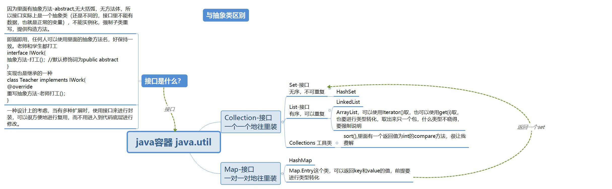

上一篇：[使用Arraylist进行统计]()

# Map基础

| 知识点                                                       | 疑问                                                         |
| ------------------------------------------------------------ | ------------------------------------------------------------ |
| Map是一个接口，HashMap是一个实现类                           | 哈希值是什么意思                                             |
| 不能hm.getKey()，在HashMap里看到toString()方法，是直接getKey()+"="+getValue(),有final关键词修饰 | 1、final什么意思，干什么的  2、不需要对象就可以直接调用getKey(),这是静态方法的使用手法，Map里有interface Entry<K,V> { K getKey();V getValue();其他的}，接口Entry是啥 |
| java.lang.Object转换时必须得转成类，Integer可以，int 不可以  | 父类Object下面的关系，   public class Object，类 Object 是类层次结构的根类。每个类都使用 Object 作为超类。所有对象（包括数组）都实现这个类的方法。 |
| Map.Entry类中还有setValue()方法，可以改变值，无法改变键    hashMap的`**entrySet**()方法` 返回此映射所包含的映射关系的 [`Set`](http://tool.oschina.net/uploads/apidocs/jdk-zh/java/util/Set.html) 视图。 | 一个不包含重复元素的 collection。更确切地讲，set 不包含满足 `e1.equals(e2)` 的元素对 `e1` 和 `e2`，并且最多包含一个 null 元素。正如其名称所暗示的，此接口模仿了数学上的 *set* 抽象。 |
| Map中不会有重复的键，所以改变一个值的方法就是重新放入这个键值对，值改变即可 | hashMap.get(ch)，可以直接取出这个key键对应的值？ `**get**(Object key)`             返回指定键所映射的值；如果对于该键来说，此映射不包含任何映射关系，则返回 `null`。 |
|                                                              |                                                              |

~~~java
public static void main(String[] args) {
        HashMap hm=new HashMap();
        hm.put("a", 12);
        hm.put("c", 13);
        hm.put("e", 12);
        System.out.println(hm.size());
    
        Iterator i=hm.entrySet().iterator();
        while (i.hasNext()){
            //i.next()只是取出了一个东东，至于这个是啥，得强制说明
           Map.Entry mp= (Map.Entry) i.next();
            //都只能用系统大类，Integer，不是int
            String key = (String) mp.getKey();
            Integer value=(Integer)mp.getValue();
            System.out.println(key+" : "+value);
        }
    } 
~~~

> - `public static interface **Map.Entry<K,V>**`         
>
>  映射项（键-值对）。`Map.entrySet` 方法返回映射的 collection 视图，其中的元素属于此类。获得映射项引用的*唯一* 方法是通过此 collection 视图的迭代器来实现。这些 `Map.Entry` 对象*仅* 在迭代期间有效；更确切地讲，如果在迭代器返回项之后修改了底层映射，则某些映射项的行为是不确定的，除了通过 `setValue` 在映射项上执行操作之外。 

> Map类提供了一个称为entrySet()的方法，这个方法返回一个**Map.Entry实例化后的对象集**。接着，Map.Entry类提供了一个getKey()方法和一个getValue()方法，因此，上面的代码可以被组织得更符合逻辑。举例如下：   
>
> ~~~java
> Map map = new HashMap(); 
> Iterator iterator = map.entrySet().iterator();  
> while(iterator.hasNext()){        
>     Map.Entry entry = (Map.Entry)iterator.next();         
>     Object key = entry.getKey();         
>     Object value = entry.getValue();
> } 
> 
> ~~~

# 计数程序如何使用Map

key使用char类型，放要统计的字符；value使用int类型，放该字符出现的次数。

逻辑顺序与使用ArrayList一致，只是不需要再新建一个类。遍历时对某一个字符的判断步骤：

1. 初始状态，Map长度为0，直接把该字符加入进来，count默认为1 
2. 遍历过程中发现Map里有这个字符，count加1
3. Map遍历完后，发现Map里没有这个字符，放进来，count默认为1
4. 该字符处理完了，下一个

~~~java
static void chAndMap(char ch,HashMap hashMap){
        if (hashMap.isEmpty()){
            hashMap.put(ch,1);
            return;
        }
        for (int i = 0; i < hashMap.size(); i++) {
            //某个字符是否在Map里，在就数字加1
            if (hashMap.containsKey(ch)) {
                //直接取出该键对应的值
                Integer count = (Integer) hashMap.get(ch);
                hashMap.put(ch,count+1);
                return;
            }
        }
        hashMap.put(ch,1);
    }

    static class SortByC implements Comparator{
        @Override
        public int compare(Object o1, Object o2) {
            Map.Entry m1= (Map.Entry) o1;
            Map.Entry m2= (Map.Entry) o2;
            if ((Integer)m1.getValue() > (Integer) m2.getValue()) {
                System.out.println("前一个大于后一个");
                return 1;
            }
            return -1;
        }
    }

    static void sort(HashMap hashMap){
        ArrayList<Map.Entry> listMap = new ArrayList<Map.Entry>(hashMap.entrySet());

        Collections.sort(listMap,new SortByC());
    }

    static void print(HashMap hashMap){
        Iterator i=hashMap.entrySet().iterator();
        while (i.hasNext()){
            Map.Entry mp=(Map.Entry)i.next();
            System.out.println(mp.getKey()+":"+mp.getValue());
        }
    }
    public static void main(String[] args) {
        String filePath="C:/Users/Lenovo/Desktop/CharactorFrequcyStatistics.txt";
        HashMap hashMap=new HashMap();
        try{
            BufferedReader br=new BufferedReader(new FileReader(filePath));
            String str=br.readLine();
            while (str!=null){
                for (int i = 0; i < str.length(); i++) {
                    char ch=str.charAt(i);
                    chAndMap(ch,hashMap);
                }
                str=br.readLine();
            }
            br.close();
            sort(hashMap);
            print(hashMap);

        }catch (Exception e){
            e.printStackTrace();
        }
    }
~~~

| 程序运行错误、问题                                           | 解决方法                                     |
| ------------------------------------------------------------ | -------------------------------------------- |
| 文本文档里的语句，最后不包含回车吗。 java中readline()方法读取文件时，会删除行末尾的换行符。在做正则表达式匹配统计空行等信息的时候需要注意。 | 知晓即可，readline()方法看到换行符就停止     |
| 文本文档编码为utf-8，第一行的第一个字符是/ufff，BOM头        | 暂时未找到解决方法，也许换个文本编辑器       |
| 排序功能未实现，还是对比较器的那个方法不理解，大于返回1、小于返回-1、等于返回0，为啥还是没排呢？ |                                              |
| Map不是Collection里的，所以不能直接用Collections.sort(列表，比较器)方法 | new ArrayList<Map.Entry>(hashMap.entrySet()) |

> 
>
> 首先介绍一下“回车”（carriage return,’\r’）和“换行”（line feed,’\n’）这两个概念的来历和区别。在计算机还没有出现之前，有一种叫做电传打字机（Teletype  Model 33）的玩意，每秒钟可以打10个字符。但是它有一个问题，就是打完一行换行的时候，要用去0.2秒，正好可以打两个字符。要是在这0.2秒里面，又有新的字符传过来，那么这个字符将丢失。于是，研制人员想了个办法解决这个问题，就是在每行后面加两个表示结束的字符。一个叫做“回车”，告诉打字机把打印头定位在左边界；另一个叫做“换行”，告诉打字机把纸向下移一行。这就是“换行”和“回车”的来历，从它们的英语名字上也可以看出一二。  
>
> ​    后来，计算机发明了，这两个概念也就被般到了计算机上。那时，存储器很贵，一些科学家认为在每行结尾加两个字符太浪费了，加一个就可以。于是，就出现了分歧： 
>
> - Unix 系统里，每行结尾只有“<换行>”，即“\n”；
> - Windows系统里面，每行结尾是“<回车><换行>”，即“\r\n”；
> - Mac系统里，每行结尾是“<回车>”，即“\r”。
>
> ​    一个直接后果是，Unix/Mac系统下的文件在Windows里打开的话，所有文字会变成一行；而Windows里的文件在Unix/Mac下打开的话，在每行的结尾可能会多出一个^M符号。