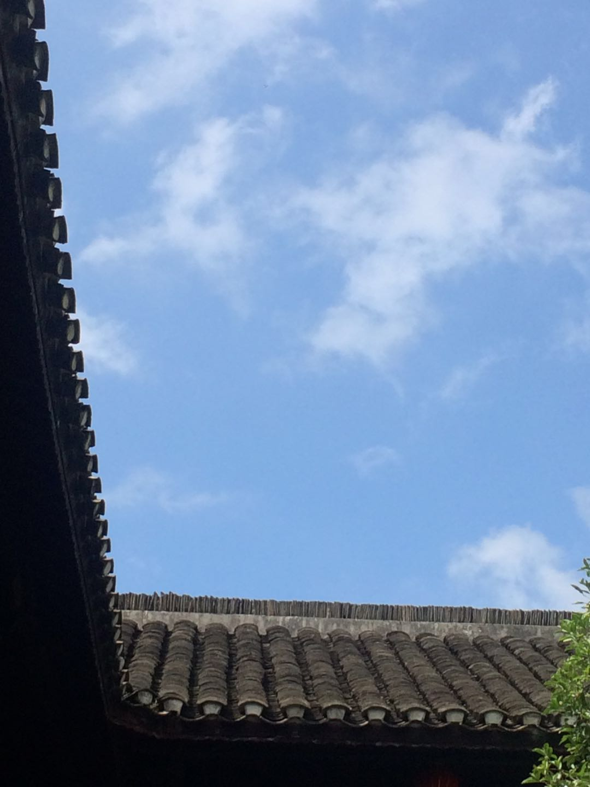

如何早起，先直接给方法。听到闹铃响后：

1. 用**坚强的毅力**踢开被子
2. 用**坚强的毅力**坐起来
3. 用**坚强的毅力**把脚放到地上
4. 再用一点点努力，站起来离开床

好，起床成功！这个时候头一般还是晕的，梦境似乎都还在继续，身体还在渴望着温暖舒适的被窝。别回头，走到卫生间去用冷水洗个脸。如果你所在的城市早上空气还不错，就打开窗子，吹吹小风，看看远方渐亮的天色。之后就可以去做你早起要做的事了。

无事可做？那你干吗要早起。。。

三个方式找到目标和方法：why、what、how，也就是为什么要早起、早起要做什么、怎么早起。

拿我自己举例，**为什么要早起？**因为我只有早上的时间是可以确保的。白天要工作，晚上经常加班不知道会到几点，回来后往往是已经累得不想动弹，只想赶紧洗澡睡觉，没有精力去做别的事情。

**起床后做些什么**，这个因人而异，可以做自己喜欢的事情，和必须得去做，而平常却抽不出时间去做的事情。对我而言，目前就是运动、看书、背诵、写日记、写文章。早上的时间非常宝贵，一下子就没有了，所以效率会非常高。这个时候不论是背诵还是写作，思路都非常清晰，大脑也很配合，《千字文》、《长恨歌》还有《春江花月夜》我都是每天早上花10分钟一段一段背下来的。

**如何早起**，具体方法见文章开头。对于早起，要抱有一种**清零心态**。也就是晚上无论几点睡着，是不是失眠了或者工作到很晚，都不管，只要闹钟响了就必须起床，不能用没睡够多长时间做理由不起。因为这会儿的补眠效果并不大，一旦打断了早起的连续性，再重新归队将会非常困难。可以起来把日常做完，再小睡一会儿，或者挨到中午的时候再午睡、当天晚上早点睡，反正就是不可以晚起。

身体的记忆和生物钟非常奇特也非常好用，但它们就像无组织无纪律的小兵，必须得严格训练控制它们。我现在每天5点50多总会自己醒过来，还是很困，但脑袋就是会自己醒，看下时间，再眯一会儿等闹钟响了起床。

我和一群小伙伴在一个400多人的群里，每天早上都会发**早+数字**打卡，我六点起来打卡，一般都是排到**早20**左右，我有时候会看看前面的小伙伴，最早的一位是4：30，发早1，而几乎每次都是她第一个。而每次看到还有这么多早起的同伴相互鼓劲，起床也更有动力。

说到早起，就必然要对应一个问题——如何早睡。试试连续几天早起你就知道了，等到晚上，过了23点就会困得不行，身体无法移动，大脑无法思考，只想躺倒，陷入黑甜的睡梦里。这会儿你就是想晚睡，那也是做不到的。

写在最后的前提，**一定要有前提**：你早起是为了做什么事情，如果找不到这个目标，早起也是坚持不了几天的哦。

