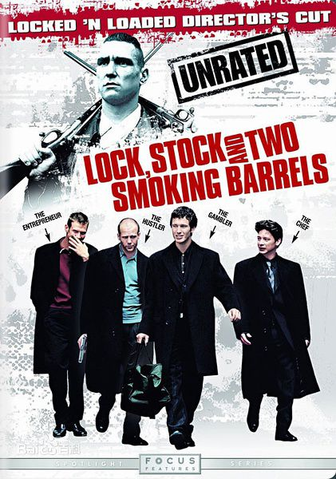
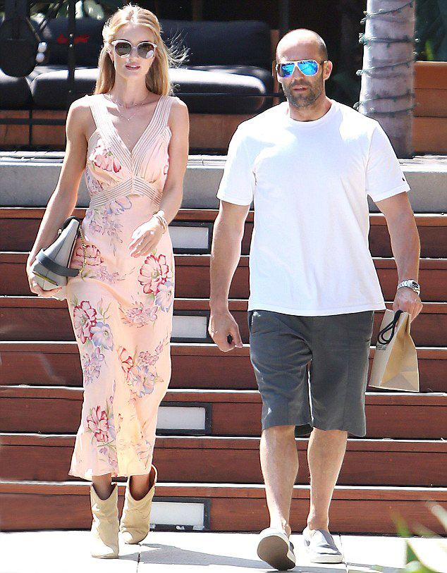
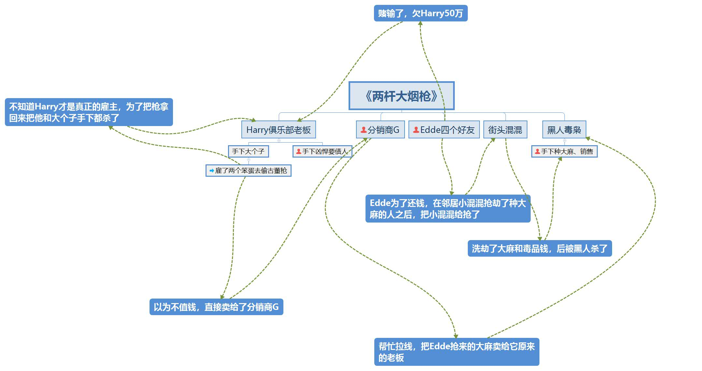

《两杆大烟枪》,看这部电影推荐戴耳机，因为里面是口音很重的英式英语发音，外放看着字幕总感觉对不上。。。还有，电影的颜色就是偏黄黑色，不是你的下载版本有问题。

> 《两杆大烟枪》是由盖伊·里奇自编自导，杰森·弗莱明、德克斯特·弗莱彻]、杰森·斯坦森、尼克·莫兰领衔主演的犯罪喜剧片。该片于1998年8月28日在英国上映。

演《机械师》的杰森·斯坦森，在这部电影里演一个在街头贩卖赃物的小贩。看花絮介绍，这是他以前的真实职业。现在他已经成了大明星，还娶了超级美女、英国名模Roise Huntington-Whiteley 。

这部电影里的人物关系非常混乱，谁和谁是仇家都说不好，我按着记忆梳理了一遍，应该是有这五条线上的人物。

最后的结果除了前面标了小红人的得以幸存，其余人全都死于火拼，还都是误会的火拼。

这部电影的标题《两杆大烟枪》，指的是两把即将拍卖的古董长杆猎枪，估值30万英镑。这两把猎枪除了黑人毒枭没有与它产生过交集，其他人都短暂地拥有过它们。

可是只有派人去偷枪的俱乐部老板Harry和他的大个子手下，知道这两把枪的真实价值，其他人用着它们的时候还在嫌弃它们太旧、枪杆太长。只把它们当作武器来用，并不知道它们本身就是一大笔财富。

因此这两把枪在电影里只是一个道具，最可乐的是**循环抢劫**这个桥段。黑人毒枭手下有种植大麻的科学家，一天街头混混去把他们给抢了，当混混们欢天喜地回到工作室时，被Edde埋伏也给抢了。

而Edde抢来的毒品，准备卖给黑人毒枭，他们自然不知道这就是原主。而此时的黑人毒枭已经满腔愤怒，准备来团灭抢了他毒品的人。更多的内容就不透露了，我是看了三遍才慢慢弄清楚。里面的歌也好听啊，《Boss》、《Man Machine》等等。

有张电影海报里写“A disgrace of criminals everywhere”,罪犯们的耻辱，是说这犯罪过程太随机太无组织吧。

黑色冷幽默，全程好多笑点。几个主演的服装也很有特色，黑色中长大衣，脖子上一条黑围巾，黑色皮鞋。

推荐指数，5颗星。