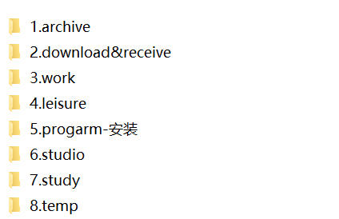
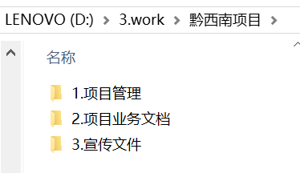
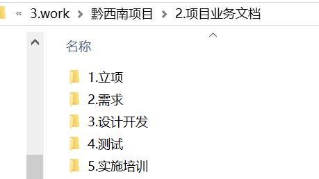

今天新整理了一下，电脑就只有两个盘，所有文件放到D盘，计划每周备份。

### 整理后如下图所示：

### 说明

1. 个人资料备份，比如身份证、学历复印件，手机备份资料，密码统计等；
2. 下载和接收文件的地方，将浏览器、百度网盘、微信、qq的默认存放地址都改在这里，安装完后安装包及时删除，不好下载到的留着；
3. 工作相关，按项目分成不同的二级文件夹，在里面按照项目的不同步骤进行区分；

4. 休闲娱乐，按照电影、音乐、照片等分开存放；
5. 各种软件的安装目录；
6. 代码项目的存放地点，包括设计和编码实现，以及技术相关的文献资料视频等；
7. 除专业技术以外的学习内容资料存放；

### 目前的问题

之前很多安装的软件无法直接移动文件夹路径，只能删了重装，这个工作量有点大。并且好多的安装过程不记得了，又得一步步的按照教程来做。

找个时间来做或者重装系统。

资料的云端或者硬盘备份问题。

