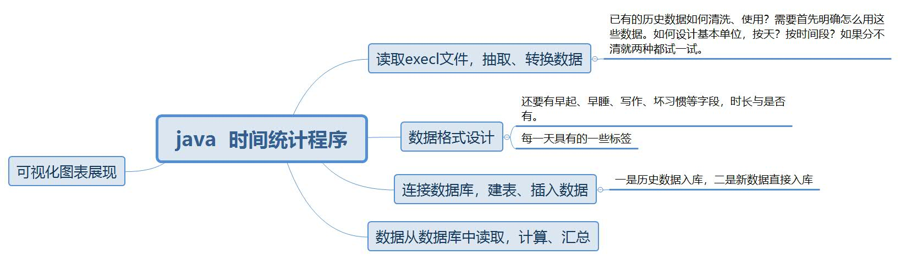
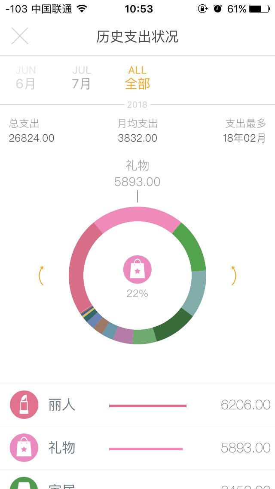
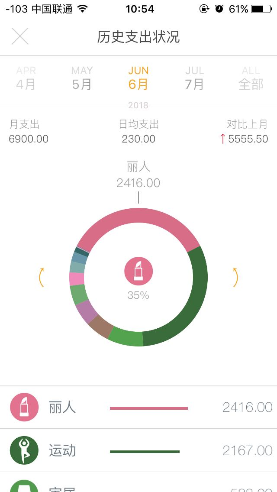
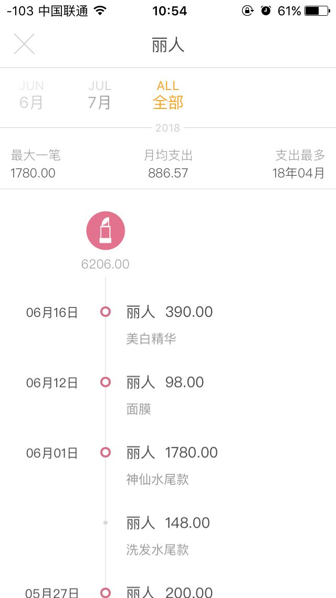

| 现状                                                         | 期待结果                                         | 差距、技术如何实现                |
| ------------------------------------------------------------ | ------------------------------------------------ | --------------------------------- |
| 数据记在execl表格里，每周为一张sheet，到了新的一周就得复制改名 | 直接生成一年的所有的周的sheet                    | 使用java生成一年所有所有周的sheet |
| 日期的写法为有小数点的数字，在4月10日，写成4.10后表格会直接判定为4.1，必须自己强制转换文件格式为文本才不会变化（不能强制小数点为两位，因为有4月3号这样的个位数日期） | 直接自动生成所有日期，格式统一为180712           | 同上                              |
| 数据的统计维度单一，就是求和后算出百分比，并且一次只统计一周的数据，想统计一个月的，就得把一个月的时间记录多次复制出来后汇总 | 直接使用程序语言来决定调哪个维度与哪段时间的数据 | 数据模型的确认与结果的对应核查    |

| 关于最终效果的想法                                 | 如何实现、工具、软件      |
| -------------------------------------------------- | ------------------------- |
| 展现使用图表，每周维度、每月唯独、不同行为之间维度 | pycharm                   |
| 数据结构用两种思维，一个是数据库，一个是数据标签   | mysql、另一种数据库？待定 |
|                                                    |                           |

| 序号 | 日期   | 特殊日子、生日 | 行为 | 时长  | 6：00起 | 23：30睡 | 坏习惯 | 颜色 | 星期 |
| ---- | ------ | -------------- | ---- | ----- | ------- | -------- | ------ | ---- | ---- |
| 1    | 180714 | 否             | 睡觉 | 6h    | 是      | 是       | 否     | 粉色 | 六   |
| 2    | 180714 |                | 运动 | 1h    |         |          |        |      |      |
| 3    | 180714 |                | 阅读 |       |         |          |        |      |      |
| 4    | 180714 |                | 工作 |       |         |          |        |      |      |
| 5    | 180714 |                | 写作 |       |         |          |        |      |      |
| 6    | 180714 |                | 其他 |       |         |          |        |      |      |
| 7    | 180713 |                | 睡觉 | 7h    |         |          |        |      |      |
| 8    | 180713 |                | 运动 | 50min |         |          |        |      |      |
| 9    | 180713 |                | 阅读 | 2h    |         |          |        |      |      |

### 初步分析数据

按一个数据库来存储是不合理的，比如有些是一天只会有一个字段，而行为却会有多个字段

改进如下：

#### 表1

| 序号 | 日期       | 星期       | 睡觉时长     | 阅读时长 | 运动时长 | 写作时长 | 工作时长 | 剩余时长 | 以前分类（娱乐、洗漱、单人休闲、多人休闲） |
| ---- | ---------- | ---------- | ------------ | -------- | -------- | -------- | -------- | -------- | ------------------------------------------ |
| 1    | 180713     | 五         | 7h           | 2h       | 50min    | 1h       | 6h       | ,,,      |                                            |
|      | 当年多少天 | 当年第几周 | 该周的第几天 | 心情颜色 | 坏习惯   | 成就     | 失误     | 教训     | 扩展1                                      |
|      |            |            |              |          |          |          |          |          |                                            |

这个表的字段可以继续列下去，一天就为一行数据。这样来设计数据库表是否可行？想想timi记账是怎么做的。

### 竞品分析

1. 金额录入
2. 当月明细支出
3. 当月按分类支出，日均支出、总数与上月对比
4. 全年按分类支出、月均支出、支出最多月份