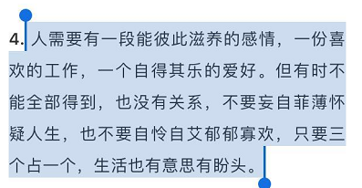

行为瘫痪，就像被吓住的傻狍子一样，无法行动，无法思考。

每次在人多的场合我就类似于失语症状，不知道说什么合适。太严肃的怕冷了场，开玩笑又怕没了轻重，显得自己轻浮或是落了别人的面子。这种自我的怀疑让我信奉了一个原则——宁愿不说，不要说错。这样其实我不知道对不对，没有验证过，就是紧紧闭着嘴不说话。最多就是跟着别人的话附和着点点头，或者微微笑。

这样很累，在不停地消耗着自己的能量，因为总听着别人说，是很费心神的。可自己又不说，这样就是双倍的消耗。让我越来越不想和人交流。内向者定义为在与别人交往是消耗过程，对我的确如此。就像大坝，平常的积累，比如阅读和思考，就像在蓄水，一旦和别人说了些，就全泄出去了。

问题存在于一是积累过于单薄，不成体系。二是我总收到无用和负面的反馈，使得我一再迷失方向。

刚刚照镜子，发现眉毛中间的川字纹好明显，这个表情可一点都算不上亲切与青春。是工作太忙，也是内心沉重。今天刚在改变自己微信公众号里看到一句话：

三者占其一即可。我想了想我自己，的确只占一种。生活有意思有盼头吗？偶尔有吧。川字纹都出现了，说明开心和无忧愁的时刻太少。看了那么多书，我越来越懂自己成为某领域专家的可能性越来越小，但我起码想让自己可以乐观点、一年中的日子感觉开心或者中立的日子多过不开心的日子。

这一点来统计试试看，今天开心的话，标记的颜色为粉红色，不开心就是灰色，中立就是绿色。于是在我的时间汇总项目里，每一天的数据模型里又增加了一个字段：颜色。

遗憾都成了秘密，过往也不值得回忆。说是未来可期，可未来在哪里？

害怕、沮丧和消沉，让我昨天回到家后看了一晚上的无脑电视剧，躺在那里其实一点也不想继续看下去。可做别的事情好恐怖，要去面对自己的无能和短板，躺在沙发上放空似乎是个更好的选择。今晚回来后差点也成了那样。今天不想去做，明天继续找借口，那事情永远也开始不了。

既然在明天我会后悔为什么今天不行动，那我今天就动起来吧。尽管还是很无能，还是很没用，不过也是一种积极的姿态，做给自己看看。别在日记本上写今天的成就：无。

高山仰止，景行行止。这么好的句子，那么好的榜样，是会让我想要追赶，追赶不上会很气馁。还差积累，还差时间，还差经历。我每每这样安慰自己，好像并没有什么作用。因为成就感也是我所追寻的，它比别的奖励都更能让人上瘾。放弃对它的追求，就像强制让自己闭上眼睛，别去看这个世界的表象。

长到三十岁，心理还像个未成熟的小孩子，在这个冷酷的世界里存活真是可怕。在这个世界里，往往是陌生人会给更多的温柔和鼓励，而身边的人却倾向于持续的否定和打击。近而不逊吗？有一定的关系，耐心总会没有的，当耐心没有的时候，笑脸也就不再有了。

以前总想在结尾做一点层次上升，起码要是*光明的结局*，积极向上。但在博客里似乎就是更想直抒胸臆，看公众号的人少，看博客的人更少。我就写给陌生人看，其实还更没有压力。写完我继续去做我的java程序，这是我目前最能找到成就感和克服行为瘫痪的事了。