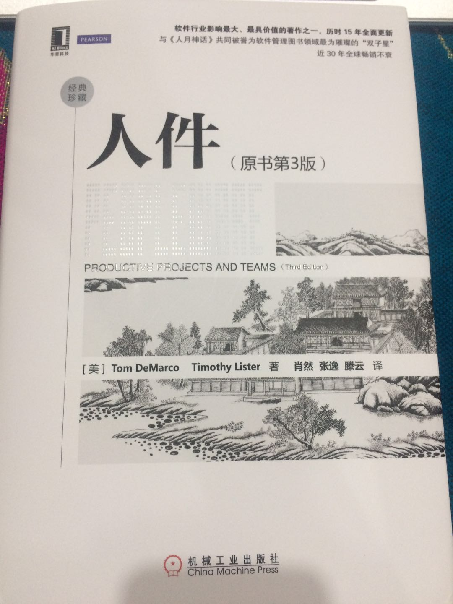

知道这本书是在看苏杰的《人人都是产品经理v1.1》，他同时提到了《人件》和《人月神话》这两本书，名字非常独特，于是我就去亚马逊网站上搜索了一下。原来这两本书都是关于软件工程的。大概看了一下简介，介绍里说这是两本畅销已久的经典书籍，软件工程相关人员必看之书。而我作为这个专业毕业的人，居然之前都没听过这两本书，太惭愧了。于是立即下单买之。

这两本书都没有电子版，只好买了纸质版的，还都不便宜，都是接近70元的精装版。两天后收到书，先看了下包装，《人件》的装帧和排版我都很喜欢。而《人月神话》的排版实在太丑了，每一页的上下左右空白太多，又是A4开的大书，只翻了翻没看下去。

《人件》这本书我第一遍看完用了三个小时，真是意犹未尽。看这本书得到的乐趣，是读书能够得到的最大的那种乐趣——海内原来真的存知己。很多想法你没看到这本书前，以为只有你自己有，还会怀疑自己的这些想法是不是不正确或者太荒谬，而你看到这本书的时候，发现居然有人和你有一样的想法，并且他们写出来后还得到了很多人的认可。也就是说你的思想并不是孤独的，真的有人可以懂你，即使只懂一点点，即使你和作者从未谋面，也能在思想的层次达到共鸣。

在读这本书的过程中，我反复想起的一句话就是，这真的是一本畅销书？它居然不是一本禁书？！

这种想法的来源在于读到这本书的精彩之处时，会发现这些都是以往只能偷偷感慨的，不能拿到明面上评价和讨论的观点，甚至书里内容都不适合截图发到朋友圈，是那种“人人都模模糊糊知道，可人人都不会明着说出口”的观点。具体是什么我也不说了，感兴趣可以自己看看这本书。就像保罗·格雷汉姆*Paul Graham*的《 *what you can not say*》这篇文章提到的，有些话只适合自己知道，不适合说出来，因为一旦说出来，会给自己带来很多麻烦，妨碍去做自己真正该做的事。

看完第一遍后我去着重看了一下作者是做什么的，想知道为什么他们敢这么直抒胸臆，写常人所不敢写。原来他们俩都是咨询公司的咨询师，专门给组织指出问题和毛病，再提出解决方案的。所以他们的发言顾忌很少，还有大量的实际数据作为支撑，底气十足。

《人件》这本书的英文原名是：*Peopleware ——Productive Projects and Teams*

我的理解：因为**软件**的英文单词是**Software**，所以**Peopleware**这个词就翻译成了**人件**。而peopleware这个词是作者自己造出来的，用来与他在书里的观点相呼应——人，而不是技术，才是软件工程管理中最大的问题。书里的管理思想并不仅仅只限制在软件工程领域，而是对之前我们所了解的国外管理学和管理概念的一种颠覆，属于很小众的观点。

《人件》这本书别看名字和所涉及的行业看起来很高深，但是内容非常浅显，行文也很幽默，说是**高级吐槽书**也不为过，看着很欢乐很减压。而在看这本书的时候，又让我想起另外三本书来，一本是瑞·达利欧的《原则》，一本是《易经》，还一本是《庄子》。

为什么是这三本书呢？把人的因素置于首位，或者说重视人的因素，不把技术奉为神明，不认为技术可以解决一切问题，这种观点并不新潮，因为我们的古代经典著作里有很多这些方面的论述，例如“君子不器”，庄子里的《在宥》、《秋水》等等，都是不重有形的下而重视无形的上。更不提近代的*思想工作*也是重中之重。只是我们大多数人不在组织内，没有这么明显的感受而已。

《原则》就更是把**人的因素**、机构的因素、文化的因素列为工作原则的*三驾马车*，只是《原则》写得像是名门正派的宗法宝典，《人件》更像是旁门左道的不传心经，却都是殊途同归：它们均认为个人的成就需建立在团队之上，而要团队能够取得成就，每一个人又至关重要。

为了写这篇读后感，我又花了几个小时重看了一遍《人件》，还是觉得乐趣多多，划了好多标注，折了很多页脚，不过里面的内容真是不适合发出来，因为如果断章取义看了之后，只会有更多误解，我还是自得其乐吧。

