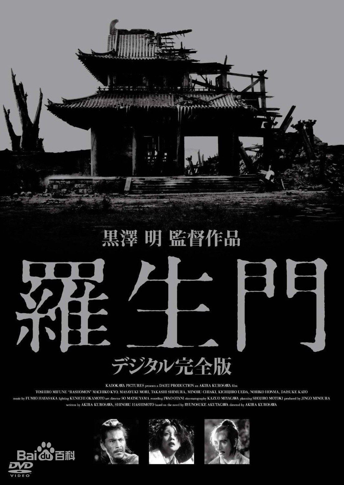

《罗生门》是一部日本的黑白电影，很多年前拍的。要不是看过这部电影，我都不明白这个词是什么意思。

电影故事发生在12世纪的日本，在平安京发生了一件轰动社会的新闻，武士金泽武弘被人杀害在丛林里。警察找到了四个证人，他们分别是樵夫、强盗多襄丸、死者的妻子真砂、借死者的魂来做证的女巫。

总共有三把武器，武士的刀，强盗的长剑和妻子的匕首。

樵夫说他捡了一把强盗和武士打斗后遗落的匕首；
强盗多襄丸说他霸占了武士的妻子后，主动提出要与武士决斗，后在决斗中用长剑杀死了武士；
死者的妻子真砂说她的丈夫想要她死，她拿着匕首晕了过去；
还魂作证的武士说他的妻子竟要强盗杀了他，他内心伤痛，用匕首自尽。

这是他们讲述的真相。不过，这是他们说的真相，他们没有说的才是这个故事的核心。

樵夫没有说他其实目睹了全过程，因为那把短刀是从他被杀死的武士尸体上拔下来的，他担心被人知道这种行为，于是当有人说武士是被长剑杀死时他就保持沉默，当说武士是被匕首杀死时他就反对；

强盗多襄丸没有说他根本不想和武士决斗，还在决斗过程中丢了长剑，最后是无意间拾得匕首杀了武士，他不想让人知道他的武器都被打掉了，于是坚持说自己是用长剑杀死了武士；

死者的妻子真砂没有说她害怕丈夫杀她，就挑拨强盗和武士决斗，自己却偷偷溜走，只说自己晕了过去，什么都不知道，醒来只看到武士已死，胸前插着匕首，把挑拨杀人的罪责推得一干二净；

还魂作证的武士没有说他也害怕和强盗决斗，不得不打起来后还输给了强盗，被匕首刺死，宁愿用自杀来掩饰自己的失败。

一言以蔽之，他们都怀着利己的目的，竭力维护自己，提供了美化自己、使得事实真相各不相同的证词。

没有人说全部的真话。为什么？为了掩盖自己一些不够光明正大的行为，认为不说或者用别的方式来说会更好一点。在这部电影里，什么是真相无法判别，因为首先，每个人说的是不是真话无法验证，其次，更可怕的是，当他们以为自己说的是真话的时候，也是他们添加了个人理解后的真相，早就不是事情的本来面目。

所以**罗生门**这个概念很有意思，它说明了一个道理：真相永远无法为人所知。即使是一个人亲耳听到、亲眼看到，他也无法知道全部的真相。在别人转述的情况下就更难判断了。

我很好奇有没有相关的文学和电影作品是讲这方面内容的，特别适合来写悬疑作品。这让我想到了以前在大学图书馆看到的一本书，书的内容是一个考古学家与他友人的书信集。

看完第一遍时我没觉得有什么惊奇的地方，开始还以为是某个真实考古学家的经历，最后他真的找到了一座还未被世人发现的陵墓，如同书里所写让所有的媒体都争相报道。我以为是传记类的文章，还真的好奇去搜了下这个陵墓和法老名称，结果却没搜到，最后才发现这本书是小说。也就是寻找法老木乃伊的过程都是虚构的，那为什么书里说还真的有一具木乃伊呢？

**带着疑问我又看了一遍，这次看完简直让我背后发凉，细想之下简直恐怖。**原来这根本不是什么来往的书信集，而是里面的主人公自己杜撰了一个友人，然后自己给自己写信，再把这些信发给报社出版，让世人知道他发现了失落的陵墓。而这个考古学家其实并没有发现什么新的木乃伊，于是最后他描写的古代制作木乃伊的过程，其实是他准备把自己制成木乃伊的步骤。

书中那具最后被媒体报道的木乃伊真正是谁，也就呼之欲出了。

这是在大学的某个冬天，我把运书的小车推到图书馆窗边的暖气片旁，坐在上面取暖看完的整本书。我不记得书名了，却还记得图书馆双层玻璃上的雾气，寥寥无人的木质书架走道，还有第二次看完后的惊悚之感。这就是一个人营造出来的罗生门，越想越觉得这个作家构思真是精妙。

一个人的思想只要不是直线形的，那么很多事情就具备了扭曲的可能性。而当一件事的参与者越来越多时，真相就更是扑朔迷离了。不仅仅是逻辑，也不仅仅是情感，而是错误的逻辑和复杂的情感构造的这个世界。

如果你曾遭遇过被污蔑或者被造谣，就会开始思考**如何证明别人说的是假话**这个问题，这个问题的难度可不小，类似于被抓进精神病院后怎么证明自己不是精神病人。

每个人诉说着自以为是的真相，却不知道在话未出口时就已经把真相做了歪曲，或是为了保护自己，或是为了保护他人，或是为了维护其他所谓真相的一致性，更别说当有人在说着刻意的谎言时。

这是认知角落的一片盲区，是我们无法逃脱的罗生门。

