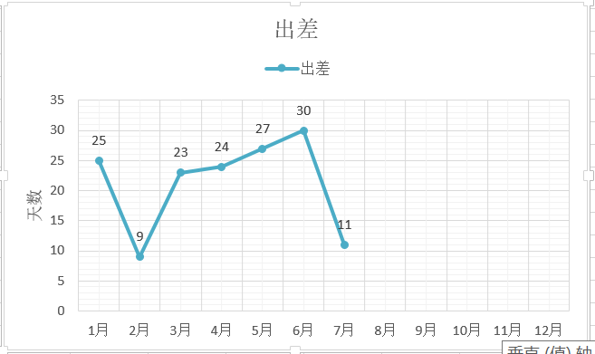
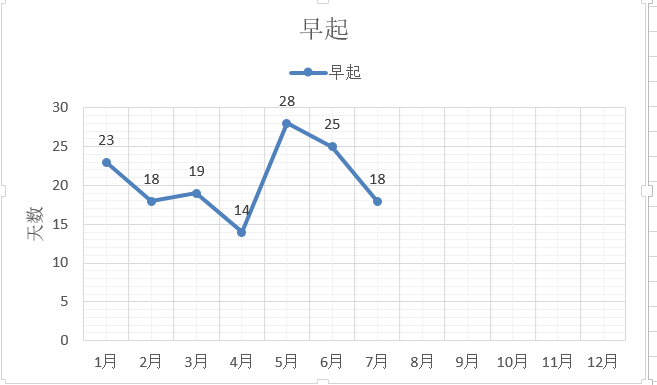
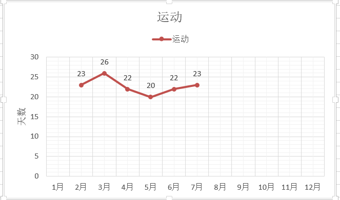
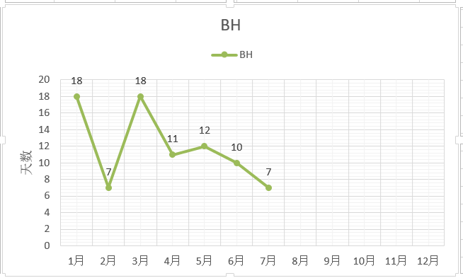
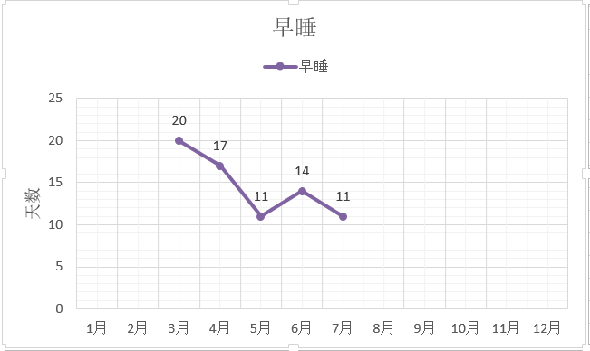
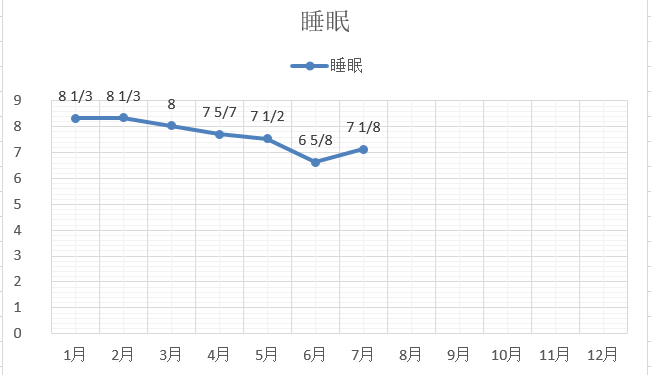
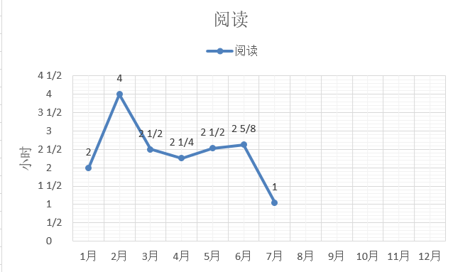
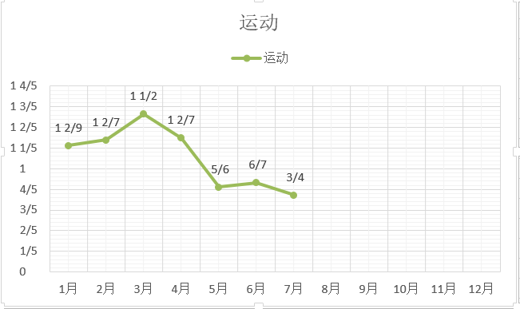
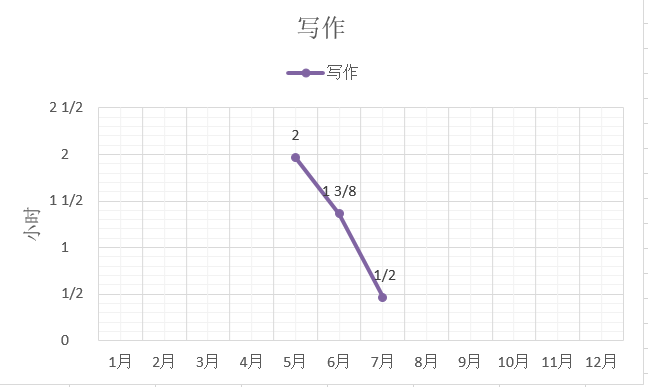

六月总结：[今年的六月我是怎么过的-数据来说话]()

五月总结：[今年的五月我是怎么过的-数据来说话]()

[TOC]

7月一共31天，31*24=744个小时

### 生活作息

| 出差 | 运动 | 公众号更新 | 个人博客更新 | 6点起床 | 23:30前睡觉 |
| ---- | ---- | ---------- | ------------ | ------- | ----------- |
| 11天 | 23天 | 13篇       | 18篇         | 18天    | 11天        |

总结：

每月天数的变化情况：

备注：2月有春节

备注：bad habit，坏习惯

### 时间明细

各项所花费的平均每天时间变化：

备注：5月份开通微信公众号，从那时开始计录写作时间

**总结**

- 睡眠时间每月在减少，从八个小时到七个小时，强制自己早起，如果可以做到早睡，精力就还可以，不过早睡做得很糟糕，近几个月平均每月只有十来天是按时睡觉的。
- 阅读、写作、运动时间均有减少趋势，时间是花到哪里去了？
  - 进行新的项目，需要看各种行业和专业的论文与资料，没太多时间看书
  - 写作改成公众号每周更新一篇，博客不定期更新，只在最有灵感的时候写，时间花费得就少，多思多想，写不着急
  - 7月回到家后居然有一个星期是在生病，开玩笑说是水土不服，于是运动的平均时间减少

### 电影

| 7月总共看了5部电影 | 记录                 |
| ------------------ | -------------------- |
| 放牛班的春天       | 歌好听，遇见何其有幸 |
| 道林格雷的画像     | 可怕的容颜和心灵     |
| 水性杨花           | 美丽的女主角和服装   |
| 我不是药神         | 适逢其时，显真英雄   |
| 摩天营救           | 先弱后强，为了家庭   |

### 读书

| 书名             | 备注                       |
| ---------------- | -------------------------- |
| 动物凶猛         | 一整本的北京口音           |
| 万历十五年       | 常看常新                   |
| 人件             | 高级吐槽奇书               |
| 政治是什么       | 台湾作家就是敢写           |
| 中国历代政治得失 | 人物轶事为皮，政策制度做骨 |
| 季羡林谈人生     | 老者智慧                   |
| 社会性动物       | 没看完，内容陈旧           |
| 散步去           | 闲适的生活，真实的生活     |