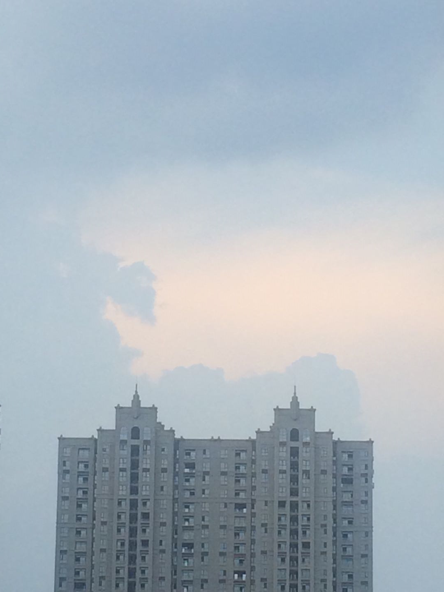

最近眼睛干涩，看书都不太敢看了，每天小心翼翼，最多看半个多小时就赶紧闭眼休息。如此一来，对于书的内容更加挑剔，新书总是先看目录，不感兴趣的绝不翻过去看，这样断断续续也看了好几本书出来。

其中有一本是久负盛名的《怦然心动的人生整理魔法》，里面提到，决定物品的去留时，要把同类的物品先全部摆出来，再一一用手触摸，去感受对这件物品是否会有心动的感觉。我对作者所说的**心动**的理解是，如果这件物品此时是在商场陈列着，你还会愿意花钱把它买回来吗。**再一次选择的机会**，多么难得啊，如果真能再次选择，估计十分之九的东西不会买，也就是说现在所拥有的十分之九的东西，都不是内心真正喜欢的，是可以丢弃的。

日本人写的书，翻译过来里面一般都有很多敬语和感谢的话，即使是一本教人如何整理的书也是如此。比如作者说她在决定一件衣服该要丢弃的时候，会对衣服说：“谢谢你一直以来的照顾，让我穿着得体。”或是买了一件不合适的衣服要丢弃它时，对它说：“谢谢你让我买下你，让我知道了这种类型并不适合我。”感谢完后就可以丢掉了。

于是又有了**一个好好说再见的机会**。初看书时觉得这种做法相当做作，不过作者做得理所当然，也会不知不觉间影响到看书的人。将每一件物品赋予人的情感，在一起时好好珍惜爱护，分开时诚挚感谢，说声珍重后相忘江湖，这种态度让整理这么一件俗气的事情都充满了潇洒的意境。

对于书的整理，作者提出的建议也很有意思，认为书看完后就可以丢弃了。这也让我思索良久，毕竟扔书是很少见的，于是想到了书存在的使命。

一本书的意义在何处？**每本书都是信息的载体，书里的文字让人阅读，里面的信息被记录、被理解、被内化后，这本书的使命就已经完成。**继续留下这本书，是为了当对书里的内容遗忘时可以再次回顾。一本书的内容越精深，内涵越多重，重读时激发的想法越多，才越值得保留。

就像《自私的基因》里讲到的一个概念，**人只是基因的载体，人存在的使命就是完成基因的传续**。书的使命完成后，或被转赠，或被二手卖掉，或被收藏到书柜深处，或被直接丢弃。没人会去在意一本书的情绪和心情，哪怕它装帧再精致，排版再华美，信息传递这一使命完成后，它的存在价值就已不在。

而人不同，人虽然做着基因的载体，却并不自知这一使命，而是自认为有别的目的。或是出人头地，或是做一番事业，或是浑噩度日，或是体验和享受生活，或是按照他人的期待度过一生……人的使命从大自然的角度是唯一的，从个体来说却是主观的，只有自己才能决定自己的使命。

每次新认识一个人，就会为这个人截然不同的生活方式和生活哲学所惊讶，人和人之间的差异，大到无法衡量，除了一些基本的喜怒哀乐能够共情，每个人之间的悲喜很难相通。**别人不理解你，才是正常的。**常说“知己难求”、“人生得一知己足矣”、“士为知己者死”，能有人理解你，那才是千万人中难得的幸运。

无人能懂时，自己更需坚定。

“我活着是为了什么？”一千个人会有一千种答案吧。每天清晨起床，吃早餐，上午工作或学习，中午吃饭，下午继续工作或学习，接着吃晚饭，晚上休息或者继续工作和学习。日复一日，年复一年，每天时间的框架都是一样，里面的内容却是千人千面。使命同样如此。

自由意志，未完。

