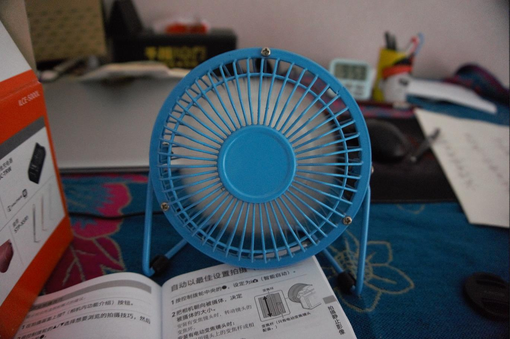
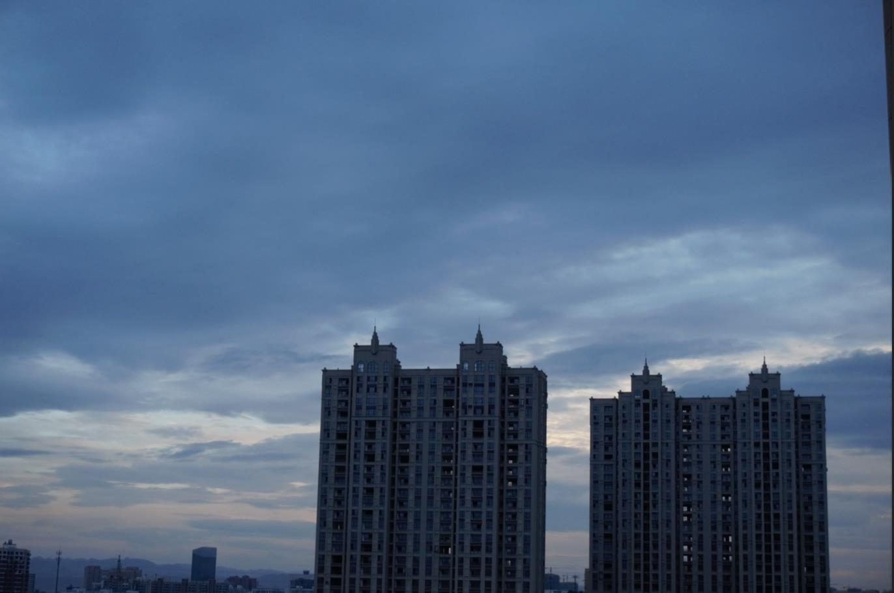

找朋友借来了相机，想拍拍风景和人物的照片，跟着说明书把每种拍照模式熟悉了一遍，于是拿着拍了拍家里的陈设还有窗外的景象。朋友的这款相机是sony的微单，几年前的款式，最高像素是2010万。拍完后取出sd卡，放到电脑上来看大图，居然选不出很喜欢的一张。

是拍的景色不够美吗，还是我的技术不好拍得不美？于是我开始重新审视镜头下的陈设和景色。

家里的装修为了跟风和省事，都用的是素色和浅色，也就是北欧风啦，极简风啦。自己看着觉得还挺适应，买东西时说要从简，别买太多，最后还是把家里都摆满了。电视、空调、沙发、茶几，这些都是必不可少，再加上懒人沙发、我的书架和河马座凳，客厅就更显得小了，还有沙发上沿摆满的一溜动物玩偶。颜色极简了，物件还是冗杂。

可家里不就是要东西多多吗，这样才有温馨感。于是温馨与整洁出现了冲突。我在某本书里看到这样一个说法，只有真正眼界广阔的人，家里的装饰都是他们走过足迹的见证，会有东西方文明的各种建筑细节和摆件。在一栋房子里，会有各式各样的物品，风格迥异，充斥其中，丰富而不凌乱。

我在家里推崇的所谓极简风，不过是自己眼界有限、足迹有限的体现罢了。广告限制了我对装修的定义，而家里的陈设也不过是受淘宝和店面的导购推荐口味的不同影响，我的审美，又体现在哪里呢？

或许说自己根本没有审美，比如现在的微信公众大号石榴婆，我在5年前就开始关注她，那时还只是一个没什么名气的小号，现在早已是只接奢侈品广告的公众大号了。里面讲到的很多时尚元素和购物心得，我只看过了眼，却没认真看进心，只把美人与美图当成了消遣的浏览。要从里面学习一些穿搭心得和扮靓秘诀，那是数不胜数，可我没有这种审美的偏向。

美与我有何用？我不去追求它，于是忽视了它。当我拿起相机，试图来捕捉一些美时，我发现我既找不到，也创造不出来，那我的这双眼每天都在看什么？不美的东西占据了满目，心灵又如何得以升华和洗涤？没有美的世界简直可悲，满眼所见皆为不足，多么可笑！

追寻美需要花费时间，花费心力，不可能随随便便就得到美。而是要用心选择、用心观察后才能发现。近到一个笔筒，一张桌布，远到一张帘子，一扇纱窗，不都有很多讲究吗？这还不涉及到消费升级和花钱的部分，对美还未产生感知时，谈不上金钱的作用。

所谓美，就是认真，就是投入，就是完美，就是无可挑剔。那是一种极致的精神，让人在这个荒漠般无聊的日常生活中得到的一点逃亡般享受，这是罪人的宽恕之光。没有美的世界，我们都是在如何的苟延残喘啊。对不美的视而不见，是最可笑的自我安慰。