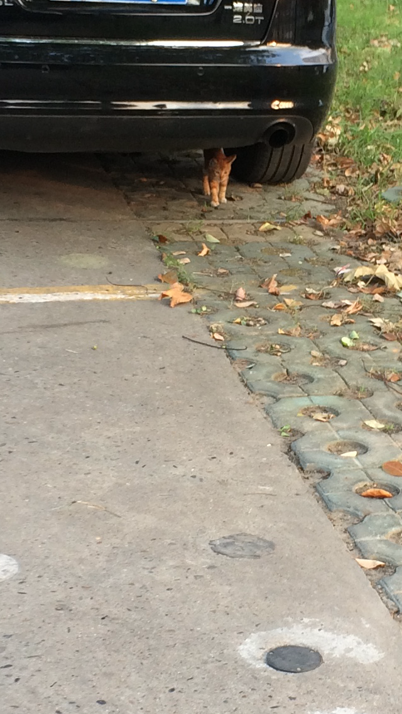

秋意凉，不需要看节气，每天推开窗就知道了，天高云淡，晚来风急，美哉。

看着秋天到了，想想今年的春夏是如何过的，有无虚度？春光已远，夏日辜负，一年走过大半，到了收获的季节，都是空空的麦穗。

空气中没有了那种挥之不去的粘腻感，这种夏天最难受的体验终于随着湿度的降低而消失，随之而来的是嘴唇和鼻腔的干燥。多余的水也随着季节的变迁不见了，它们去了哪里？

声声的蝉叫还在耳边，似乎秋季的凉风还未能让它们屈服。蓝色的天际永远不愁看不见飞过的鸽群，它们一圈又一圈的反复划过，迷失在这渐凉的城市里。

附近学校又开始了新一届的军训，这些穿着迷彩服的少男少女中曾经不也有着谁谁谁的面孔吗，共同的经历，让回忆都不具有独特性。

这是即将到来的今年的秋天，去年的秋天如何？前年的秋天如何？五年前的秋天如何？十年前的呢？都不值得回忆，回忆时也想不起什么特别的了。还不如想想那些金黄的枯叶，它们永远精致美丽。

远离了高热，穿的衣服也有了更多的选择。夏日流淌不尽的汗水也仿佛成了梦里才出现过的水露。一岁一枯，再岁而亡。我想我为什么不愿多写了，越写就越无法逃避自己的真实想法，而这些真实想法，即使不用直白的文字写出来，也会无意识的显露在字里行间。

陌生人的看好让人欢欣鼓舞，陌生人的嘲笑可以一笑了之，担心的是来自身边的人。怨憎会，就是如此。若不相逢，彼此就是相安无事的陌生人，一旦相逢，就成了有纠葛的认识的人。

有能做到不受外界看法影响的人吗？以前我也以为自己能，后来才发现自己太天真。别人的确不在乎你，自己也可以不在乎别人，可别人的评价会影响你。职业上的，人际交往上的，接纳或者排斥，还真就由那些评价构成。

“良言一句三冬暖,恶语伤人六月寒。”想这些事多让人心烦，还是登高望远吧。

城里的楼房二三十层高，站在家里已经是拔地而起几百米了，可是还不够啊。往周围看去，还是一栋栋的楼，还是一条条的街，在哪个城市看都是一样，只是把天空分割成了不同的形状。高度有限，眼界有限，这是不是现实与隐喻完美结合？

站在马路边最能感受秋天的到来，最热的时候，空气在路面上被蒸腾不均，扭曲的视野让热气变成了扭曲的滤镜。

读书的时候有寒暑假，对于夏天和冬天的变迁有格外的体会。那两段长长的闲暇时光，让这两个季节都走得更慢了。工作后四时相同，天天重复，早起，上班，下班，睡觉，每到五天一休，每到年末一次总结。春夏秋冬，在感知中也变得模糊。刚把冬衣收好，夏天的裙子又要在衣柜一角挂起，除了这温度，四季有何不同？除了越来越麻木的自己，还有越来越麻木的眼和心。

落叶值得我们为之伤感吗，并不值得。因为到了来年，它们会长得更绿，长得更繁茂。不像我们，刚辞旧岁，又来新年，一再蹉跎，辜负时光。

