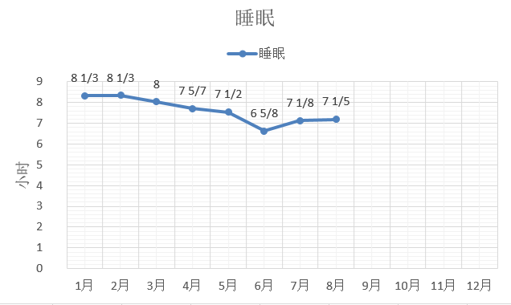
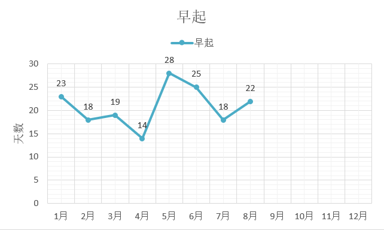
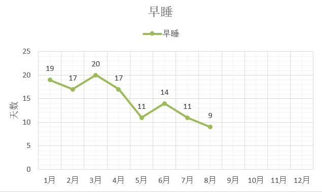

**秘密一：早起不如早睡**

**秘密二：早睡自然早起**

**秘密三：长周期来看，身体所需要得睡眠时间是一定的，如果有几天减少了睡眠时间，后面总会补回来**

睡眠时间的记录，从一月份开始，我已经持续了7个月，从每天的开始睡觉时间，到到醒来的时间，小憩和午觉的时间也记了下来。每天一汇总，每周一统计，到了月末算出平均值，和其他月份的时间进行对比。

只看这个数据，睡眠的时间在逐渐减少，从8个小时到7个小时，再少也只是刚刚低于7小时。不过这个图说明不了太多问题。还有两个，一个是早起天数图，还有一个是早睡天数图。

我定义的早起从7点到6：30，再到6：00，差不多每两个月调整一次时间，只要当天早于订立的时间起床，就算早起。早睡一直是按照23：30来记录的。

从大的趋势来看，天气热起来后，早起很容易；天气冷的时候，早睡很容易。这也和立春立秋之后的昼夜长短变化有关。天黑得早，睡得早，天亮得早，起得早。

只是每次看到23：30没睡觉的日子有那么多，就心慌慌。逼迫自己早起很容易，设个闹钟，然后放远一点，闹铃声音调大一点，早上闹钟响了就必须得下床关闹铃，自然也就起床了。可是睡觉却无法逼迫自己，睡不着就是睡不着啊。

今早起来我突然想到，为什么早起的时间会有变化，早睡的时间却不调整？单单只追求早起是没有意义的，如果没有休息好，当天的精力也并不好，心情也很受影响。重要的指标不在于早起了多少天，早睡了多少天，而在于早起与早睡的匹配天数有多少，也就是说，有多少是早睡之后早起的。

很简单的道理，晚上23点睡，第二天自然可以6点起，晚上零点睡，再强制自己6点起，那不是跟自己过不去吗？

早睡为何这么难？

一天的开始，没有多让人期待，可是一天的结束，却总是让人念念不舍。电视、手机、网络，有太多东西可以让我们不接受这一天已经结束的事实，不愿暂停的大脑，不愿暂闭的双眼，都在无限挽留着这一天的逝去。

没有做好告别的准备，哪怕只是普普通通的一天。怎么对今天说声再见呢，是真的再也不见了啊。我想去睡了，却不想让今天结束，还有什么事情没有做，还想再看本书，还想再听会儿歌，还想看着夕阳再发会儿呆。明天早起有什么不能做的吗？是啊，那是新的一天的做的事情，今天，是义无反顾地失去了。

不愿结束的日子，不愿结束的执念，如果再来一遍，会更好吗？

---

有时在整理电脑目录文件的时候，会想到大脑也需要经常清空断电。每天的睡眠就是它休息的时候，可是按照我记录的做梦情况来看，这种休息只是我们在休息，大脑可还忙着呢——做梦。

关于梦，以后有机会我也统计下，有多少天在做梦，有多少天是醒来后还记得的，然后里面的梦有多少是现实向的，有多少是古代还有未来科幻的，哪些人出现过，次数多少。

记录真是一件很有意思的事情，我用了大半年的数据，也只能得出一点点趋势推断，有一句话，“如梦幻泡影”，在记录梦境的时候特别有感慨，因为如果在刚醒的时候没把梦写下来，那么一会儿就会忘得干干净净。

