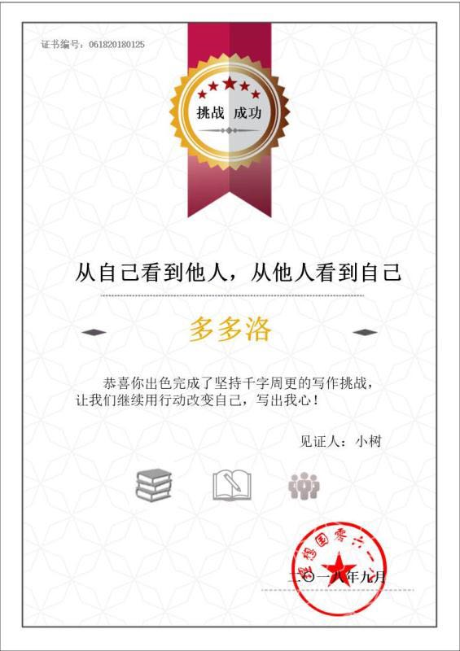

三个月的周更结束了，在群里的每个人每周必须写一篇1000字以上的文章，幸运的是我也坚持了下来。最初每周写得篇数多，后来就偷懒到一周一篇。

最开始写的时候没有特定的主题，想到什么了，看到什么了，就以此为题凑出个千字，慢慢自己也不满意，写得不好啊，不够深刻，不够真诚，对别人也没有帮助。为什么还要写？

就像朋友圈的分组功能，我目前还没有用到，想一想可以分为这几类：家人、朋友、同事、陌生人，然后每次发朋友圈时进行分组选择，谁能看谁不能看。真是麻烦啊，所以既懒得分组，也懒得发朋友圈了，还是先专注于自己的生活。

回顾这几个月写的内容，有读书笔记，有自律，有时间安排，有健身，有心情，有技术笔记，有工作感想，有抱怨，有小说，我在归类的时候很想概括，大概就是如何让自己活得更幸福，更开心。不是说每天都要大笑开怀，而是要觉得生活所赠与的，已经完全满足了自己的所需。不对自己挑剔，吹毛求疵，也不对别人挑剔，心满意足可以作为幸福的一个指标吧。

健身锻炼，长寿康健，这是幸福的基础保障，有一个好的身体和体力，是我臆想的幸福生活的基石。

早起早睡，自律控制，这是维持生活既定轨道的方法，相同的路径，相同的结果，不至于走偏。

看书学习，是为自己的焦虑和迷茫找一个出口，受困于自己的狭小视野，就从别人的角度来看看世界。

哈佛大学的公开课，也就是哈佛幸福课，好几年前这个视频就出来了，现在我开始一点一点看，每天看半个小时，是想了解怎么从体系上来学习幸福——幸福是什么，为什么要追求幸福，怎么得到幸福。

这门课有23节，每节差不多75分钟，全部看完估计要2、3个月，就当给自己报了一门夜校课程，用一个学期的时间来学习。最开始几个视频没有按照顺序，而是挑了几个自己感兴趣的话题先看，再倒回去从头开始看。这和看书一样，先看感兴趣的，再看一般吸引的，这样起码可以保证不是全部没看。

我发现想要学好一个概念，只用一点点时间是不够的，比如看一个10分钟的TED,只能说初步了解，都无法熟悉关键词和关键理论，而上课的方法，就是在一遍又一遍的重复提起中，对一个概念慢慢熟悉。回头想想，有点遗憾以前的大学上课时间，没有好好听讲。。。

最近整理工作的计划安排，整的头大，时间跨度在2个月，可以具体安排到天，用project把计划列出来，我又开始担忧——就像个人列出的计划，真的可以按照计划完成吗？每一版计划就像一个耳光，只看最后会不会耻辱地落到身上。

等到把这个幸福课程都听完，再来写一个结业报告。

