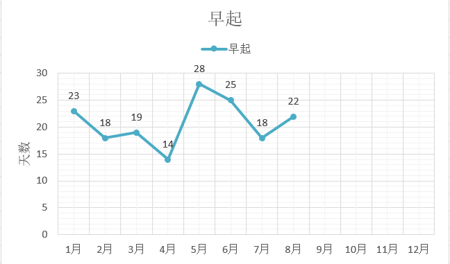
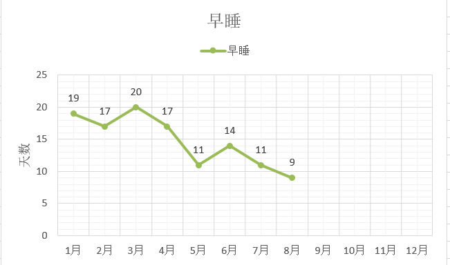
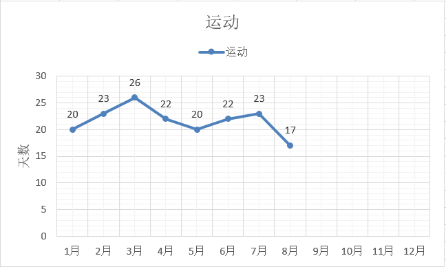
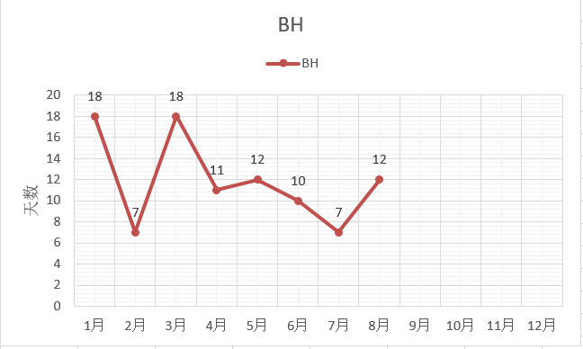
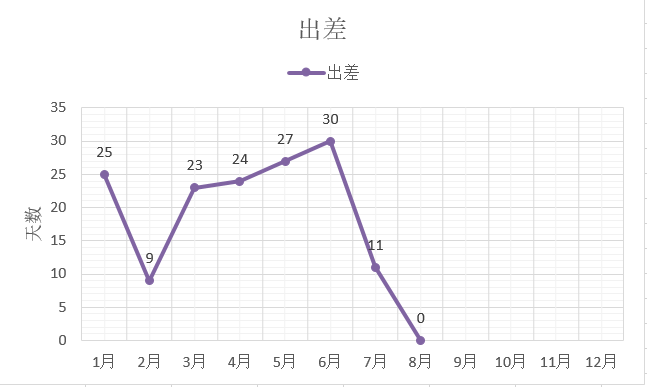
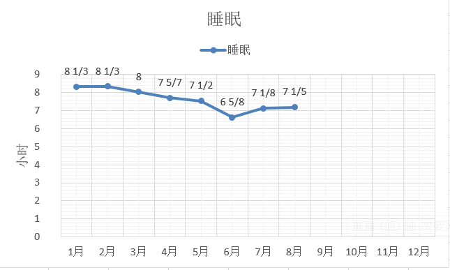
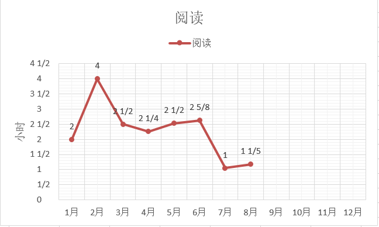
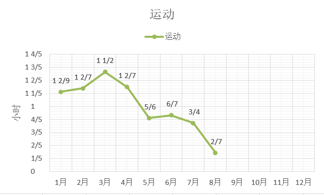
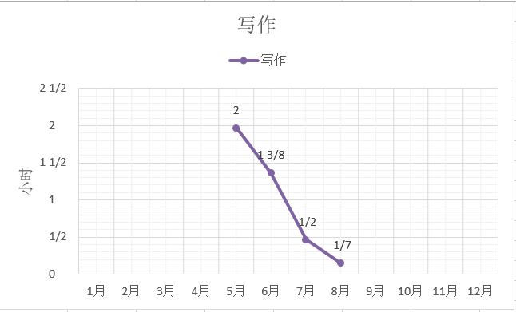

六月总结：[今年的六月我是怎么过的-数据来说话]()

七月总结：[今年的七月我是怎么过的-数据来说话]()

[TOC]

8月一共31天，31*24=744个小时

### 新发现好物

**学习助手**App，是用艾宾浩斯遗忘曲线理论，在记忆的关键易忘时间来提醒，把一个想要记住的内容作为任务添加进去，就会按照规律来提醒复习。

### 生活作息

**总结**

- 8月是堕落的一个月，在除了工作以外的时间，没有好好看书，没有好好写文章，甚至没有好好健身，在炎热的季节里找了很多借口放纵自己，沉迷于电视剧和连载小说，还有着迷于昏昏沉沉的贪睡。。。
- 在有限的读书时间里，把中国历史梳理了一遍，发现原来自己所了解的历史知识，还是太片面和太浅薄了，这种整条线的梳理耗时耗力，不过一旦弄完，收获很大。
- 在宜昌去了三峡大学的游泳馆，什么叫做下饺子，这次是了解了。没有在兴义的游泳馆体验好，一是人多，二是设施老旧，小城市的幸福生活体验在一些细节处做得还更好，不过能有人陪着游，这个棒棒哒。
- 在宜昌的这个月正好参加了单位的体检，没有什么大毛病，血脂血压什么的都正常，还是偏瘦。
- 在家吃外卖的日子，还真是有点唏嘘不已。。。

| 出差 | 运动 | 公众号更新 | 个人博客更新 | 6点起床 | 23:30前睡觉 |
| ---- | ---- | ---------- | ------------ | ------- | ----------- |
| 无   | 17天 | 4篇        | 7篇          | 22天    | 9天         |

每月天数的变化情况：

### 时间明细

各项所花费的平均每天时间变化：

备注：5月份开通微信公众号，从那时开始计录写作时间

### 电影

8月份居然一部电影都没看。。。

### 读书

| 书名                               | 备注                             |
| ---------------------------------- | -------------------------------- |
| 《中国历代政治得失》               | 看得太晚，好书！                 |
| 《季羡林谈人生》                   | 长寿文人的智慧                   |
| 《社会性动物》                     | 老旧的信息，没看完               |
| 《散步去》                         | 漫画，闲适的人生                 |
| 《从巴黎名媛学到的》               | 生活可以精致的俗气               |
| 《蒙田随笔》                       | 写得好乱，看得好慢               |
| 《怦然心动的人生整理魔法》         | 终于买到了，整理狂魔的最爱       |
| 《你今天真好看》《我可以咬一口吗》 | 漫画，可爱的朋友                 |
| 《流动的盛宴》                     | 嗯，我的朋友都是文豪，作者如是说 |