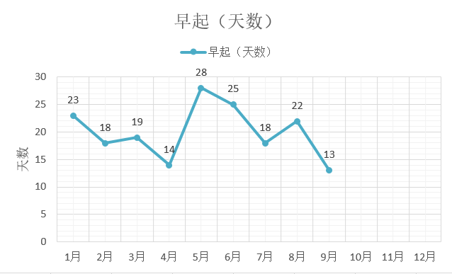
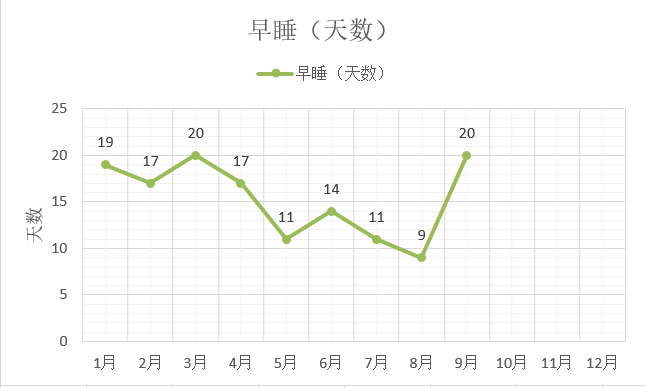
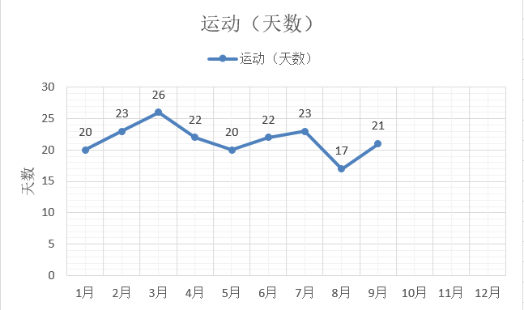
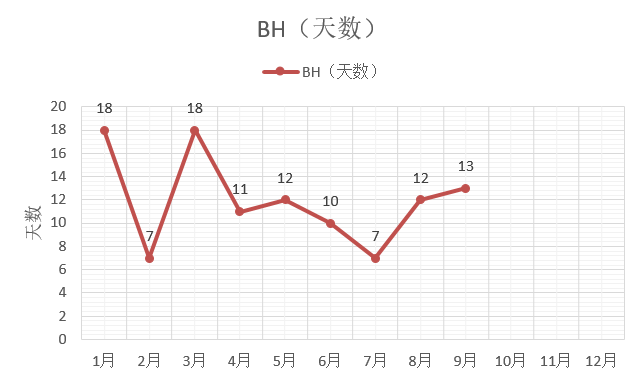
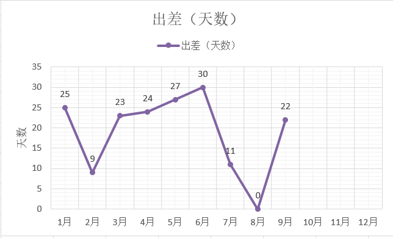
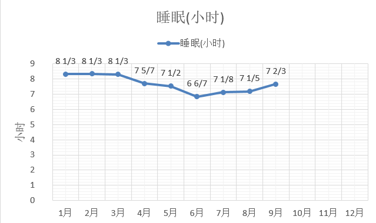
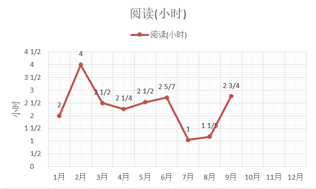
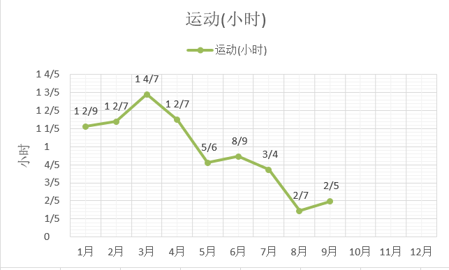
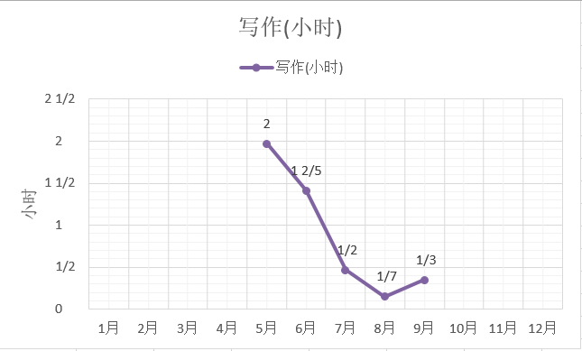

七月总结：[今年的七月我是怎么过的-数据来说话]()

八月总结：[今年的八月我是怎么过的-数据来说话]()

[TOC]

9月一共30天，30*24=720个小时

### 生活作息

**总结**

- 新养成了一个习惯，每天睡前躺在床上，闭眼做7次深呼吸，用鼻子吸气，把胸腔尽量吸满气，再用嘴巴吐气。一般7次做完后就很容易睡着了。这个月的早睡天数大大提高，这个方法很有用。
- 运动的总天数没有大的变化，可是在下半月坚持了没有“断掉”，即使很不舒服，或是前一天运动过量，还是坚持每天动一动，拉伸下也好，即使只有5分钟，可以培养每天运动的习惯，状态好的话就可以多做一会儿。
- 一次培养的习惯数量多不了，当连续运动和早睡做得比较好了，早起天数又减少了。
- 看书这个月看得比较杂，通过《三体》找到了对物理、天文学的兴趣，通过看《极简欧洲史》对古代欧洲有了更多的了解，让我想到了以前看的一本《神祇、陵墓与学者》，找回了出国旅行的期待。还有关于商业、口才、服装搭配的一些书籍，生活本就多姿多彩，如果只看到一部分实在是眼光太狭隘。
- 精简了朋友圈，删了几乎有100人，现在大概只有六十多个好友，轻松简单，也更愿意发朋友圈了，还想要写更多文章。如何摆脱他人对自己施加的影响，是一生都要去学习的功课。
- 电影最近几个月都爱看欧洲电影，很有质感与情调，生活化的那一面也很吸引人，精致不在于贵，而在于一种心态，要坚持自己的品味与风格。美国电影要少看，和现在的“奋斗说”一样，让人满是幻想，徒增焦虑。

| 出差 | 运动   | 公众号更新 | 个人博客更新 | 6点半起床 | 23:30前睡觉 |
| ---- | ------ | ---------- | ------------ | --------- | ----------- |
| 22天 | 21天天 | 4篇        | 9篇          | 13天      | 21天        |

每月天数的变化情况：

### 时间明细

各项每天所花费的平均时间：

备注：5月份开通微信公众号，从那时开始计录写作时间

### 电影

| 9月总共看了9部电影 | 记录                    | 我的评分        |
| ------------------ | ----------------------- | --------------- |
| 蚁人1              | 变小之后无敌            | 2（看一遍足矣） |
| 幽灵党             | 其实内容空洞得很        | 2               |
| 黑豹               | 强兵利器如何使用才好    | 2               |
| 大腕               | 老旧的幽默              | 1（不该看）     |
| 天使爱美丽         | 天真与纯情，难得        | 3（隔年可重看） |
| 红白蓝之红         | 退休老法官、模特、沉船  | 2               |
| 红白蓝之白         | 离婚后的黑色幽默        | 2               |
| 红白蓝之蓝         | 面对失去，有了自由      | 2               |
| 灿烂人生           | 6个小时的电影，还没看完 |                 |
|                    |                         |                 |

### 读书

| 书名                           | 备注                                             |
| ------------------------------ | ------------------------------------------------ |
| 《极简欧洲史》                 | 前两章就是精华，好书！                           |
| 《三体》三部曲                 | 天马行空，宇宙尽头                               |
| 《春秋故事》                   | 少儿版东周列国志，通俗易懂                       |
| 《揭秘MUJI》                   | 还未看完，对所有流程用文字描述，形成可传播的知识 |
| 《恋爱口语》                   | 可爱的燕公子                                     |
| 《改变你的服装，改变你的生活》 | 要让服装衬你，穿着要自信自在                     |
| 《故事：材质、结构、风格》     | 揭秘电影如何讲好一个故事                         |
|                                |                                                  |
|                                |                                                  |