# 作者

#### 澳洲教师、学者： John Hirst    约翰·赫斯特

# 关于本书

#### 全名：《你一定爱读的极简欧洲史》

#### 来源：历史课程教案整理

#### 特点：简短，全面，用三个关键点串起了欧洲近2000年的历史

# 拓展阅读

#### 书：《枪炮、病菌与钢铁》 、《陵墓与神祇》

#### 文章：《欧洲历史上各个时期最强大的国家都是哪些？》

# 全书思维导图

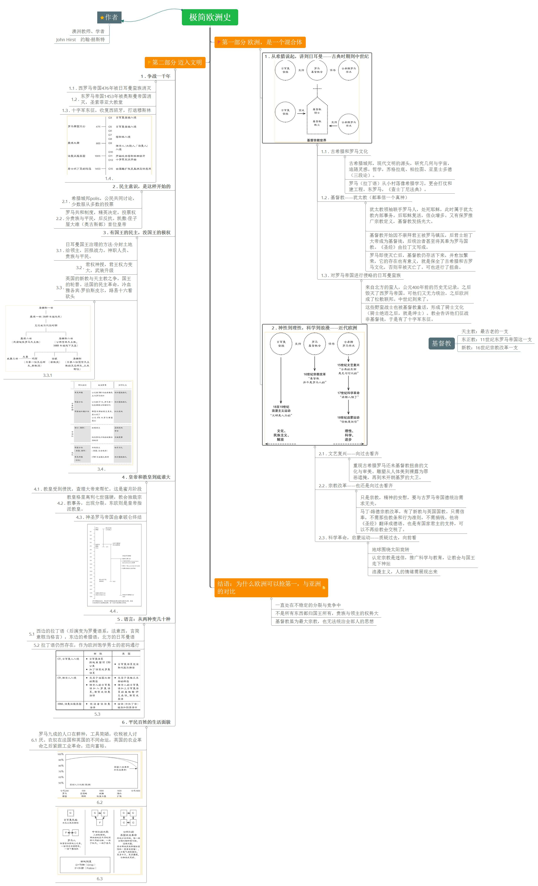

# 特点

#### 这本书的***惊艳之处***就在于，只要看完短短**几十页**的**第一部分**，对近2000年的欧洲史就能明白个大概。

**哪三个关键因素造就了欧洲历史呢**？ 作者认为有：

1. 古希腊与古罗马文明；
2. 基督教；
3. 入侵欧洲的北方日耳曼蛮族。

为了更好的理解，可以想想这样三群人。

1. 一群生活在公元前3世纪至公元5世纪的古代人；
2. 一群信奉上帝为唯一真神的人，先过得很苦，后成了与国王平齐的人；
3. 一群野蛮的战士，生而好战，只会打仗，占领了国土连税都不会收的人。

# 本书内容

## 1、古希腊、古罗马文明

回到两千多年前，中国春秋战国时代，西方有古希腊文明；当中国秦汉统一时，欧洲大陆上也已经有了罗马帝国。

古希腊城邦，徜徉在爱琴海与黑海之间，是现代文明的源头，有无数的学者研究几何与宇宙，追随灵感，还有那些如同繁星般耀眼的哲学家，苏格拉底、柏拉图、亚里士多德（三段论）。

罗马人说拉丁语，最开始生活在现在的意大利国土上，只是一个又一个的小村落，他们向希腊人学习学术文化，也更会打仗和建设工程。之后因为罗马帝国的疆域太大，分成了两个部分，一是在现意大利这边的西罗马帝国，还有一部分在现土耳其那边的东罗马帝国，也就是拜占庭帝国。（伊斯坦布尔、拜占庭、康斯坦丁，都是指同一个地方）。

尽管西罗马帝国在公元5世纪已消亡，罗马的统治荣光却在拜占庭一直持续到了15世纪。罗马帝国对于欧洲来说，就像中国的盛唐，是回忆古昔时最感念的朝代。

在公元800年查理曼大帝再次统一欧洲后，分裂出来的公国组成了**神圣罗马帝国**，尽管只是一群和罗马没有任何关系的松散联邦，仍冠以**罗马**二字来追忆往日的辉煌。

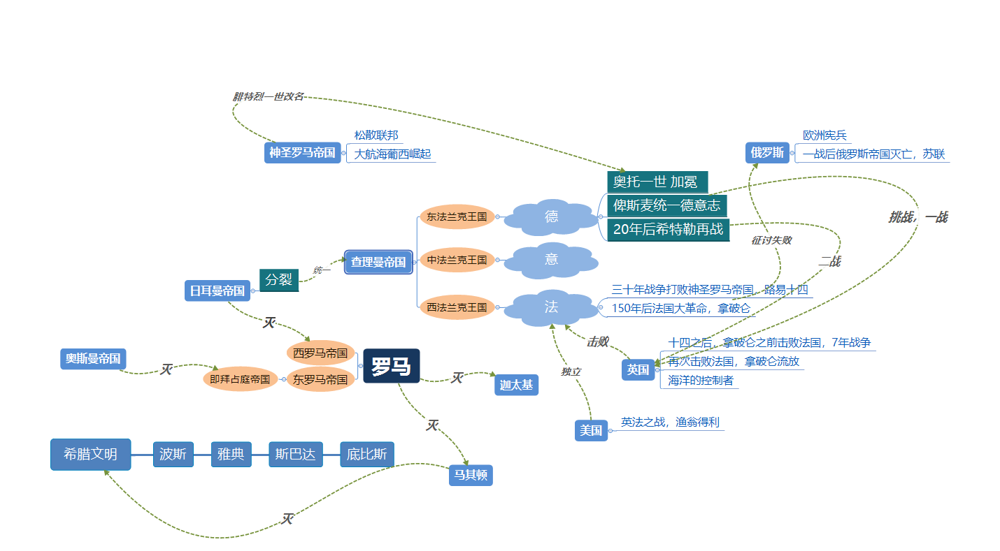

我自己画的欧洲历史变迁简图，有点乱哈。

## 2、宗教

犹太教最先出现。耶稣也是犹太人，只是他的宣讲令犹太教不满，于是犹太教领袖联手罗马人，处死了耶稣，此时仍属于犹太教的内部事务。按照《圣经》的说法，耶稣会复活。基督教开始在民众中发扬光大。

基督教与犹太教都只信奉一个真神，而罗马的统治者不在他们的信奉之列，于是基督教遭到罗马的残酷镇压。直到公元4世纪，君士坦丁大帝成为基督徒，双方才开始了合作，后来的统治者甚至将其奉为了国教。昨天的敌人成了今天的同伴，历史充满了黑色幽默。

罗马人是说拉丁语的，《圣经》也是由拉丁文写成。在罗马灭亡后，基督教却存活了下来，并愈加繁荣。政治易变，信仰难丢。不过基督教的继续存在也有意义，否则古希腊和古罗马文化，也会随着罗马的灭亡而消失。当然了，为了与宗教意义保持一致，教会对古希腊和古罗马文化也进行了属于他们的解释。

例如，基督教是不赞扬杀人的，可统治一个帝国又需要战争，这该怎么自圆其说？——“消灭不信基督教的异教徒”，教会找到了方向，于是有了十字军东征。那这些东征的骑士又来自哪里？

## 3、来自北方的蛮族——日耳曼

作者说他们是蛮人。

在他们南下入侵西罗马帝国之前，都没有自己的历史纪录；他们占领了西罗马帝国，却又无力统治，连税都收不上来，只好依赖于教会。

这些野蛮战士遵从教义，形成了骑士文化（骑士绝迹之后，就成了绅士文化）。教会告诉他们要去征战非基督徒，于是有了十字军东征。此时教会与国王关系融洽，教会即负责统治精神世界，却也在现实世界横征暴敛，甚至有了“赎罪钱”。

这就是接近一千年的欧洲中世纪。很多文章里都会说中世纪是“黑暗”的，就是因为教会的精神统治和现实压迫合而为一，人只能麻木地活着，没有希望，没有未来，只有上帝、天堂和地域，现世的生活只是为了赎罪。

## 三者的关系

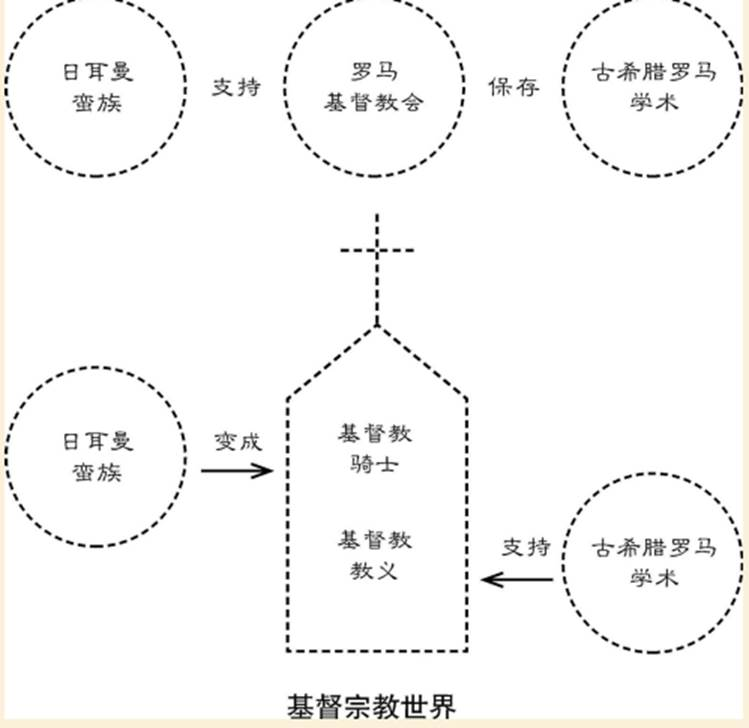

下次更新从中世纪到近代欧洲，这三个因素又发生了变化。

## 从中世纪到近代

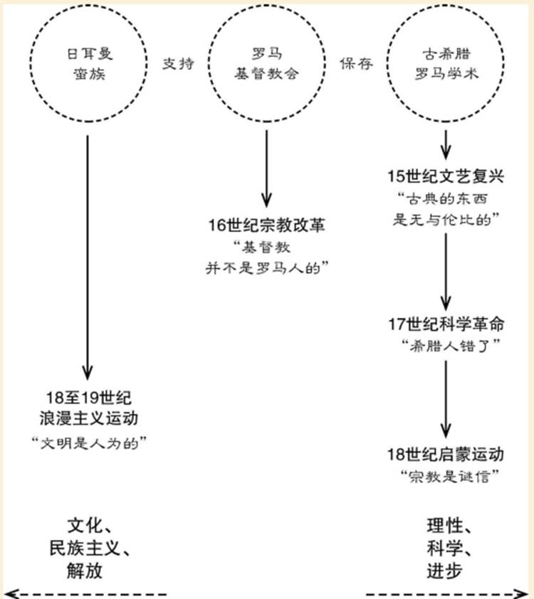

### 2.1 . 文艺复兴——向过去看齐

#### 重现古希腊罗马还未基督教扭曲的文化与审美。雕塑从人体美到裸露为罪恶遮掩，再到米开朗基罗的大卫。

### 2.2 . 宗教改革——也还是向过去看齐

#### 只是宗教，精神的安慰，要与古罗马帝国德统治需求无关。

#### 马丁·路德宗教改革，有了新教与英国国教。只需信奉，不需那些教条和行为准则，不需捐钱。他将《圣经》翻译成德语。也是有国家君主的支持，可以不再给教会交税了。

### 2.3 . 科学革命，启蒙运动——质疑过去，向前看

#### 地球围绕太阳旋转

#### 认定宗教是迷信，推广科学与教育，让教会与国王走下神坛

#### 浪漫主义，人的情绪需展现出来

# 第二部分 迈入文明

## 1 . 争战一千年

以地中海、希腊、罗马为中心的欧洲遭遇的外敌不少。

先是来自北方的日耳曼人，在公元476年取代了西罗马帝国；

而位于拜占庭的东罗马帝国，则遭遇了来自东方的穆斯林信众的侵袭；

同时，维京人的长船沿河而下，烧杀抢掠已成了法兰克王国的欧洲大部。

喘过气来之后开始了讨伐异族的十字军东征，只成功了第一次而已。

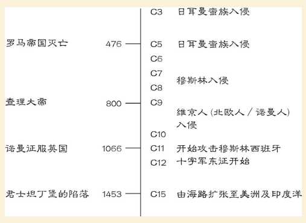

## 2 . 民主意识，是这样开始的

公元前6、7世纪的希腊民主政治，因城邦的集结而存在；

公元前4世纪的罗马信奉共和政治，贵族与平民权力可不对等，平民也有反抗。直到有权势的大臣凯撒妄图称帝，他的侄子屋大维实现了这一想法，成为了罗马的第一位皇帝奥古斯都。

各种争论，精英主义，大众的盲目，哲学最初与政治如影随形。

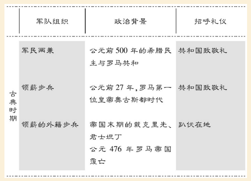

## 3 . 有国王的民主，没国王的极权

分别说的是英国和法国的革命。英国留有君王，却是两院共议，法国砍头路易十六，却让雅各宾派在国内大兴极权统治。

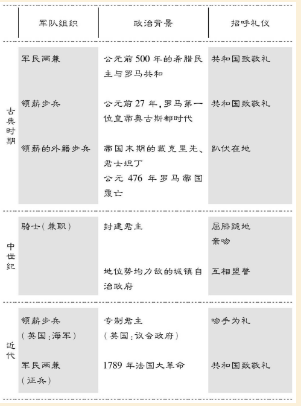

## 4 . 皇帝和教皇到底谁大

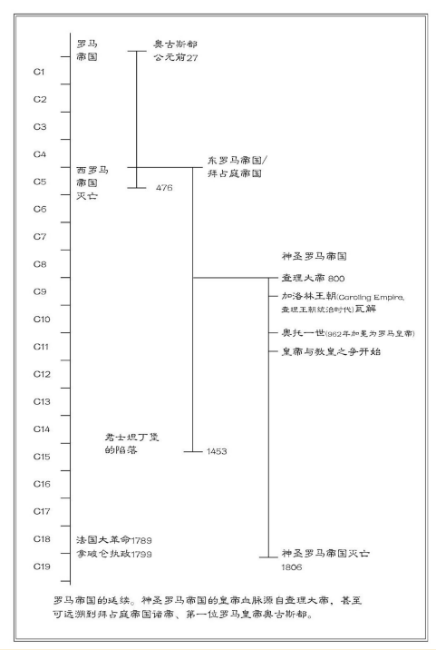

宗教与国王的关系也是复杂的，先是合作，后生嫌隙，再到决裂，又重归于好。一系列的争夺确定了利益的分配。

## 5 . 语言：从两种变几十种

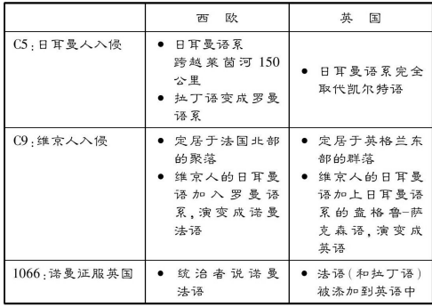

西边的拉丁语（后演变为罗曼语系，法意西，言简意赅当格言），东边的希腊语，北方的日耳曼语。拉丁语仍然存在，作为欧洲饱学男士的密码通行。

## 6 . 平民百姓的生活面貌

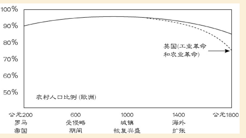

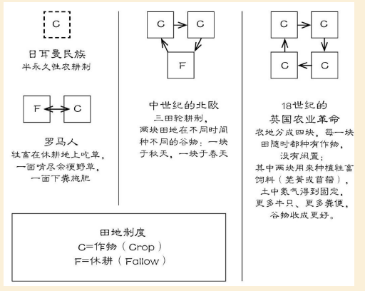

罗马九成的人口在耕种，工具简陋，收税被人讨厌。

农奴在法国和英国的不同命运，英国的农业革命之后紧跟工业革命，迈向富裕。

# 结语：为什么欧洲可以抢第一

 一直处在不稳定的分裂与竞争中，不是所有东西都归国王所有，贵族与领主的权势大，基督教虽为最大宗教，也无法统治全部人的思想。

# 基督教

## 天主教：最古老的一支

## 东正教：11世纪东罗马帝国这一支

## 新教：16世纪宗教改革一支

