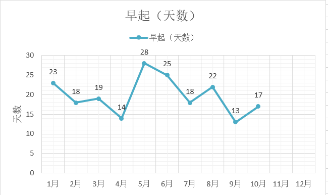
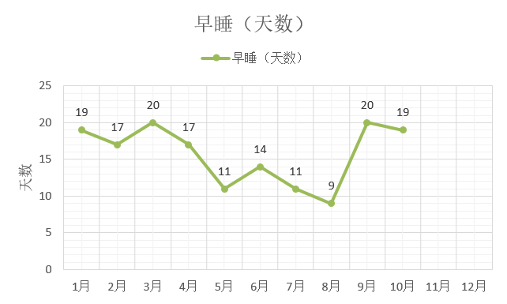
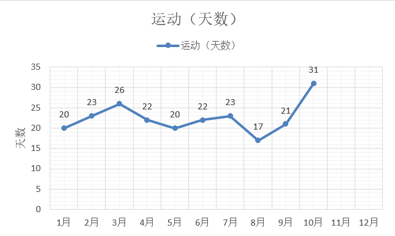
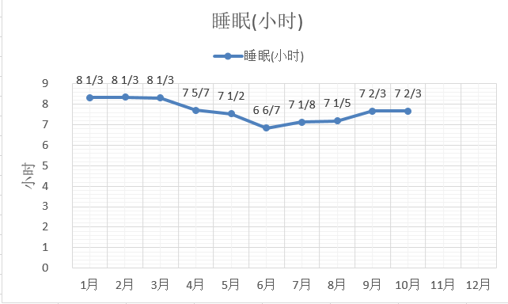
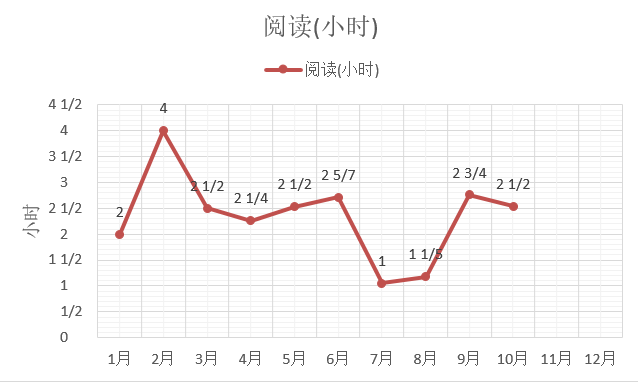
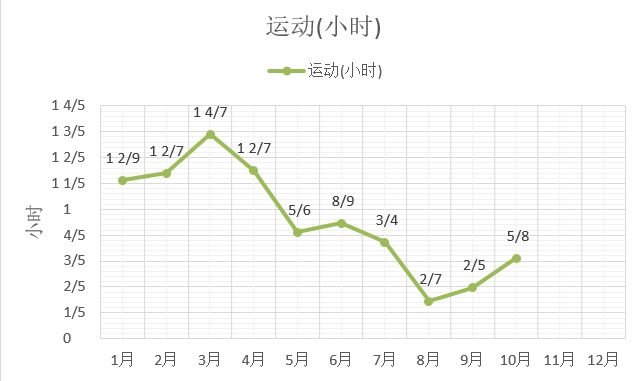
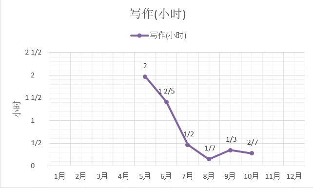

八月总结：[今年的八月我是怎么过的-数据来说话]()

九月总结：[今年的九月我是怎么过的-数据来说话]()

[TOC]

10月一共31天，31*24=744个小时

### 电影

| 10月总共看了6部电影 | 记录                         | 我的评分        |
| ------------------- | ---------------------------- | --------------- |
| 绝美之城            | 如今陈腐的罗马城             | 2（看一遍足矣） |
| 玩命追踪1           | 复仇总是酣畅淋漓             | 1（不喜欢）     |
| 小男孩              | 信念有那么一瞬间打动了我     | 1（不喜欢）     |
| 独家新闻            | 又是一桩杀人案，女卧底       | 1（不喜欢）     |
| 无人地带            | 战壕，紧张气氛，独自等死     | 3（隔年可重看） |
| 地洞                | 越狱神片，一把小钢锯无所不能 | 3（隔年可重看） |

### 读书

| 书名                           | 备注                                   |
| ------------------------------ | -------------------------------------- |
| 《当我谈跑步时，我谈些什么》   | 再次重看，真实的跑步经历               |
| 《正念奇迹》                   | 当你喝茶时，喝茶就是你生命中最重要的事 |
| 《1368个单词就够了》           | 英语口语表达，说简单句和简单词         |
| 《拆掉思维的强》               | 差点没看下去，后面稍好一点             |
| 《一本小小的红色写作书》       | 简短以便阅读，清楚以便欣赏             |
| 《七十二堂写作课》             | 记录和发表感想，记叙文                 |
| 《沃顿商学院最受欢迎的谈判课》 | 好书，值得早点看，多次看               |
|                                |                                        |
|                                |                                        |

### 生活作息

**总结**

- 天冷起床艰难，跟自己定了一个约定，日出时就起床。
- 晚上抱着热水袋坐在床上看书，好暖和，经常看得不想睡觉。
- 要求自己每天最少运动15分钟，实在不想动的时候，就做做拉伸、臀桥、平板这些简单的。腹肌在夏天结束后不是很明显，这回半个月游了五次泳，腹肌又出现了。

| 出差 | 运动     | 公众号更新 | 个人博客更新 | 7点起床 | 23:30前睡觉 |
| ---- | -------- | ---------- | ------------ | ------- | ----------- |
| 14天 | **31天** | 4篇        | 5篇          | 17天    | 19天        |

每月天数的变化情况：

### 时间明细

**总结**

- 无法早睡的时候就不强求自己早起，睡饱才是目的。
- 看书的时间分散的越多，能看的内容就越多，早上半小时，中午20分钟，晚上一两个小时。

各项每天所花费的平均时间：

备注：5月份开通微信公众号，从那时开始计录写作时间

