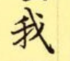
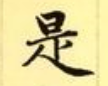
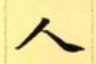
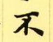
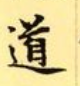
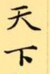
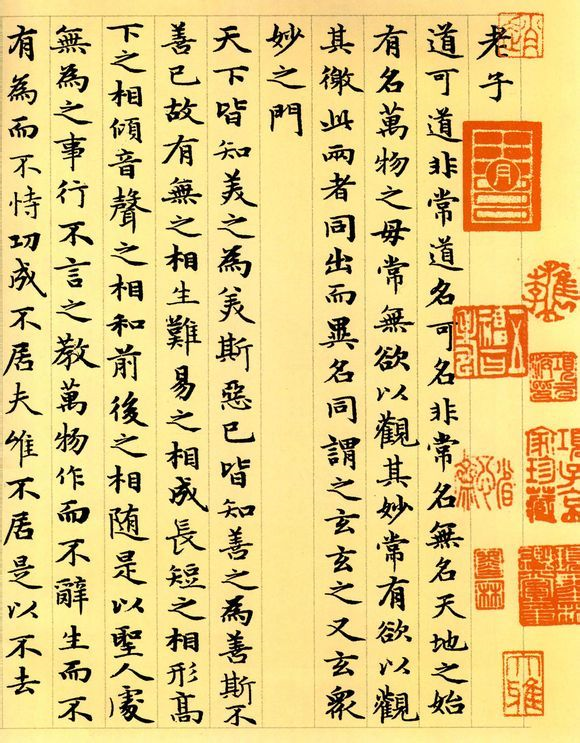

这篇文章适合手写。既然不行，就来发挥下想象力吧。

我的字一直拿不出手，小时候没有打好基础的缘故，长大了来练很是辛苦。最开始看别人的潦草写法觉得很是成熟，于是去学写行书，能学会连笔，却学不会那种飘逸和潇洒。

之后又觉得宋徽宗的瘦金体很美，像是刀削斧砍，最是轻飘的字，居然也能这么性格鲜明，力量十足，每一个笔画似乎都有刀芒蕴含其上，能学会刚劲的横横竖竖，却学不会里面的刚中带柔。

再之后看到赵孟頫的小楷《道德经》，内容看不懂，字体却惊艳到了我，最基础的楷体，这位老人家竟能写得这么好看！于是又开始了一轮新的练笔。

如果你也练过字，就该知道，一横不是一横，一竖也不是一竖，一个横折钩也不是画一个直角，有时越用钢笔，就越是瞧不上这种不能写出粗细变化的文具。

一横，起笔，中段和结尾，用力多少，着重还是轻力，都会改变这一横的风骨。竖要写的直，起笔要重，落笔要轻，结尾的时候要像一根针，又尖又细，直入纸间。折钩的地方要有顿笔，既有折线，又不能太过刚硬，夹角往往小于90度，横要往上抬，竖要往里折。最难写的是捺，像是中国舞的水袖，甩出去又能收的回。

举几个例子：

## 

这是一个在踢球的小人儿，昂着头，挺着胸，胳膊展开，发力的那条腿有力地踢出去，整个字充满了力量感，如果支撑的腿不直，可就很难发力了。

## 

这是一个在练武术的小人儿，一会儿金鸡独立，一会儿马步向前，动作行云流水，刚柔并济。日和中间的一横，相互都是平行的，这个是我最近才发现的秘密，汉字的书法虽然看起来灵动，可它也遵循一些数学规律。那一竖不会从横的中间开始，而是靠左，因为要和下面的一撇一捺相呼应。

人这个字很难写得好看，这个字完全不像形，可一写出来似乎就能看到一个人的仪态，要么是太卑躬屈膝，要么是太急躁干瘪，要写的有血有肉充满感情，很是不易。

看着“不”站在那里，像不像一位正义凛然的检查员，就是不给通过。写他的时候，一定要写出他的坚强不屈，甚至还有那一丝傲慢的感觉。

这是一位带着高冠的大人，站在船头，水波在他的脚下分开，没有什么可以阻挡他向前的旅程。最下面的横捺，既要有曲线的变化，又要能撑起整个字的结构，可不是一根像火柴棍似的横笔就能表达的。

天下苍生，天下兴亡，这两个字字面来看就是天空以下的意思，代表整个土地及上面的人和物，都是笔画简单的字，却要写得大气，能撑起来。“天”的一撇一捺这个开合的角度得掌握好，太小了天隔得远，太大了天像要塌下来，“下”这个字，竖要短，短才有“下”这种感觉。

汉字书法的美，我认为美在字里有情绪和风骨。看颜真卿的《祭侄文稿》，能被那潦草的字迹乱了心神，一同悲愤；看王羲之的《快雪时晴帖》，仿佛也能穿越时空，感受到雪落天晴的欣喜。

现在需要写字的场合越发少了，能看到人手书也是越来越少，高中的时候和朋友还经常写信，大学以后就再没写过了。

