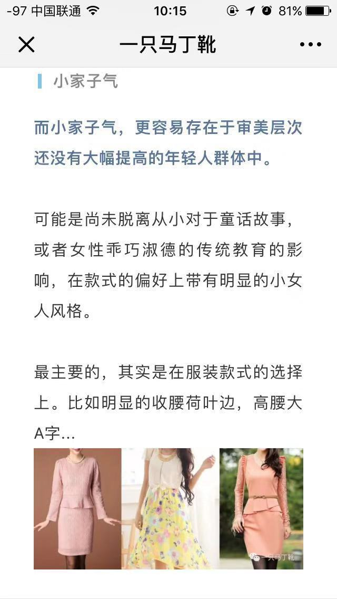

**“小家子气可能是尚未脱离从小对于童话故事，或者女性乖巧淑德的传统教育的影响”**。

看着她的评论，想到自己以前买的一些衣服，也只能不好意思的笑笑，的确有很多就是这种小家子气的衣服，最过分的就是“阿*莲”了，不过小女孩有小女孩的品味，黑历史而已。现在再看到那些衣服，不买就是了。

单单穿着打扮而已，他人的眼光、评论就让人喘不过气来了，更别说还有：

>  工作怎么样，是否高薪高头衔高福利；
>
> 家庭怎么样，是否好房好车好伴侣；
>
> 孩子怎么样，是否又听话又活泼又礼貌又好学；
>
> 为人处世怎么样，是否朋友众多一呼百应；
>
> 性格怎么样，是否热情宽厚严肃慷慨；
>
> 消费怎么样，是否品味独特购买力上佳；
>
> ……

**评价，归根结底它究竟是什么呢？**

——我的观点，它就是一个想法，一个看法，一种从过往的经验得出的结论，不是绝对正确，更不是世界的真理。完全是主观的，很可能是对的，也很可能是错的。包括我的这个观点也是主观的，它也不一定正确。举几个例子：

拿电视节目来说，新闻播报是事实，新闻评论是观点；

拿阅读来说，看科普文章看的是事实，看小说、随笔看的是观点；

“身高1米88”事实，“好高哦”是观点；

看工作打卡记录，一周迟到3次是事实，“这人是个懒鬼，不遵守纪律”是观点；

运动场上，菲尔普斯拿了游泳金牌是事实，“他一定是世界上游的最快的人”是观点；

---

有些人甚至会利用这种评价来控制别人，让别人来按照他的评价行事。并且事实很难让人生气，而观点往往会冒犯到别人。想象两个人聊天，我说我有存款5000，这是一个事实，对面的人却说“你是个穷鬼”，这就是一个观点。

冒犯的点就在于**归纳**，把一个单独的、随机的事件，上升成一个固定的结论，也就是“贴标签”。比如做家务，一次学不会这是事实，可因为这一次学不会就被说成“笨蛋、傻瓜”，就是把问提“上升”，严重化了。

我记得有一次和老妈生气，居然是因为她看到我削苹果没把皮削干净，居然思想发散，说我这也不会做，那也不会做，以后嫁人了会被婆家骂死，还嘲笑是她这个当妈的没把女儿教好。当时气得我呀，一方面是生气这种男尊女卑的想法，女人嫁人又不是去做保姆，家务做不好就要被开除?一方面是生气我就一件事没做好，别的优点你就全当不存在啦？认为我做的不好，就告诉我要怎么改正，何必说这些不好听的话。

以前我的情绪控制做得很差，那次也是和老妈大吵一架，生气结尾。现在想想真是傻的很，明明还有那么多种说法可以和她把这事揭过去，却在一瞬间被生气控制住了大脑，只会发脾气，不会心平气和地讲道理。她说的话里面就是事实和观点共存，**找到事实，承认它，找到观点，质疑它**，完全没必要生气。

了解这一点就像武林高手有了宝剑，面对再多评价和非议，再听到有人随意“定调”，说你是个什么什么人，说你怎么怎么样，不论是好听的，还是不好听的，都可以用这把宝剑分割清楚——**这些是事实，你说的没错，我承认，我接受；这些是你从有限的人生经验得出的观点，我并不认为你说的对，我不认同。**

开车的时候，前面的司机突然变道，他不遵守交规，不提前打灯，安全意识不足，这些都是事实。而要说“这个司机是个傻叉吧，tmd会不会开车！”这就是一个观点。他可能是一位精明的商人，可能是一位德高望重的艺术家，可能是一位忙碌的单身父亲，最可能的就是一位普通的上班族，因为开车乱变道，他就被人随意的斥骂。

现在来个角色互换，想象如果你是这个司机，着急变道被人骂了，你会怎么办？生气、愤怒、骂回去，甚至下车打一架，都很有可能，可是，有没有别的解决办法？既能安抚住骂人的人，又能让自己不因为被人骂而心绪不平、歇斯底里？

