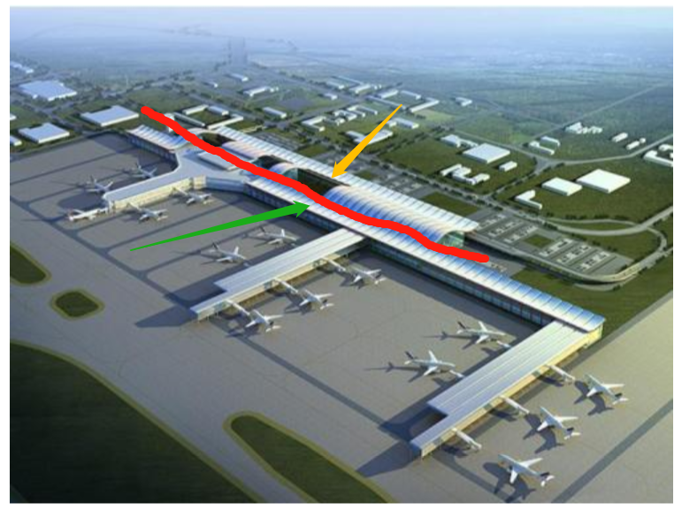
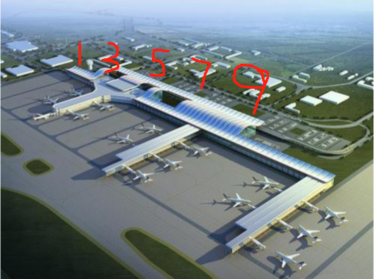
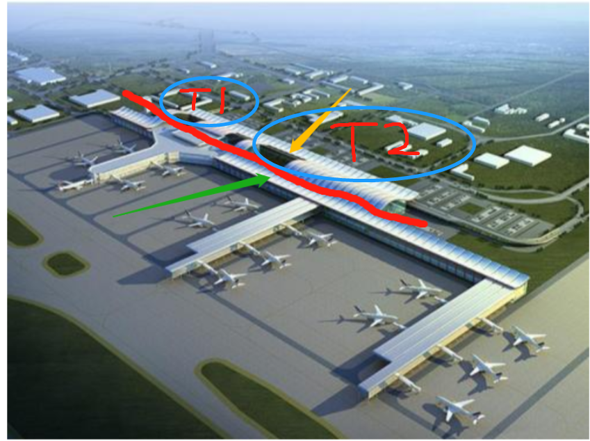
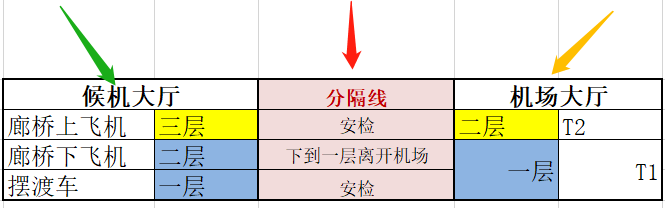
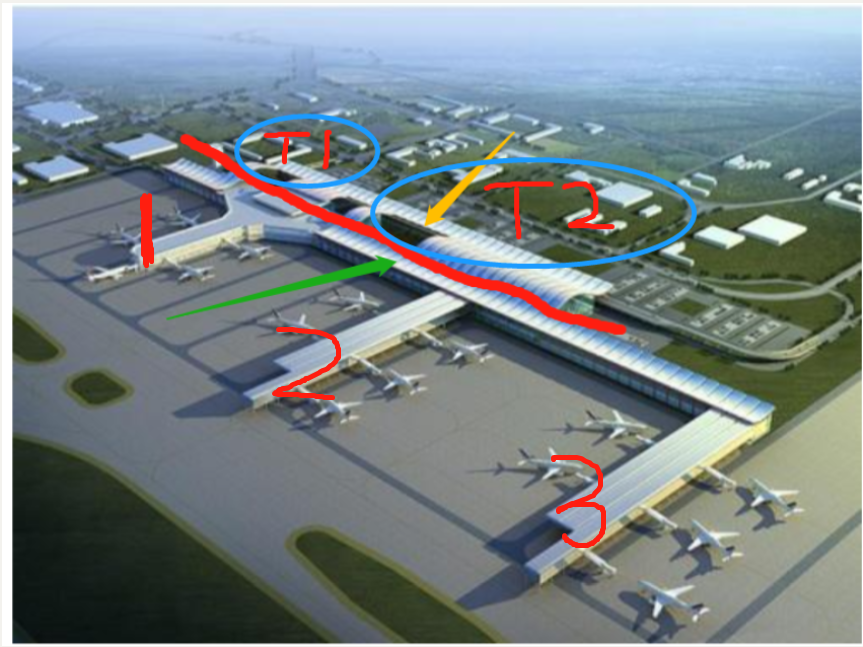

逛的是贵阳机场，全称贵阳龙洞堡国际机场。每次我只是在这里中转，百无聊赖地等待二三四五个小时后，再坐另一班飞机离开。从2017年9月到现在，14个月里总共停留了22次，只有一次参加大数据博览会，离开过机场去了贵阳市区。

在贵阳机场，我吃过三次汉堡王，一次南粉北面的米饭套餐，喝过两次星巴克，一次贵州特色小吃店的焖饭和鸡汤，在中转联程厅，更是吃了记不清次数的午餐盒饭；还在鄂尔多斯店铺里买过一条半裙，迪斯尼的店里买过两个书包作为侄女的新年礼物。

可直到上周五再次转机前，我都不知道这个机场的全貌是什么样的，每次到达、离开停留的大厅，是在机场大楼的哪个方位？逛的店铺在一楼还是二楼还是三楼？登机口的编号都是怎么安排和分布的？

之前没有想过这些，只是浑浑噩噩地跟着指示牌从一处挪到另一处，这里向左，那里向右，此处直行。走路的时候总带点心虚，因为不知道自己现在在哪里，也不知道去的地方在哪里，只知道眼前这个指示牌。同人生路一样，都是谜之前行。

发现这一点后，我就突然对贵阳机场有了很大的研究兴趣。先是在网上找资料，设计图、俯瞰图、平面图、立面图、剖面图、机场指南、机场简介……奇怪的是能找的很少，我对建筑业不熟悉，也不知道专门的网站，只有在百度搜到了零星半点的图片。好玩的是居然还有贵阳机场的绿植分布图，广告招租位置分布图。

后面用的是《2017中国民用机场投资建设年度峰会召开 中建八局协办》新闻里的一张配图，还原度很高。

以图里红色的线作为分隔，黄色箭头那半边是**机场大厅**，面向市区；绿色箭头这边是**候机大厅**，面向机场跑道。分割线可以理解成安检。

**机场大厅**分上下两层，门的编号一上一下。候机大厅分三层，晚一点说。楼下最左边是1号门，往右走，第二个门是3号门。到了二楼，会看到第一个门是2号门，下一个是4号门。如果没去过楼下的人，看到门的编号会不会有点崩溃，为什么只有偶数门，单数门去哪儿了？

航站楼分为T1和T2。T1是先修的，换机票、托运行李和安检都在**一楼**，场地比较小。现在是国际、港澳台和部分国内航线在这儿办登机手续。

T2在**二楼**，柜台多，安检口多，周围一圈还有不少商店和餐饮。黄色箭头指的地方就是办理登机手续的大厅。

此处好需要一张机场的内部设计图。找不到，我只好用execl表格做了一个大概的说明，T1和T2虽然是楼上楼下，却**并不在**一条竖直线上，T1在一楼，靠近建筑最左边，感觉有点儿可怜。T2在二楼，又在整个建筑的中间，可以说是占据了最佳地形，财大气粗。

现在来说**候机大厅**。之前每次最迷糊的就是过安检之后，机场的层数就不同了，外面的大厅是两层，里面的候机大厅却有三层，很有看盗墓笔记发现自己走到一个空间中并不存在的夹层里的那种诡异感。

候机大厅也是到达大厅，有三层。一层是等待上飞机的乘客逗留的大厅，这里的登机口乘客不能直接上飞机，需要坐摆渡车；二层是下飞机的乘客离开机场的通道，中转联程就在这一层；三层是等待上飞机的乘客逗留的大厅，有很多餐饮服装店铺。

朝向飞机跑道的这边有三条伸出来的“手臂”，它们的一层是支架，二层是下飞机的乘客走出去的通道，三层是候机大厅。一架飞机到达，一个门出去会看到有两个廊桥，一个方向是出去的，会达到二层；另个方向是上飞机的，人会从三层下来。

---

就拿我每次的行程来说，从宜昌到贵阳后，可能会停在1、2、3“手臂”，出去廊桥下到候机大厅的二楼。

要是不拿行李就直接去同一层的中转联程换票，然后从中转联程直接先上三楼，再找登机口；要是需要拿行李，就要下到一楼的行李厅，拿完之后出去机场大厅，往左走到一楼的T1航站楼，再托运行李过安检。下一程贵阳去往兴义的都是小飞机，连不上廊桥，只能坐摆渡车，于是登机口都在一楼。

当从兴义回到贵阳，下飞机先坐摆渡车到一楼。有托运行李的话，拿完行李出去上到机场大厅的二楼，在T2航站楼办手续过安检；没有托运行李，就从一楼上到二楼，在中转联程换票，再上到三楼候机。贵阳飞宜昌都是走廊桥，在三楼的大厅等待时就会逛逛吃吃。

---

描述一遍发现还是有点复杂的。22次转机，我直到上一次才想到研究一下地形，之前就像那迷宫里的小白鼠，它是闻着巧克力香味向左向右向前，我是看着指示牌向左向右向前。

现在知道了方位，再走就不会迷茫了。弄清楚一个机场，收集资料用了3小时，在现场印证地图，走遍每个通道用了2小时，自己走得明白，要我指路也是没问题的，还挺有成就感的呢~

