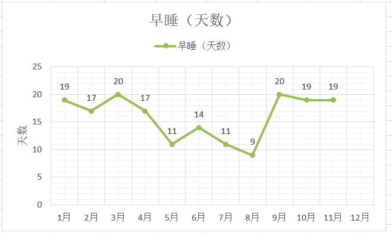
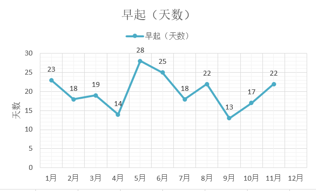
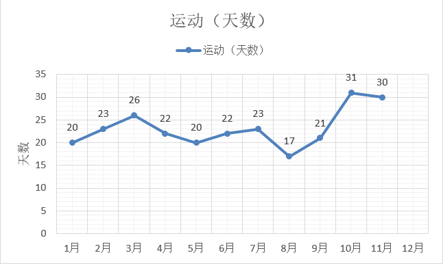
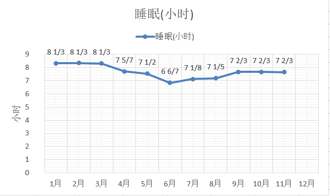
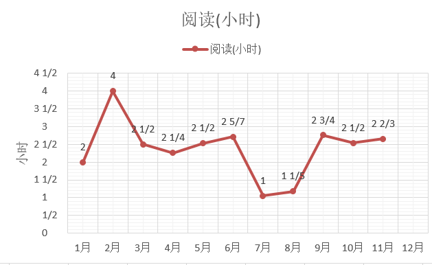
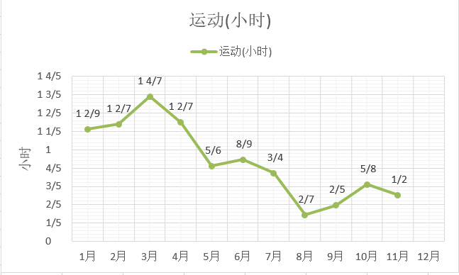
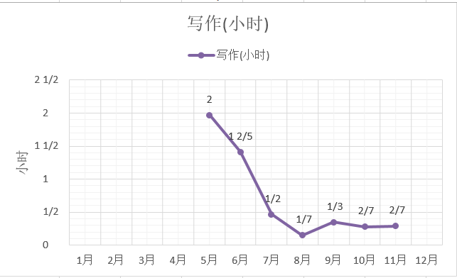

九月总结：[今年的九月我是怎么过的-数据来说话]()

十月总结：[今年的十月我是怎么过的-数据来说话]()

[TOC]

11月一共30天，30*24=720个小时

### 电影

| 11月总共看了2部电影 | 记录                   | 我的评分        |
| ------------------- | ---------------------- | --------------- |
| 《与安德烈的晚餐》  | 一直在谈谈谈，看不下去 | 1（不喜欢）     |
| 《荒岛余生》        | 三年海外存活经验       | 2（看一遍足矣） |

### 读书

| 书名                                 | 备注                                 |
| ------------------------------------ | ------------------------------------ |
| 《哲学家们都干了什么》               | 最后还是只能说世界是唯心的           |
| 《习惯的力量》                       | 找到头和尾，改变中间就简单很多了     |
| 《肠子的小心思》                     | 好书！吃的时候也想想辛苦工作的肠子   |
| 《今天也要用心过生活》               | 没有新内容，只是那些重要的事总被忘记 |
| 《情绪为何总被他人左右》             | 没看完，大概是不要交出对自己的控制感 |
| 《恰到好处的生活之味》               | 细细品味，生活很美                   |
| 《八万四千问》                       | 佛法的“空”                           |
| 《原生家庭：如何修补自己的性格缺陷》 | 缺钱好说，缺爱难治                   |
| 《冥想》                             | 让大脑什么也不想，好难               |
| 《是我把你弄哭了吗？》               | 绘本，可爱死啦！                     |
| 《过犹不及，如何建立你的心理防线》   | 该说不，就说不                       |
| 《鲁宾孙漂流记》                     | 精彩跌宕的经历                       |
| 《暗时间》                           | 没看完，程序员中的思考者             |
| 《被讨厌的勇气》                     | 越被更多人喜欢，越没有自我           |

### 生活作息

**总结**

- 一半在出差，一半在家。出差的生活比较自律，在家只想舒舒服服地待着。吃得多，动得少，心情妙妙妙~
- 工作是不分地点的，在哪儿都忙，还熬了一个整通宵，到现在都没恢复过来，好！心！烦！
- 运动有些懈怠，虽然每天都会拉伸一下，但是大半个月都没有高强度的锻炼过了。

| 出差 | 运动     | 公众号更新 | 个人博客更新 | 7点起床 | 23:30前睡觉 |
| ---- | -------- | ---------- | ------------ | ------- | ----------- |
| 16天 | **31天** | 4篇        | 5篇          | 22天    | 19天        |

每月天数的变化情况：

### 时间明细

**总结**

- 天冷了其实睡得早，只是好几个晚上的加班导致平均睡眠时间少，心烦。
- 双十一买了好多书，纸质的和电子书，看得好过瘾。
- 写作想好好写，却总是懒得动笔，还想多看看，主要是自己没什么新鲜的想法。
- 看书的时间分散的越多，能看的内容就越多，早上半小时，中午20分钟，晚上一两个小时。

各项每天所花费的平均时间：

备注：5月份开通微信公众号，从那时开始计录写作时间

