-------（电影详细列表见后）-------

2018年看了60部电影。按照个人喜好，我做了一个简单的打分系统：

>  4分超级好看，3分还不错，2分一般，1分根本不该看。

60部电影里，4分的5部，3分的10部，2分的33部，1分的12部。

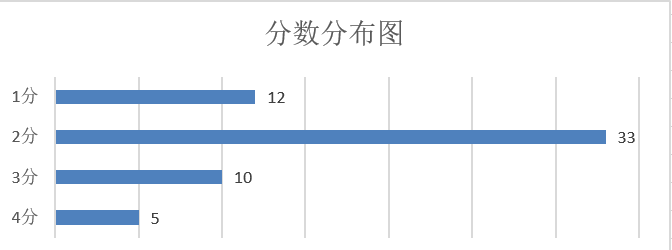

按照电影的拍摄国家，分布如下，美国的最多，有33部。

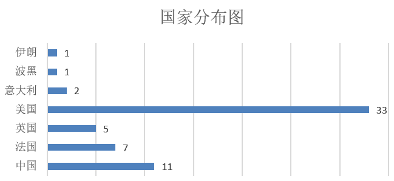

按照电影的拍摄时间。

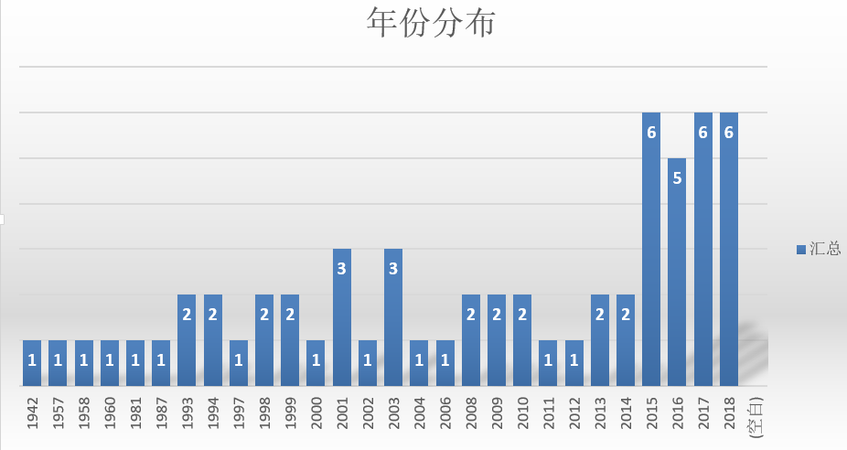

每月各看了多少部。

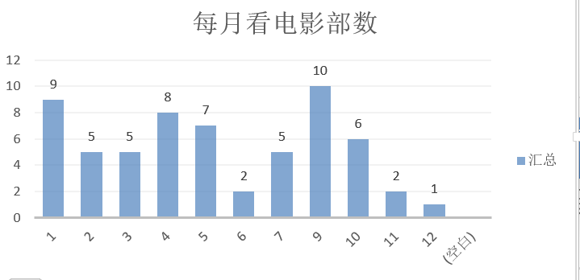

以下是电影介绍，首先是最好看的4分方阵。

| 电影名           | 内容                                   | 导演                   | 上映年 | 国家 |
| ---------------- | -------------------------------------- | ---------------------- | ------ | ---- |
| 《控方辩人》     | 看完回味无穷，哪些是真相，哪些是谎言？ | Billy   Wilder         | 1958   | 英国 |
| 《阿黛尔的生活》 | 悲剧在于无法避免                       | Abodellatif   Keshiche | 2013   | 法国 |
| 《十二怒汉》     | 是用事实和耐心改变了他们               | Sidney   Lurret        | 1957   | 美国 |
| 《两杆大烟枪》   | 无事生非，啼笑皆非                     | Gucy   Ritchie         | 1998   | 美国 |
| 《卡萨布兰卡》   | 机智对话，遗憾爱情                     | 迈克尔·柯蒂斯          | 1942   | 美国 |

《控方证人》，黑白电影，2018年我反复看了有5遍，每个角色都是演技派，女主角更是美出天际。2018年最佳观影。

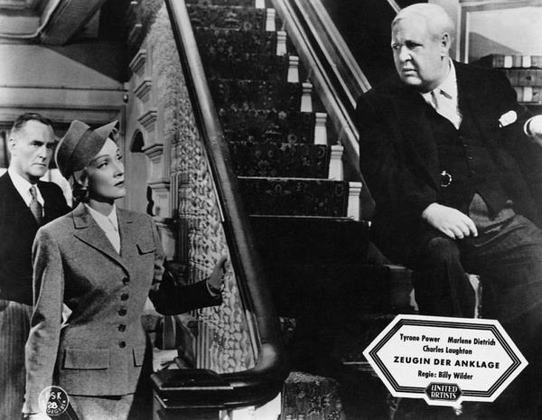

《阿黛尔的生活》，蓝色是温暖的颜色，悲剧在于无法避免，感情长不长久与性别无关。

《十二怒汉》，还是黑白电影，陪审团的决议过程，一个小小的房间，最难的事之一就是改变别人的想法吧。

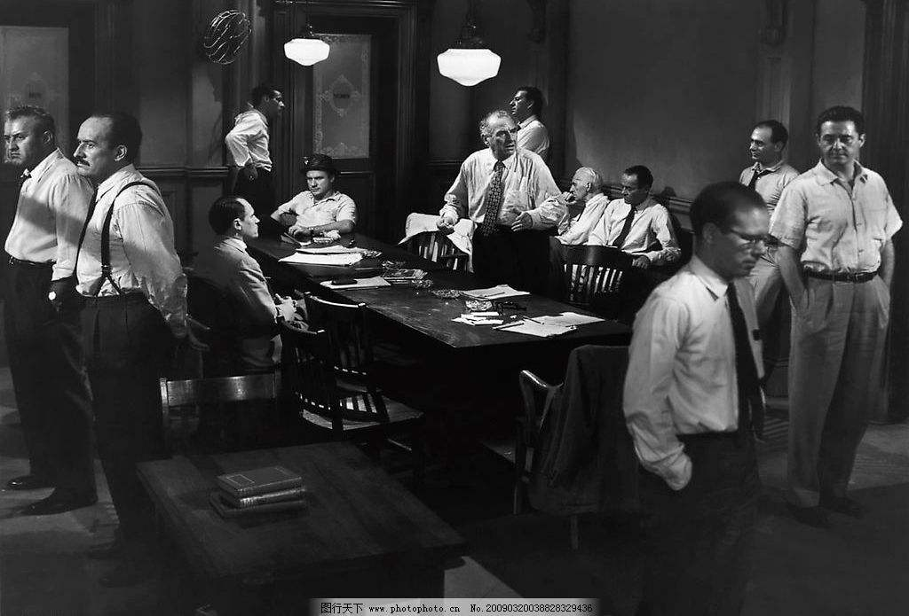

《两杆大烟枪》，英国电影，笑点飘忽的黑色幽默，人物关系扭得和麻花差不多，3刷。

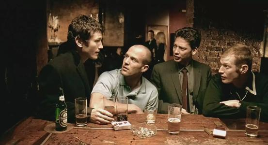

《卡萨布兰卡》，经典黑白老电影，以前也看过很多次，2018年2刷，主要是看台词，警督是吐槽担当。

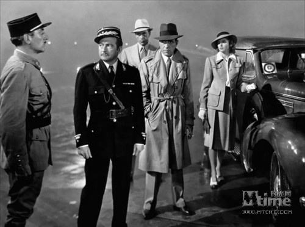

上面的5部是我认为60部里最好看的，以下是也很不错，但估计很久不会重看的电影。

| 电影名                 | 内容                                                         | 导演                | 上映年 | 国家   |
| ---------------------- | ------------------------------------------------------------ | ------------------- | ------ | ------ |
| 《请以你的名字呼唤我》 | 色气满满,意大利1983年北部，真美，我们奋斗一生或许都无法享受这样宁静、优美的夏日，两个人唤醒了彼此 | Luca   Guadagnino   | 2017   | 美国   |
| 《Carol》              | 不经意间爱情降临                                             | Todd   Hayes        | 2015   | 美国   |
| 《本能》               | 杀来杀去，谁是真凶                                           | Paul   Verhoever    | 1993   | 美国   |
| 《大象》               | 只能幸运自己不在那所学校                                     | Gus   Van Sant      | 2003   | 美国   |
| 《放牛班的春天》       | 歌好听，遇见何其有幸                                         | 克里斯托弗   巴拉蒂 | 2004   | 法国   |
| 《水性杨花》           | 美丽的女主角、服装                                           | S   Eliot           | 2008   | 英国   |
| 《天使爱美丽》         | 天真与纯情，难得                                             | 让   皮埃尔 热内    | 2001   | 法国   |
| 《灿烂人生》           | 美景，人物，感动人心                                         | 马克·吉欧达纳       | 2003   | 意大利 |
| 《无人地带》           | 战壕，紧张气氛，等死的人                                     | Danis   Tanoric     | 2001   | 波黑   |
| 《地洞》               | 紧张，细致，钢锯好用                                         | 雅克   贝克         | 1960   | 法国   |

《Call Me By Your Name》，太有名气的一部电影，景色很美，人物也不错，甜茶那么火不是没道理的。同样是乡下，镜头里意大利的乡下真是美得不像话，不谈恋爱都感觉太浪费场景。

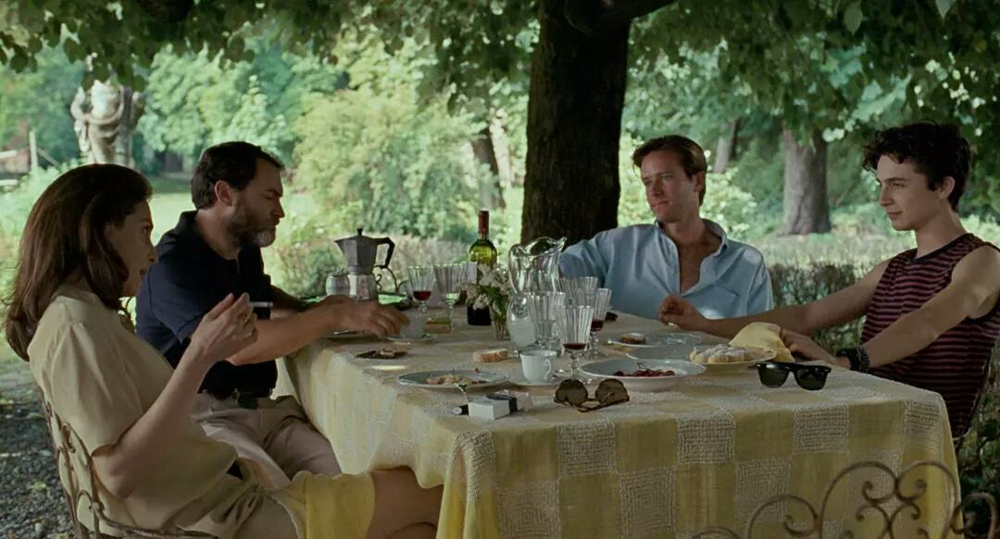

《卡罗尔》，出来的时候也是名气很大，不过一直觉得主角都不是我喜欢的类型，就没有看，后来是为了和《阿黛尔的生活》对比，才找来看。里面暗戳戳动心的情节还挺打动人的。

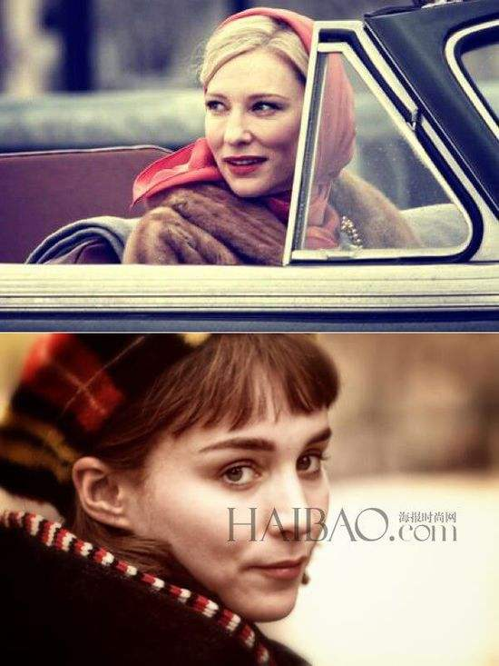

《本能》，好惊悚，女主角帅炸天。

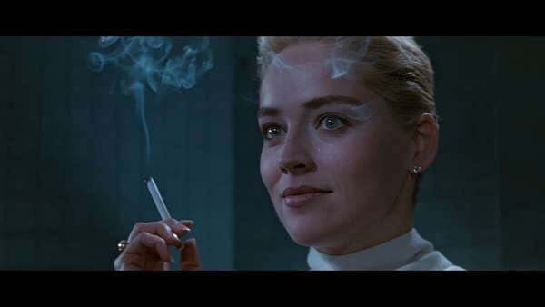

《大象》，美国的校园枪击案，不在沉默中灭亡，就在沉默中反抗。可怜那些无辜枉死的人。

[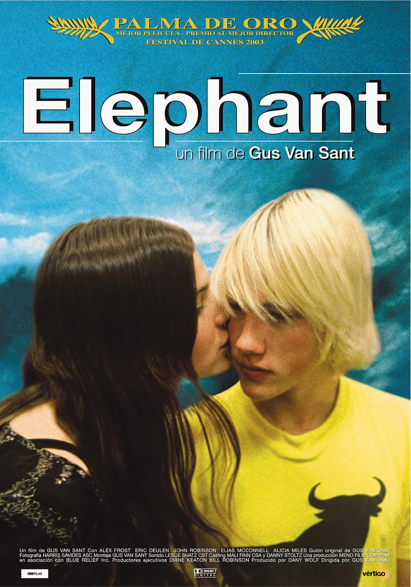](https://movie.douban.com/photos/photo/455148092/#title-anchor)

《放牛班的春天》，天使面孔和天籁嗓音的叛逆少年，碰到有天使内心的音乐老师。

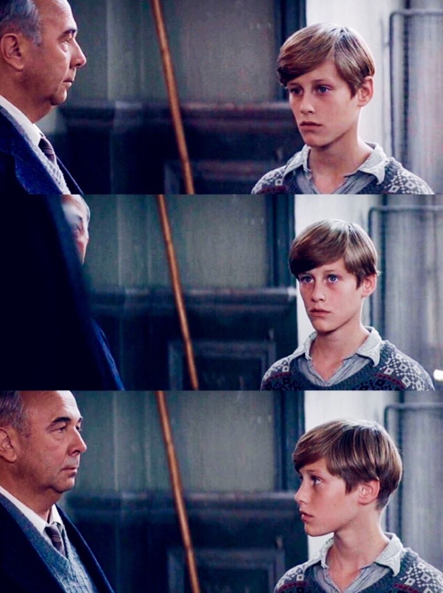

《水性杨花》，Easy Virtue，英国电影，情节有趣，人物好看，还有一段探戈，比《闻香识女人》里面那段还要好看。

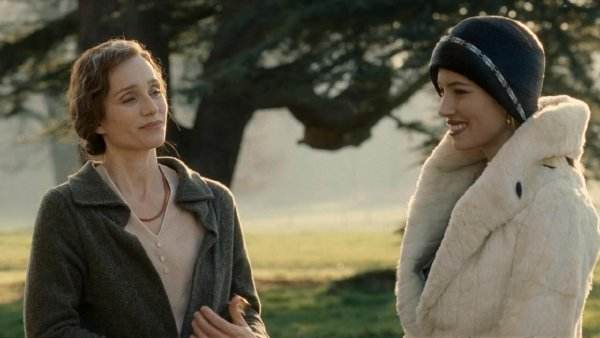

《天使爱美丽》，很有灵气了。

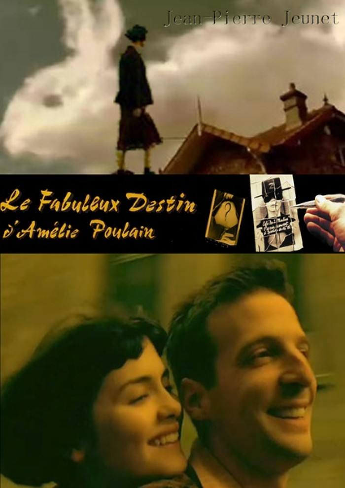

《灿烂人生》，5个小时的电影，我用了快半个月才看完。要是没钱去欧洲旅游，看这部电影可以弥补下遗憾，外景好美好美好美。。。一个家族在20多年里的故事。

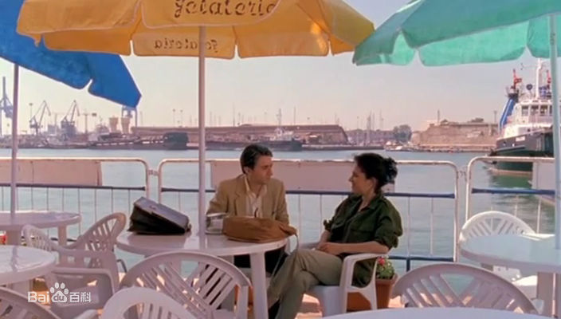

《无人地带》，无法取出的炸弹，无法化解的仇恨。

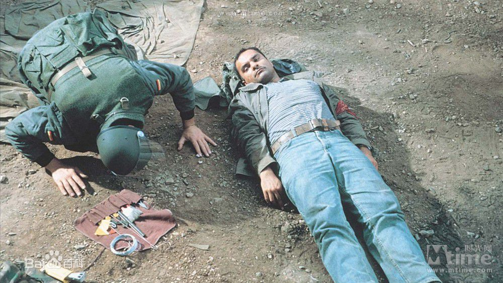

《洞》，越狱片的鼻祖吧，拿着一根小钢锯快能上天入地了，紧张、刺激、好看。

[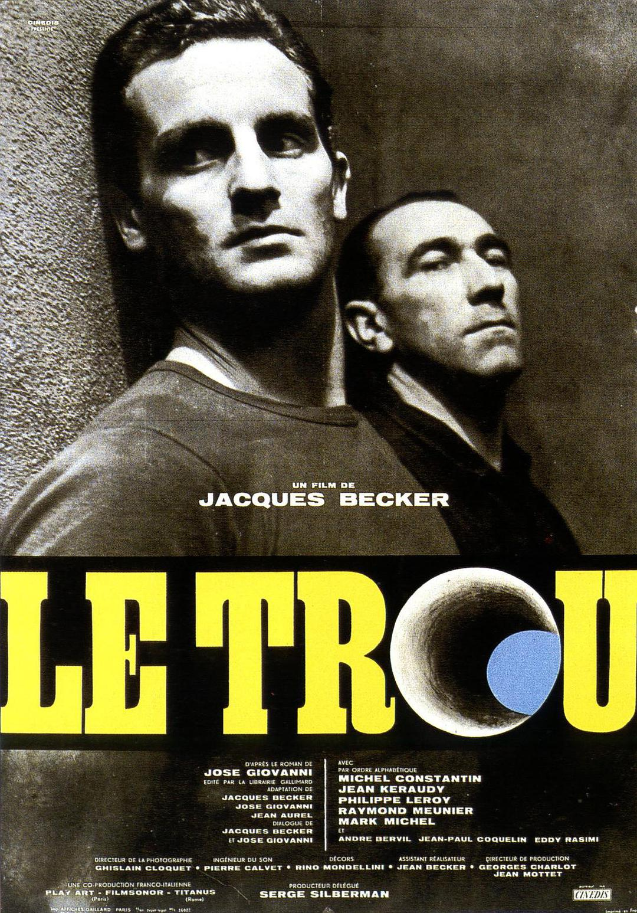](https://movie.douban.com/photos/photo/2497389074/#title-anchor)

以下是两分的电影，就不贴图片了，只是我按照自己的喜好排列的，也许会有你喜欢的。

| 电影名                       | 内容                                                         | 导演                         | 上映年 | 国家   |
| ---------------------------- | ------------------------------------------------------------ | ---------------------------- | ------ | ------ |
| 《拯救大兵瑞恩》             | 开头的登陆战血腥异常，最终的救援成功了，付出了很多的生命代价，孰轻孰重，谁来判定，士兵的服从在战略上有意义，对他们个人能说公平吗？还是说为了更宏大的目标？ | 史蒂文·斯皮尔伯格            | 1998   | 美国   |
| 《功夫熊猫》                 | history，present，mistery？原创是这里吗？最后一刻悟道了弹小指，打败了泰朗，老师原来是小熊猫。 | 马克·奥斯本                  | 2008   | 美国   |
| 《伯德小姐》                 | 情节温柔，颜值逆天，为了人可以再看一遍，故事并不吸引我。     | Greta   Gerwig               | 2017   | 美国   |
| 《寻梦环游记》               | 墨西哥亡灵节，小男孩的音乐梦想，最崇拜的歌手是自己的祖父，家庭、友情、错过、牵挂……可爱的骷髅。 | 皮克斯动画工作室             | 2017   | 美国   |
| 《头脑特工队》               | 动画片里具体化了快乐、忧伤、愤怒、厌恶、害怕五种情绪，而他们也在不停地改变着我们的行为。 | 迪士尼+皮克斯+Peter   Doctor | 2015   | 美国   |
| 《疯狂动物城》               | 动物们已经穿上了衣服，爪子和蹄子也已言和。兔子和狐狸得合作创意大集合。 | 迪斯尼影业                   | 2016   | 美国   |
| 《华尔街》                   | 新手交易员，失去天真，只为钱。                               | Oliver   Stone               | 1987   | 美国   |
| 《逃离德黑兰》               | 从伊朗人冲进大使馆就开始紧张，知道飞机离开伊朗上空才放松下来。 | Ben   Affleck                | 2012   | 美国   |
| 《心灵捕手》                 | 缺少打动人心的力量。                                         | Gus   Van Sant               | 1997   | 美国   |
| 《春风沉醉的夜晚》           | 诚意满满的电影，比小说好看。同性别无关，你走进了我心里，却是我沦陷了。 | 娄烨                         | 2009   | 中国   |
| 《推拿》                     | 一群盲人的工作和爱情                                         | 娄烨                         | 2014   | 中国   |
| 《日照重庆》                 | 家长失职，子女遭殃                                           | 王小帅                       | 2010   | 中国   |
| 《蝙蝠侠大战超人：正义黎明》 | 先对打，后一同打怪                                           | Zack   Snyder                | 2016   | 美国   |
| 《路边野餐》                 | 看完查百度才知道没看懂                                       | 毕赣                         | 2015   | 中国   |
| 《大佛plus》                 | 空佛像中有什么呢                                             | 黄信尧                       | 2017   | 台湾   |
| 《小鞋子》                   | 穷到买不起一双小童鞋                                         | 马基德   马基迪              | 1999   | 伊朗   |
| 《复仇者联盟3》              | 灭霸集齐5宝石，灭世一半                                      | 漫威                         | 2018   | 美国   |
| 《三块广告牌》               | 坚强的女人，女儿惨死                                         | Martin   McDonagh            | 2017   | 美国   |
| 《血战钢锯岭》               | 信仰的力量，勇敢无畏                                         | Mel   Gibson                 | 2016   | 美国   |
| 《搏击俱乐部》               | 重看，没有初看时好看                                         | David   Fincher              | 1999   | 美国   |
| 《鸟人》                     | 不疯魔，不成活                                               | 亚利桑德罗                   | 2014   | 美国   |
| 《纽约黑帮》                 | 历史的车轮无情碾压我们每个人                                 | martin   Scorsose            | 2002   | 美国   |
| 《我不是药神》               | 适逢其时，显真英雄                                           | 文牧野                       | 2018   | 中国   |
| 《摩天营救》                 | 先弱后强，为了家庭                                           | 传奇   环球影业              | 2018   | 美国   |
| 《蚁人1》                    | 变小之后无敌                                                 | 漫威                         | 2015   | 美国   |
| 《幽灵党》                   | 其实内容空洞得很                                             | Sam   Mendes                 | 2015   | 美国   |
| 《黑豹》                     | 强兵如何使用                                                 | 漫威                         | 2018   | 美国   |
| 《红白蓝之蓝》               | 面对失去，有了自由                                           | 克里斯托夫                   | 1993   | 法国   |
| 《红白蓝之白》               | 离婚后的黑色幽默                                             | 克里斯托夫                   | 1994   | 法国   |
| 《红白蓝之红》               | 退休老法官，模特，沉船                                       | 克里斯托夫                   | 1994   | 法国   |
| 《绝美之城》                 | 美丽罗马、服装，故事看不懂                                   | 保罗   索伦蒂诺              | 2013   | 意大利 |
| 《荒岛余生》                 | 如何存活，一人荒岛                                           | Robert   Zemeckis            | 2000   | 美国   |
| 《无双》                     | 造假专业，技能出众                                           | 庄文强                       | 2018   | 中国   |

一分的电影，看完印象不深，不会再看第二遍了。

| 电影名              | 内容                                                         | 导演              | 上映年 | 国家 |
| ------------------- | ------------------------------------------------------------ | ----------------- | ------ | ---- |
| 《乘风破浪》        | 儿子太浪回到出生的前一年，认识了正意气风发的中二青年徐正太，还认识了从未有印象的妈咪。热血与金钱，守旧与发展，永远格格不入。 | 韩寒              | 2017   | 中国 |
| 《湄公河行动》      | 真实事件发生在2011年的湄公河，13名中国船员被无辜射杀。军人保家卫国，这才是价值观输出。 | 林超贤            | 2016   | 中国 |
| 《大卫·戈尔的一生》 | 一个人愿意付出多少去帮助他人？拉康的哲学，要去许无法实现的梦，因为这个奢望的过程才是幸福的。 | 艾伦·帕克         | 2003   | 美国 |
| 《月光男孩》        | 心爱的男孩，十年再聚会，从小的不公正待遇，一路的艰辛，只是想和懂自己的人在一起。 | Barry   Jenkins   | 2016   | 美国 |
| 《红海行动》        | 警犬啸天                                                     |                   | 2018   | 中国 |
| 《华尔街2》         | Gekko归来，准女婿护驾                                        | Oliver   Stone    | 2010   | 美国 |
| 《道林格雷的画像》  | 可怕的容颜与心灵                                             | Oliver   Parker   | 2009   | 英国 |
| 《大腕》            | 老旧的幽默                                                   | 冯小刚            | 2001   | 中国 |
| 《玩命追踪1》       | 复仇总是酣畅淋漓                                             | Eliott   Lester   | 2011   | 英国 |
| 《小男孩》          | 信念有那么一瞬间打动了我                                     | 阿加多   蒙特沃德 | 2015   | 美国 |
| 《独家新闻》        | 又是一件杀人案，卧底女                                       | 伍迪   艾伦       | 2006   | 英美 |
| 《与安德烈晚餐》    | 没看下去，谈谈谈                                             | Louis   Malle     | 1981   | 美国 |