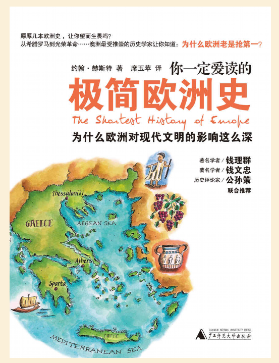
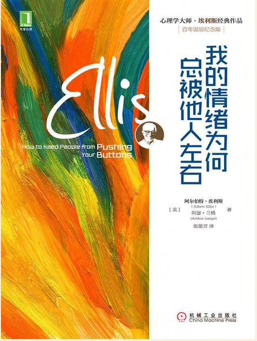
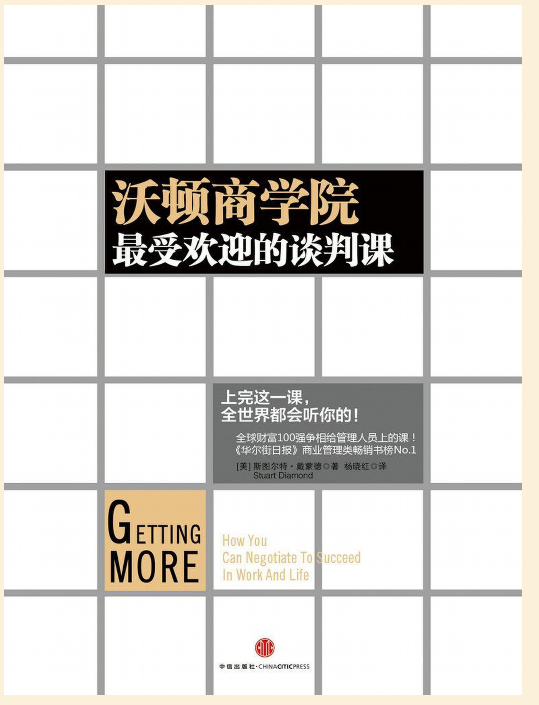
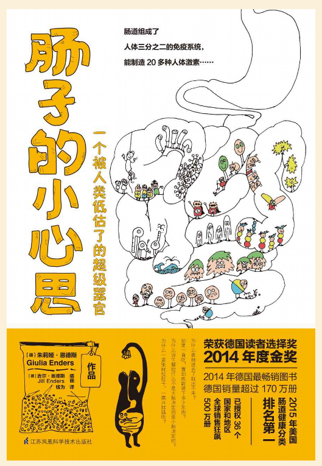
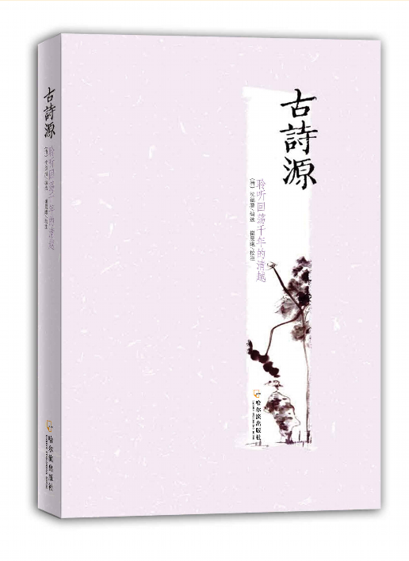
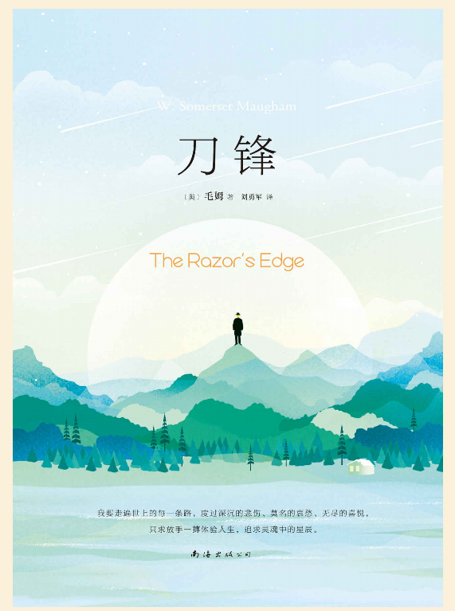
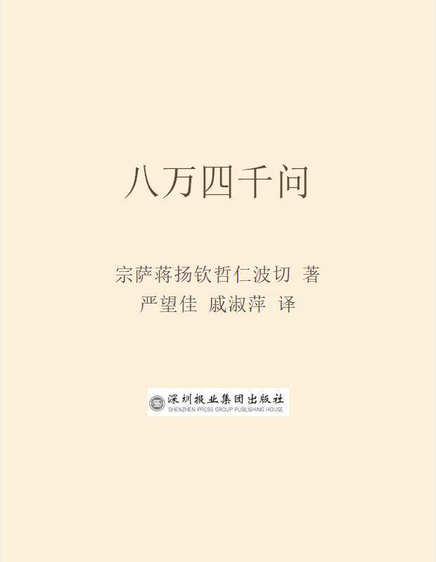
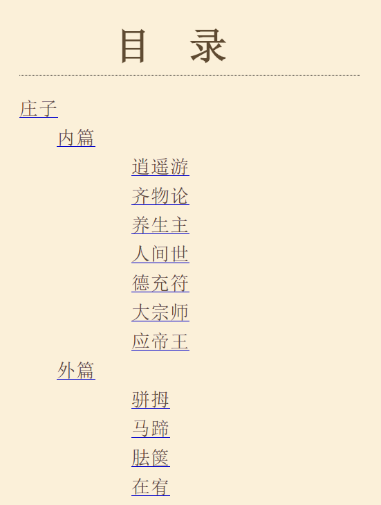
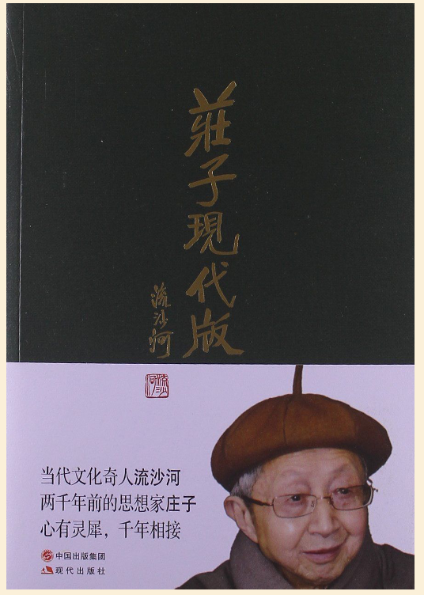

## 

**（1）**

读书是为了什么，在我来看可以分为两类：

1. 获取信息
2. 安抚情绪

大部分的书是为了获取信息，比如中国历史、欧洲历史上发生了什么，如何管理时间、精力，怎么写好文案，怎么谈判，怎么控制情绪，怎么穿衣搭配等等。

看完能够掌握一种技能，了解一些知识，知道在面对一些问题时要怎么处理。

小说、诗词、散文、哲学和宗教类的书，大部分能让人释放压力，安抚情绪。上学时学朱自清的《背影》，当时读着没什么感觉，去年再看，却差点落泪。

像是李白的《侠客行》、《将进酒》，任何时候读来都能震荡人心。

> 赵客缦胡缨，吴钩霜雪明。
>
> 银鞍辔白马，飒杳如流星。
>
> 十步杀一人，千里不留行。
>
> 事了拂衣去，深藏身与名。

悲剧作品让人认识命运的残酷，对待自己和他人更加包容。灵性的修行让心更柔软，在庸碌平凡的生活中看到一抹思想的光彩。

小说《刀锋》里主人公拉里选择的“流浪”，一种与他的社会阶级完全不同的生活方式，看完最能抚慰既想蠢蠢欲动，又没有行动力的心灵。

**（2）**

这次主要来说说第二种，能安抚情绪的哲学、宗教文章。

讲对佛法理解的《四万八千问》里有提到**无常**。

《哲学家们都干了什么》里面讲到了**休谟的不可知论**与**加缪**笔下的荒谬。

**(3)**

什么是无常，就是没有因果关系。一切都是暂时的。

也就是休谟很著名的那句，**明天的太阳不一定升起**。是的，太阳以前、现在都在那里，可明天还在不在，真不一定。

> 休谟指出虽然我们能观察到一件事物随着另一件事物而来，我们并不能观察到任何两件事物之间的关联。

这不是胡搅蛮缠，而是哲学史上一个很重要的命题——看起来有关系的几件事情，它们之间真的有类似先后、因果这样的关系吗？以前发生的，以后就一定会发生吗？

**（4）**

我们爱说因为、所以，如同掌握了事实真相的秘密，其实也只是还未被证伪的推测罢了。

因为一个人天天健身锻炼，所以这人就一定长命百岁？

——可健康并不在掌握之中。

因为一个人做了很多坏事，所以这人就一定会下场凄惨，而好人会有很好的结局，幸福一生？

——可这些只是故事里的情节，不是真实的生活。

抱有这些想法的人，当发现很多事情真是有某种“命运”在安排的时候，会对生活更谦逊一点。

但行好事，莫问前程，这是一句很好的格言。

**（5）**

加缪的小说《局外人》，他描写的场景初看像是最荒诞的情景剧，可是再看，却发现明明就是真实。

因为亲人离世，没有嚎啕大哭就是没有情感？就要在被法庭审判时被作为冷血杀人犯的证据？

世界的荒谬，在于现实没有电影般的完整结局，没有谁是主人公，没有谁能在死亡那一刻说出完整的遗言，做出最好的、最有戏剧冲突的告别，只有突兀的、不经意的、无人在意的黯淡结局。

和这本《最好的告别》一起食用，可以减少那种个人轻如鸿毛的无措感。

当衰老与死亡近在眼前，无论是亲人还是自己，要怎么面对、怎么护理、怎么做好心理疏导？就像少年派的奇幻旅程里那句话:

> 人生就是不断地放下，然而痛心的是，我还没来得及与他们*好好告别*。
>
> All of life is an act of letting go,but what hurts the most is not taking a moment to say goodbye.

死亡是最大的无常与荒谬，在它之前，看所有的困境与危局，都像开玩笑似的。

**（6）**

有近一个多月没有看书了，这还是在年前许的愿，要把读书笔记都整理一遍，随手翻了几篇，居然心情大好。

在写之前，可以说是不高兴很久了，主要是关于工作，关于自己的发展，怎么都跳不出以后养老无着落的牛角尖，像是看到人生尽头雪花满地，凄惨无比。

无意回顾了之前的一些笔记，偶有所得，还让心胸宽广了一点点。或许，这就是读书带来的好处吧，于困境中让人能够喘口气。

非要功成名就才能快乐吗？一事无成就不值得活着吗？自己就非得被一时的困难愁死吗？

哲学是唯心的，生活态度也是唯心的，想怎么理解都可以，想怎么活也可以，那何必要苦哈哈的呢?

2019年目标，开心地过，具体指标分解——每周五写下7个本周让自己一乐的事情或者笑话。

（**7**）

《庄子》，这是一本神奇的书，读古文原著太艰深了，推荐这本《庄子现代版》，保证看得乐呵呵。

这是在还没有“物欲横流、奋斗进取”这些词出现之前就存在的名著，里面的观点与现在的时代主流可以说是格格不入。

>  没有用的人，才是能活得好的人。越有用，也不过是越被压榨。
>
> 智力不要用多了，收着点。不是让你守拙，而是真的拙。
>
> ……

先别急着批判正误，这不是是非题，毕竟是两千多年前的思想，这样的书，最大的意义就是让人质疑，居然还能这么想？

**（8）**

为何我们过得不快乐？成功学已经把我们捆绑得毫无喘息之力，**乐天知命**更像是不可见的传说。

娱乐、时尚、消遣，这些对于提升快乐只有着一时的作用。不开心的时间一长，整个世界都灰暗了。

书本身并没有什么作用，看一些书，最多是打开另一扇大门，启发出一些别样的念头，以上这些书你要有感兴趣的，可以找来看一看，都很好看。

