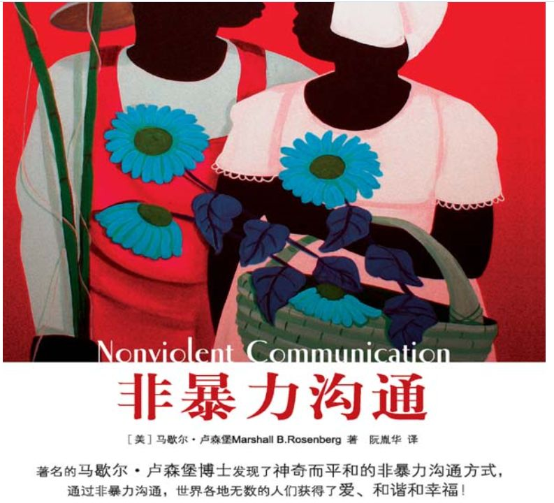

## （1） 

套路，也就是既定的方法，一步一步教你怎么做。菜谱是套路，话术是套路，上妆步骤是套路，搭配心得是套路，流程制度也是套路。虽然老开玩笑说玩套路不好，真诚点好，可“套路”多点，能过得更好。

**（2）**

我毕业的时候，美团来校招，面试官问了这样一个问题，“你最喜欢哪本书，为什么？”

我当时就卡了壳，颠三倒四不知道说了些什么。是的，我是一直在看书，可直到大学毕业，我也没能逻辑清楚地说出一本书的好处和对自己的影响。

（3）

现在再面对这样的问题，我会这样回答：书的内容先简单介绍下，再说说这本书我认为最有意思的观点，这些观点我是认可还是反对，最后结合自己的实际情况说说这些观点对我的影响。

这其实就是读书笔记的套路，从去年开始，我每看完一本书后会整理读书笔记，这样的*套路*已经逐渐熟能生巧。

**（4）**

贵州出差，楼下马路的红绿灯计时很怪，八车道的路，只有15秒的绿灯，还没走到路中间，就已经变成红灯。经常走的人在没有右转车的时候就会提前过街。

那天是一位父亲带着一个小孩，他们第一次走，小孩看到有人还是红灯就在过街，就很好奇地问他爸爸，“爸爸，为什么他们要闯红灯？”

当时周围包括我在内，还站了不少人，小孩的问话声音又大，大家都盯着这位父亲，似乎很想听听他的回答。他的回答是什么呢？——“因为他们急着去送死！”

**（5）**

我想，这位父亲先是恼怒那些不守交规的人，带坏了小孩，又被我们这么多人看着，有些窘迫，就像突然被推到了发言席上，大脑一片空白，所以说了一句很经不起推敲的话，起码对小朋友来说，并没有解决他的疑惑。

按照《非暴力沟通》这本书里的套路，这位父亲可以这样说：

“是的，他们闯红灯了。（先承认事实）

这样是很危险的，因为这会儿是车过马路的时间，车不会减速，人有可能会被撞到，他们可能是有很着急的事情才闯红灯，这实在是太危险了。（再解释原因）

想到以后你要自己过马路，我就非常担心，因为爸爸非常在乎你的安全。(接着说出自己的情绪想法)

你能答应爸爸以后过马路不要闯红灯吗？（最后提出愿望）”。

**（6）**

这是一套很完整的话术，《非暴力沟通》里还有很多。这位父亲不用生气，不用紧张，也不用恐吓，就能让他的小孩明白闯红灯的坏处和他对孩子的爱。这种沟通方式，就是一种套路，也是一种情商的体现。

**（7）**

情商，我的理解分为两部分，第一种是能很好地控制自己的情绪，第二种是有能力影响别人的情绪。

情绪很稳定，不受其他人的挑拨，不会非常低落，也不会非常高昂，即使出现波动也能很快调整过来，这就是能很好地控制自己的情绪。

相处时让人如沐春风，不会想要戒备和防范，说的话能够改变别人的心情，很会劝人，这是擅于影响别人的情绪。

**（8）**

第二种有没有套路我不清楚，第一种，怎么控制自己的情绪，是真的有套路的。

别人可以说千万句难听的话来刺激你，挑动你的情绪。

饭店的服务员可以对你爱搭不理，商店的售货员可以拿鼻孔看你，和你一个车道的司机可以别你，伴侣可以只挑你的错处，老师亲戚可以拿你和别人比较，领导可以批评你这不行那也不行……

如果不想因为这些事情生气郁闷，就早点找到合适的套路来应对。

**（9）**

我就深感自己套路太少，每次只能凭一时的机智来解决问题，这就是所谓的“小聪明”，可小聪明不是次次都有用的，找出规律，总结套路，这才是不犯同样错误的最好方法。

大智慧者套路多。

