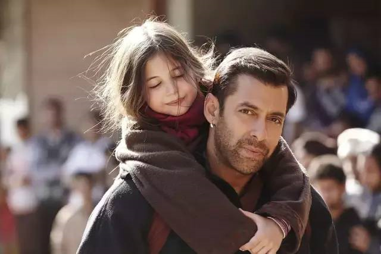
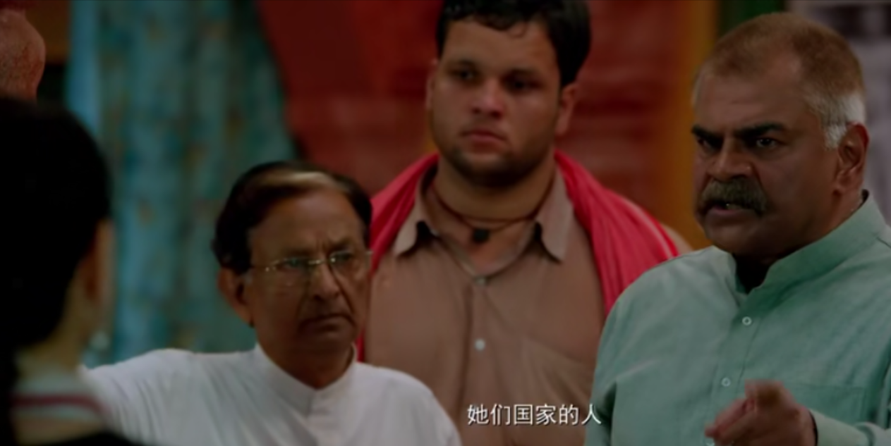
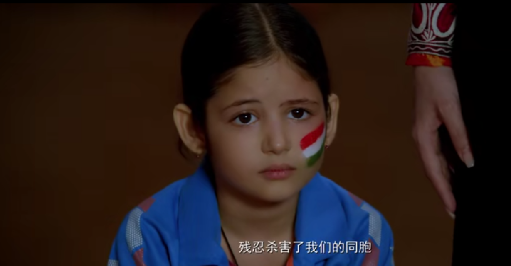
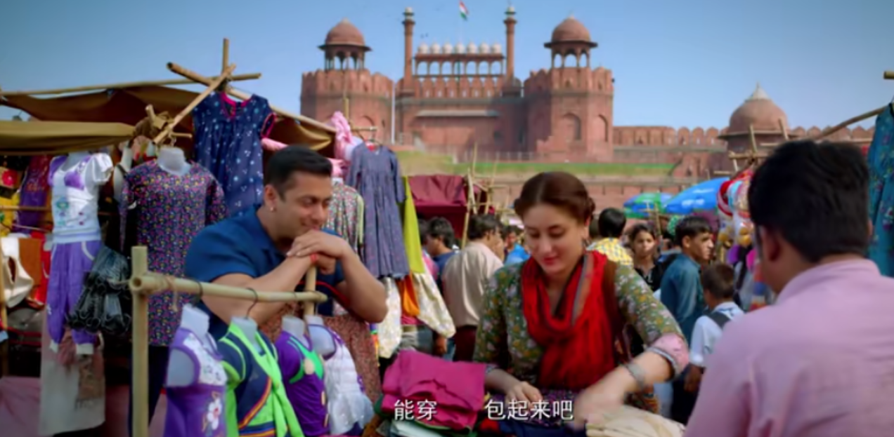
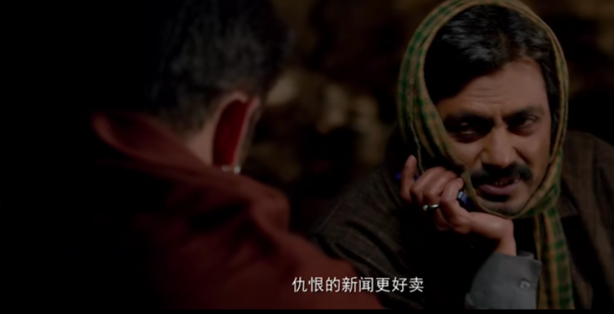

来出差的路上听同事说道，这部《小萝莉的猴神大叔》看完后让他感动不已，强烈推荐我也看看，于是找了个时间，在某平台上找来看了。

电影时长两个多小时，中途我都没舍得停下喝水，一方面是小萝莉的美颜看着的确赏心悦目，一方面是好奇接下来故事会如样发展。

故事发生在巴基斯坦与印度之间。出生在巴基斯坦的小姑娘到了六岁还不会说话，于是她的妈妈带着她来到印度的一座伊斯兰寺庙祈福，小女孩在回巴基斯坦的途中独自下车，流落异国，之后她被印度的猴神大叔收留，历经艰苦，大叔最终把她送回到巴基斯坦父母身边。

里面有几个冲突点，第一是政治上的。看完电影我去搜了一下，印巴冲突从二战之后一直持续，本来这两国都属于英国的殖民地，独立后彼此争夺竞争，关系并不好。电影里猴神大叔的岳父也说到，小女孩的国人杀害过印度人。

第二是信仰上的冲突，巴基斯坦人大部分信仰伊斯兰教，印度则是多种宗教，电影里的猴神大叔就是哈努曼神的忠实信徒，这位神的形象来源于猴，猴神大叔这个称呼也来自这里。猴神大叔没钱，他住在准岳父家中，而准岳父一家是婆罗门，吃素，不准其他种姓的人住到自己家中。小女孩不会说话，大家也就不知道她并不是婆罗门，更不是印度人，只能从生活的细节可以看出不同，比如她吃不惯猴神准岳父家的全素宴，反而跑到了隔壁的穆斯林家里大口吃肉。

电影里面有一个场景，猴神大叔和他女友给小萝莉买衣服，是在街边市场的小摊上。让人很好奇，这个城市的购物水平如何，有没有大型商场，对名牌什么看法，街边的摊铺与门面怎么管理、怎么纳税，与中国有什么不同。还有服装，拍到巴基斯坦这边的镜头中，男士戴帽，女士戴面纱，脸会露出来，头发不会。印度就没有这么严格，女士鲜艳的纱丽更多是做围脖，化妆也更精细，就像大叔的女友，还有很深邃的眼线。

从印度送小女孩回巴基斯坦的偷渡路上，风景都是树林雪山，没有经过繁华的都市，也让人好奇，再怎么不发达的国家与地区，大型都市也会有繁华地带，不去拍这些来显示国力，是为了体现地方民族特色的方法吗？就像电影里拍到巴基斯坦的一个新闻总部时，也是和其他城市一样的格子间，办公桌和正式套装，看不出来是中东地区，没有特色。

电影中他们的语言也能通用，我去搜了下，巴基斯坦的国语是乌尔都语，在印度也广为通行，这也就难怪电影里面两个国家的人可以直接交流。

电影中沙漠地区，巴基斯坦的士兵是骑着骆驼在边境巡逻，大叔带着小萝莉偷渡时被发现，军官被他们的故事打动了，居然放过了他们，我更多认为这是出于电影效果的安排，敌对国家偷渡不拘留？简直不合常理，不过这是电影，就继续看它如何演下去。

电影里一定要有一个坏人，反派大boss，他的存在就是为了给主角的胜利增加难度，给故事情节增加紧张感，这部电影的大boss就是巴基斯坦军方的一位高层，他没有像其他人一样被大叔的善良和勇气打动，而是固执的认为他就是间谍，要求手下刑讯逼供，最后当然不得人心被手下反对啦。

故事是happy ending，皆大欢喜，一直说不出话的小女孩能说话了，也找到了她的家人，大叔偷渡的罪名在博爱的背景下不值一提，这是发生在两个敌对国家平民之间的故事，无辜的孩童，单纯的成人，可以是好朋友，为什么要彼此仇恨。这部电影很多细节都不可琢磨，因为不符合现实，**可这也正是故事的迷人之处，它不仅仅是展现现实，更能带着美好的期望，描绘现实能成为什么样子。**

“仇视的新闻很多人爱看，爱的新闻却没人关注。”这是电影里，帮助大叔送小萝莉回家的一名记者说的话，这名记者是巴基斯坦人，他想将这个新闻在巴基斯坦的电视台报道，高层却没有同意，他只好借助网络，直接上传视频，最终被大量的人收看，成了释放大叔回印度的民意基础，而之前拒绝播放新闻的电视台也将其看作热点进行转播。

这些细节也从一方面展示了技术的手段比单纯的诉诸道德更有用，还暗暗讽刺了一把那些新闻机构只看热点，不重善恶。

这部电影两个多小时的播放时间里，市井风情，生活细节，异域风光，服饰妆容，交通军事，都有不少看点，还有文化信仰与博爱的价值观，是内容很丰富的一部电影啦，虽然也有很多值得吐槽的地方，不过还是推荐，值得一看。