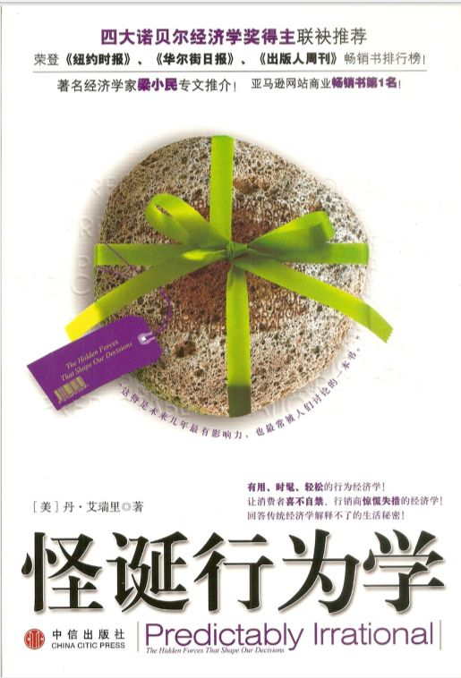

**1**

想象这样一个场景，你帮邻居顺道拿了个快递，邻居却非要给你两块钱，说这是你的跑腿辛苦费，你会怎么想？

小孩子不愿意做家务，要给他们钱吗？或者说，为了鼓励他们多做家务，要给他们钱吗？

在《怪诞行为学》里，作者在第四章中提出了这样一个问题，“为什么我们白干活高兴，干活赚钱反而不高兴？”

作者给的例子是你到岳母家过节，吃了一顿丰盛的晚宴后，要给岳母晚餐钱，猜猜你会得到什么待遇？

**2**

作者把人与人之间的互动关系称为**社会规范**，把事与钱之间的等价交换称为**市场规范**。

作者认为，社会规范优于市场规范，两者无法共存，社会规范一旦被市场规范改变，就很难恢复。

打个比方，**社会规范**就像雪花，很美却不易保存，一旦温度升高，它就会消融。

比如公司，可以营造*我**们是一个大家庭*的温馨氛围，可如果公司同时存在着严格的管理制度，那么这种*温馨*也只是空喊口号而已。

假设员工早上迟到，按照管理制度，是违反了规则要扣钱的，可这要真是一个温馨的家庭，你没有按时出现，家人首先关心的是你是否出了什么急事，而不是先扣你的钱。

简而言之，讲了市场规范，就不要再把社会规范拿来做遮羞布了。

**3**

要让孩子乐意去做家务，得苦口婆心地教育，培养热爱劳动的意识，不怕苦不怕累，万一他们听不进去还得靠大嗓门吼，多麻烦呀，可要是按照劳动成果给钱，他们会不会就愿意去做了呢？

作者担心的是，一旦孩子认为，做家务就是拿到报酬，为家里做事就是打工，那他还会认为这是一个*家*吗？

**4**

这让我想起了之前读丹尼尔·平克《驱动力》，里面提到的内在驱动与外在驱动。

> 1. 1、外在驱动：奖励和惩罚驱动，做出特定行为时环境会带来的奖励或惩罚。例如胡萝卜加大棒政策，做好了给奖赏，没做好给惩罚。
> 2. 2、内在驱动：也就是因一件事很有趣、很具有挑战性、很令人着迷而去做的驱动力，对于高层次的创造力至关重要。完成一件事本身的愉悦感，例如心流体验，参与有宏大愿景、超脱个人成败得失的事业。

工作的热情在于**热情**本身。钱是一种外在驱动力。

**5**

关于《怪诞行为学》作者提到的社会规范与市场规范，我发散想了下，认为作者还少写了一种，**权力规范**。我这里不展开了。

另外，作者大概没有来中国调研，他要是来调研，一定会很疑惑，红包该怎么分类？

红包里面包的是闪亮亮的人民币，这是市场规范的象征，可红包的来往却是实实在在的人情，是属于社会规范。

**6**

作者认为社会规范比市场规范要好，国内也有这样的现象。

比如，护工、月嫂，给他们开很高的薪酬，可为什么还有那么多质疑的声音，怀疑他们的照看不尽心。总说要有家里人，才能完全放心。

暂时认为他们没做好是监管不严，如果监管，又要监管到哪一步呢？

举个例子，服务条款可以这样一直在细节上修改：

倒一杯水给病人喝，

倒一杯温度40度的水给病人喝，

倒一杯温度40度的水并微笑着给病人喝，

倒一杯温度40度的水并真心微笑着给病人喝。

等等，真心，这个要怎么定义，怎么监管？假笑和真笑是否有标准呢？

市场规范可以找来干活的人，可只有社会规范才能找来付出真心的人。

**7**

再说回来，社会规范就一定好吗？

要说中国的社会是人情社会，遵守社会规范，这对没有人情关系的人很不公平，别人打打招呼就能解决的事，自己哭天喊地也办不到。

可要说是遵守市场规范，就对没有钱的人来说也很不公平，别人用钱能摆平的事，自己没钱，当然就摆不平啦。

**8**

作者认为社会规范好，让我想到了另外一件事，社会规范，也就是我们说的“人情”，既然它有优点，它就能成为某些人逐利的工具。

如果有人先想办法故意让你欠下他的人情，之后再来找你偿还，这时你偿还的往往远大于之前他的付出。

这样的例子在《影响力》这本书里有非常多。

比如购物时的无偿试用、试吃，赠送小礼品，节日的嘘寒问暖，关怀有加，都是在你不需要的情况下强制给你的“人情”，然后静静等待着某一天的收割。

**9**

看书的乐趣大概就是这样东想西想吧，不再发散了，不然两千字打不住。

