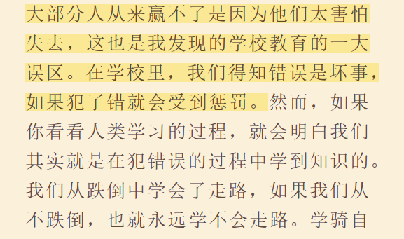

再次读《穷爸爸富爸爸》，仍为里面的观点所冲击。

工作是出于恐惧，挣钱是出于恐惧，而工作只是解决长期问题的短期办法。一条无止境的邪恶循环让我们深陷其中，度过一个又一个无眠之夜。

我们最爱说恭喜发财，却没有人说怎么发财，好好工作是一种方法。只是总有在牺牲青春牺牲梦想，没有勇气。

资产与负债的区别。环顾四周，买的东西都是负债，不能再制造利润，而哪些是能制造利润的呢？错误的消费方式迫使人挣更多的钱，可要抑制消费吗？不断的反思，人云亦云最可怕，害怕与众不同。绝对不信“不能”，而是去找办法解决。

有没有不去想钱，只专注做事，就自然得到钱的办法？低头耕耘，收获自来？

将自己的事业看作最重要的，那每一笔本金都是你的雇员。是浪费掉，败坏掉还是让他们找更多的同伴回来？

举例子以低于市场价格的房产购买后再高价卖出，这和查理·芒格提到的购买股票方法一样，可操作起来难度很高，怎么知道市场均价是多少，怎么发现低于市场价格的东西。这就是投机，可却能够最快地积累财富。

害怕失败的恐惧能够让人裹足不前。究竟会失去什么呢？

我是怎么一步步放弃运动的