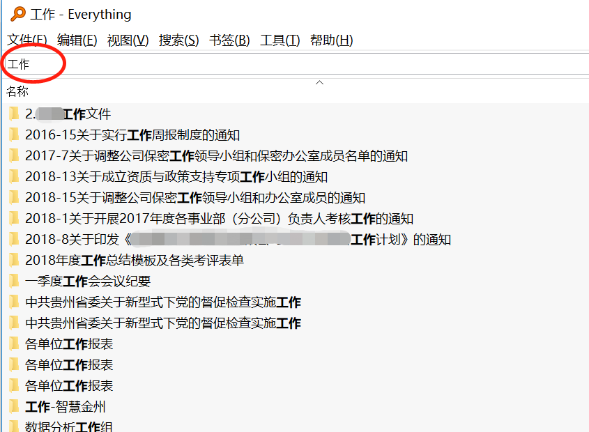

整理，有房间的整理，衣柜的整理，还有书桌的整理，当然也包括电脑桌面和手机桌面的整理。特别是电脑，平时既会用来办公，也会用来休闲。工作中，最抓狂的就是当我们想要找一个文件时，怎么都记不得放哪里了，只能打开一个又一个的文件夹，逐个寻找。那么，对于电脑里的文件，我们要怎么整理、收纳它们呢？更重要的是，当我们想要找一个文件时，如何能够快速的找到这个文件？如果你对这些问题感兴趣的话，就请继续看下去吧。在最后还会介绍两个很好用的小工具。先放一张我现在的桌面。

系统：Win 10；任务栏在屏幕上的位置：顶端（放在顶端是我的个人使用习惯）；壁纸：每日必应（每天自动更换壁纸，来自bing.com搜索的背景图，都很美，Microsoft Store下载安装）。

在桌面上只有一个回收站的图标，因为有时候我会在桌面上临时建一些文件，删除的时候好方便直接拖过去。不需要其他图标的原因是，打开图标需要点击，要是想提高效率，能不用鼠标就不用鼠标，并且win10 的快捷键也非常好用。想要打开文件夹，**win键+E**就可以。可以省略鼠标去点击的动作，并且不用先显示桌面，也就是说，在任何窗口下，都可以用**win键+E**“召唤”出文件夹。

现在再来看一看电脑目录的结构是怎样的。

我的电脑就分了两个盘。C盘是系统文件，主要来看D盘。

介绍一下这样设计的思路：每个文件夹用数字编号，好记好定位。【1.archive】这个词是档案室的意思，我存放的是一些个人资料，比如证件、证书的扫描件，重要文档等。这些资料单独建一个文件夹，是为了方便备份和查找。【2.download&receive】下载和接收，这个文件夹是专门用来存放下载文件和接收文件的，具体做法就是将浏览器、迅雷、百度云盘，爱奇艺、优酷、腾讯播放器的**默认文件下载地址**都放在这个文件夹，软件的**安装包**也都是下载在这里。接收的文件主要来自微信与企业微信的桌面客户端，将它们的**文件接收位置**也设置在这里。这个也往往是占用空间最大的文件夹，如果硬盘不够用了，来这里删删文件，就能给电脑大幅“瘦身”。

win10自带的Edge浏览器。

【3.work】这里存放工作相关的文件。里面的文件夹我也是按照**数字+项目名**命名。

第2个是公司的工作文件，包括自己的周报、公司发文等都放在这里。4和5是近期的两个项目，以第4个为例。

这些文件夹里面的东西特别多，1.项目管理主要是涉及进度安排、会议纪要、问题跟踪和人员日志等。2.业务文档，因为是软件项目，我就按照软件项目的5个步骤分别设置了文件夹，将不同阶段的文件放在里面。

【4.leisure】休闲娱乐，里面放下载好的音乐、电影、电子书、漫画等等。因为存放在2.download&receive里的文件时常会被清理，所以下载了值得多次看的影音资料，就把它们转移到这里。

【5.progarm-安装】在2.download&receive里下载的软件包，安装时将目标文件夹，也就是**安装位置**都放在这里。

【6.studio】工作室，放个人做的一些项目、创意、记录。【7.study】自我学习、提高用的资料的存放处，这个要与4.leisure区分开，4里面是放用来娱乐放松的，7这里面是放兴趣、研究和进修的资料。【8.temp】临时文件夹，有时候太着急或者懒散不想分类时，可以将所有文件先扔这里，之后再找时间慢慢整理，特别适合从U盘里拷来很多文件时。

---

想要提高效率，就减少鼠标的使用，多使用快捷键。例如，当电脑上开着微信时，截图就用Alt+Z。

任务栏上可以放常用的应用，然后用**win+数字**快速打开。比如我的任务栏第一个是浏览器，win+1就可以把它打开；第4个是印象笔记，用win+4就能打开。

---

当想要找一个文件找不到时，往往是因为，第一没有好好命名，第二没有放在它专属的位置。命名只有在创建文件时就多加注意，否则没有别的办法。放到专属位置就要在文件还未存在前，就先建好文件目录。就像鞋子放鞋柜，衣服放衣柜，碗筷放碗柜，先打好柜子，再收纳物品就简单多了。

---

介绍的两个小神器，一个叫做**Everything**，一个叫做Git。

Everything是基于**文件名**的快速搜索，比windows自带的文件搜索速度快了不知多少，打完关键词，所有包含这个关键字的文件、文件夹都能搜索出来，也支持类型、时间、大小等筛选。如果你能记得某个文件的几个关键词，却怎么都不记得放在哪里了，这个超级好用。

Git这个就比较偏技术了，需要你有一个Github账号，并且有一定的使用基础。还需要在电脑上装git。这个主要是为了备份文件方便。我以前用百度云备份，得先打开百度云，再把文件上传上去。后来发现可以在Github里建一个项目，设置为对外不可见，然后将它clone到本地，把需要经常备份的文件放在里面，需要备份时，右键使用git的命令行。

然后三句命令就可以完成上传备份：

> git add .
>
> git commit -m "info"
>
> git push

这个方法是我在上传博客的时候发现的，好像没在其他地方看到有介绍，和大家分享一下。

好啦，关于电脑里文件的整理分享就是这些，如果你有一些其他的好方法，也请告诉我哦。