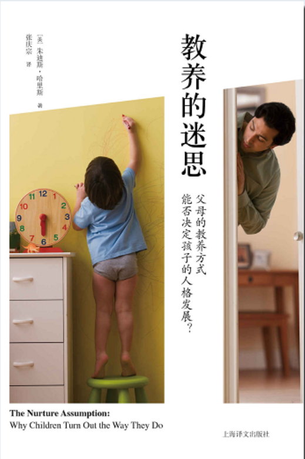

你的性格是怎么形成的？问题的答案在《教育的迷思》这本书里。在作者看来，性格如同石膏，在婴幼儿与青少年时是可塑期，成年时性格就像石膏成型，难以改变。于是想知道你的性格是怎么形成的，请跟随作者的视角，去看看你还未长大之前，发生了些什么吧。写这本书的作者叫做朱迪斯·哈里斯，她申请哈佛的博士被拒后，就一直在家做些研究工作，60岁的时候写了这本争议极大的书。为什么这本书争议极大？作者在开篇是这样说的：

>这本书有两个目的：
>
>第一，**改变**你认为孩子的人格——过去叫做“性格”——是由父母塑造而成的看法；
>
>第二，告诉你孩子的人格是**怎样**塑造而成的。

英文原版书标题直接翻译过来是——教养假设：为什么孩子会变成他们现在的样子？中文标题——父母的教养方式，能否决定孩子的人格发展，这个其实并不全面。整本书看完，为什么孩子会变成他们现在的样子，答案是什么呢？

> 父母的**道德培养、言传身教**对孩子有用吗？有，可**只在家里**有用；
>
> **基因**不容忽视，大自然就是没有公平可言；
>
> 孩子的性格与行为更受**同辈人**的影响，而不是成年人的。

这本书有15章，书里用了大量研究成果来说明为什么**老一套的看法**——父母怎么养孩子决定了孩子的性格与一生的成就——是**站不住脚**的。也就是说，如果一个人的性格有问题，成人后难以融入社会，不要上来就责怪父母，不要再说什么父母皆祸害，除非父母在儿时一直虐待孩子（这属于犯法而不是性格影响）。性格有问题更可能是从小在同龄人中没有地位，被嘲笑、欺负和孤立，这种对孩子的性格和成就影响更大。

那为什么总在责怪父母而不是曾经的校园欺凌人士呢？因为每当回到家就会看到父母，而不是那些欺凌的人，人类的记忆也倾向于忘记看不到的伤痛。所以尽管那些人留下的伤害已经大大改变了你的性格，你也慢慢忘了那些人，却能在每次看到父母时就回想起他们犯的一些错误。

这本书最大的意义在于——别人**都认为**对的事情，就**一定**对吗？**专家**说的，也一定对吗？这本书出版后被大量的教育专家、心理专家批评，可作者的确提出了另一种看待教育的角度，并且根据她的**论据**，**结论还挺可信**的。

篇幅所限，我这里无法像书里一样列出大量的论证，只能写一些结论，如果你对这些结论是**如何论证**出来的，请看原书。

---

这本书里有几个关键词，**遗传基因、同龄人、自我分类、群体认同、社会化、地位、行为规范。**

作者认为性格受**遗传与环境**的影响。也就是先天与后天的不同影响，先天就是父母的遗传基因，包括胖瘦、部分行为倾向。

> 好动、任性、具有攻击性、易怒；
>
> 对常规活动感到厌倦、乐于寻求刺激；
>
> 不害怕受到伤害；
>
> 对其他人的情感不敏感；
>
> 更有甚者，在强壮的体魄下，智商低于一般的孩子。所有这些特征都有重要的遗传成分。

后天则是环境的影响，这个环境**不是家庭**的环境，也就是父母是否好好陪伴孩子、是否认真教育孩子、是否离婚等等，都不是作者所说的后天环境。作者说的环境影响，是指**孩子的同龄人**，也就是其他孩子组成的群体的影响。这个群体不要简单认为就是身边接触的那几个孩子，而是一整个“概念”，可以是从没见过的、也没一起玩耍过的，只是听到过的其他地方的孩子，或者是在电视上、漫画里看到的孩子的形象，都是**同龄人群体**。

> 全世界儿童都一样，想和其他孩子在一起。

其实小孩的世界不比大人的轻松，大人不想配合了最多被人说不合群，不会有什么大不了，仍然能自娱自乐。可小孩子如果不被他们的同龄人接受，他们会认为这是除了父母死亡以外最可怕的一件事。

为什么作者认为父母的影响只终结于家门口呢？因为人会**分类**，善于模仿，并且是天生就会，妈妈和陌生人，我们和他们，族人和敌人，和我相像的人，和我不同的人。孩子会区分**他们和成人**的不同，他们会把自己**归类**为“孩子”，归类之后，就会自主地模仿这个群体里其他人的行为习惯。

当他认为自己属于“孩子”这个群体的时候，他也会自觉去遵循“孩子”这个群体的规范，也就是**社会化**，好得到这个群体的认同，让自己在这个群体中的**地位**上升。他们是怎么逐渐改变的呢？比如在地上打滚撒泼，在家里做这个没事，可当他们在其他孩子面前也这样举动，却被嘲笑被孤立，他们就知道不能在其他孩子面前打滚撒泼，在其他孩子面前和在家里不一样，这个行为不能在**外面的世界**存在。我认为按照作者的解释，熊孩子就是还未被**孩子群体**给社会化。包括口音，孩子都会自觉地学习同龄人而不是家里大人的口音。孩子崇拜的是“孩子王”，而不是大人偶像。

分类会逐渐让孩子形成两种甚至更多的性格特征，在家里、在陌生人、在学校、在朋友面前，同一个孩子会有不同性格和行为举止。

家里的教育只有与外面世界的规范一致时，孩子才会把家里的教育保留。简单来说，也就是**言传身教**比不上**孟母三迁**。同龄人群体的认同，才是孩子性格塑造的关键。

---

这本书的结论里，对家长的解脱有：离婚不影响孩子，父母的养育方式不影响孩子，不用专门教导孩子说话，少讲点道理，孩子听同龄人的而不是大人的。

对家长的要求有：不能虐待孩子，给他们尽量好的同龄人环境，给孩子正常的名字，让孩子外表整洁、尽量打扮好看，多教教孩子怎么在**外面行为得体**，不要留会被同龄孩子**嘲笑**的破绽。其他的，看基因了。