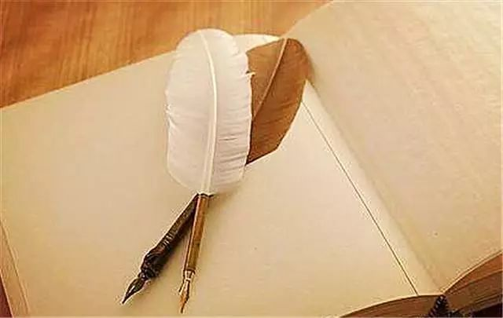

写征文，翻旧文，发现自己写的不想再看第二遍。

上周公司让写篇征文，字数要求1000字以上，本来我打算就把以前写的读书笔记修改下交上去，可翻翻旧文，却没发现一篇很喜欢的。

更新公众号也有一百多篇了，“自己写得一点都不好啊”这种感慨还是经常产生。

对于为什么写不好，我想了如下几个原因：

1、不敢暴露真情实感；

2、质疑自己的想法写出来是否合适；

3、逃不出“文章必须有用”的思路；

4、修辞、文笔不优美流畅；

5、担心会用太多时间。

------

**1、不敢暴露真情实感**

这一点很奇怪，想想以前的QQ签名档、QQ空间，大家都很喜欢发一些自己的心情、想法或者是吐槽，可现在大都喜欢保持沉默。

微信朋友圈都难得更新，要么就是一些转发，一些模糊的三言两语，谈天谈地就是不谈自己。

整个这样的大环境之下，别人都不说自己的心路历程，一个人在那儿抒发就会觉得怪怪的。

**2、质疑自己的想法写出来是否合适**

很多想法来源于情绪，而情绪短暂又易变，要把坚固的文字建立在这种不牢靠的基础之上吗?

每次有感而发写下的文字，过后再看总觉得有些“极端”，不够心平气和。

可不得不说，情绪是一种很神奇的东西，它能大大激发大脑的活跃程度，写起东西来如有神助。

大概也是因为极端本就比中正平和更刺激人，也就更好写出来。

就像炒菜，清汤小菜炒好吃比口味重的菜炒好吃要难多了，后者多放刺激性的佐料就可以。

可我自己就不喜欢看那种总在煽动人情绪的文字，自己也不想写这样的。

**3、逃不出“文章必须有用”的思路**

我自己挺喜欢看实用性的文章，因为我有很多的疑问和难题，找人问也问不到，也不知道该问谁，就只好去书中找答案。

通过看书我受益良多，于是也希望自己写的东西能对看的人有些帮助，在文章里就总是一门心思想要提出具体的解决方案，可我的经验还是太微不足道了啊。

任何事物被制造出来是有目的的。零食要被吃掉，玩具要能让人愉悦，游戏可以让人忘记时间。

文字的目的是什么？

**4、修辞、文笔不优美流畅**

这个是基础和练习的问题，我准备多看看名家文章来学习提高。

**5、担心会用太多时间**

以前我打字是一指禅，去年开始写公众号硬逼着自己学会了正确的打字方法，现在速度比以前快多了。

可一篇1000多字的文章写下来怎么都要好几个小时，思路不清楚的时候更长时间也有可能。

上周公司的那篇征文就是，想着要花好多时间来写，就从周三一直拖到周日晚上十点半，没办法第二天早上就要交了，才开始沉下心来写。

我记了下时间，算上打草稿、打字和排版，一个半小时也能写1500字。

------

一篇文章最难的不是写的过程，而是**开始写**这个心理建设。

我经常看着周围的人在想，他们脑袋里一定有很多特别好的想法和见解，他们为什么不愿意写出来？

你为什么不愿意写出来？

