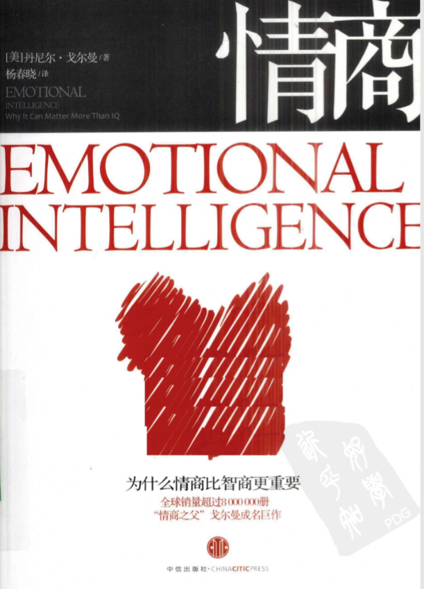

这是一本讨论情商的书，其实书很老了，1995年就有了第一版。书里包含的内容也很多，从情绪的来源、什么是情商、怎么运用情商、怎么培养情商，以及缺乏情商的后果是什么都写到了，全部看完能够很好的理解情商。可如果你不喜欢看书或者没有时间，也没有必要全部看完。里面我认为最有用的是以下这两章：情商与婚姻、情商与健康的关系，也就是思维导图里用黄色框框标记出来的，亲密敌人、心与药这两章。

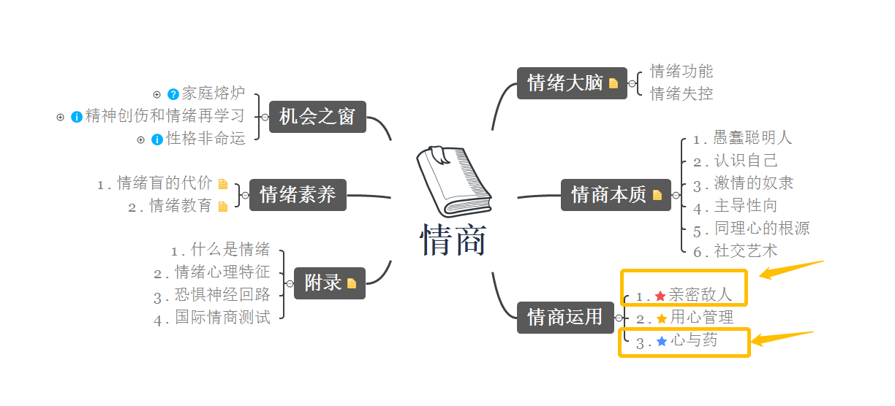

用心管理那一章写得也不错，主要是针对领导层写的，怎么提高领导的情商，激发下属的工作热情，如果你感兴趣也可以看看。

# 情商包括什么

先来说说情商究竟是什么，英文直接翻译就是情绪智力。智力，是对知识和信息的理解与运用。我认为情商是指对情绪的理解与运用。

我把书里讲到的情商本质的5个部分，认识自己、激情的奴隶、主导性向、同理心的根源、社交艺术概括成以下四点，画了个象限图。

## 理解自己的情绪——觉察

## 调节自己的情绪——克制、改善

## 理解他人的情绪——同理心

## 调节他人的情绪——社交往来

情商既然是对自己和他人情绪的理解和调节，那么在婚姻中，它的重要性是怎么体现的呢？

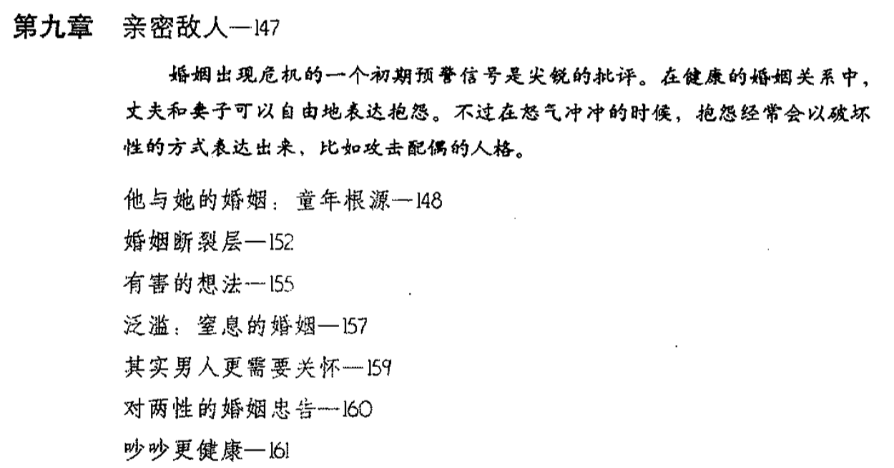

结论有什么呢？

1、婚姻中女人可以唠叨和抱怨男人**某件事**做得不好，但不要上升到对**人品和性格**的攻击。例如，可以说“这个碗你没洗干净”，不能说“你就是个懒鬼，总是粗心大意”。一旦上升到对人格的攻击，男人就会自动进入“防守或战斗”状态，也就是沉默或者回击。本来是在说什么事来着？哦，这时已经没人记得了。

男人呢，需要多听妻子说话，必要时重复她的话都可以，不要一上来就给建议，重要的是表示你理解她。这里面的的逻辑是什么呢？情绪的存在是有道理的，不让人把情绪表达出来，比如说你不要哭、你不要生气、你不要难过，这都是**不合理**的建议，你否认对方的情绪表达，就否认了对方的感受，否认对方的感受，那这个人的存在又有什么意义呢，人的存在就是有情绪的。

里面还有一点写得很有意思，因为男女从小的教育和接触到的环境不一样，长大后男女对情绪的感知是不一样的，一个男人如果悲伤，女人可以看出来，而如果一个女人悲伤，男人却很可能看不出来！并不是说男人迟钝，而是他们从小就被教育要隐藏情绪，于是长大后他们不仅无法理解和调节自己的情绪，往往也无法理解别人的情绪。

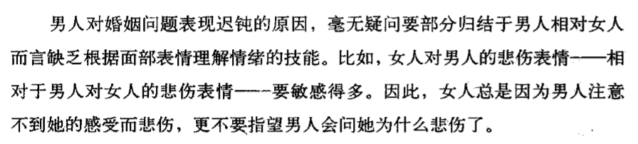

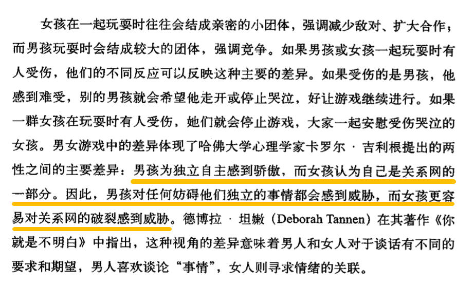

情绪对于身体健康和疾病恢复又有什么作用呢？

1、研究发现**神经细胞**能够与**免疫细胞**相互释放信号，推论是好的情绪能够让人少生病，免疫系统更强大，即使生病了也好得快。同时要警惕最影响身体健康的三种情绪——**愤怒、焦虑与抑郁**。

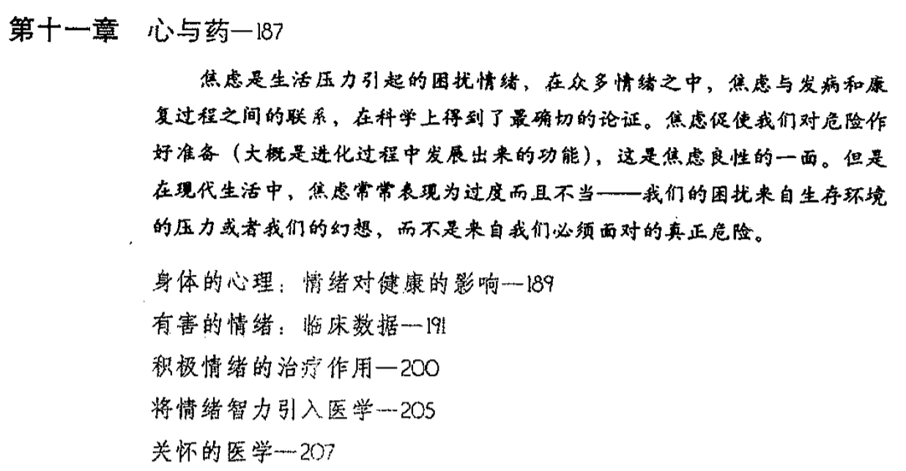

愤怒会影响到心脏的泵血功能，因为每次生气时血液都会大量的冲向四肢，与平时的血液流动不一样，给心脏和血管带来压力。次数多了，心脏和血管就会变得脆弱。这是远古时代人类就形成的反应，因为愤怒的感觉来源于自己受到了某种损失，而远古人类的办法就是暴力还击，夺回损失，于是愤怒时血液会大量涌向双手与双脚。下次你再生气的时候感受一下，面部发白呼吸紧促，都是因为供血不足引起的。

焦虑与抑郁对健康是一种慢性的摧残，它们把原本用来维持身体运转的能量白白消耗，于是身体慢慢出现这样或者那样的毛病。

---

书里涉及的内容也有一些缺失，比如作者在书里也提到了情商如何培养，主要是在青少年时期父母与教师要好好引导，可要是父母与教师这块儿没做好呢？待到孩子长成了大人，又该如何提高自己的情商呢？这些书里没有讲到。

下面放一些这两章内容的截图，如果你感兴趣，可以把这本书找来看看。

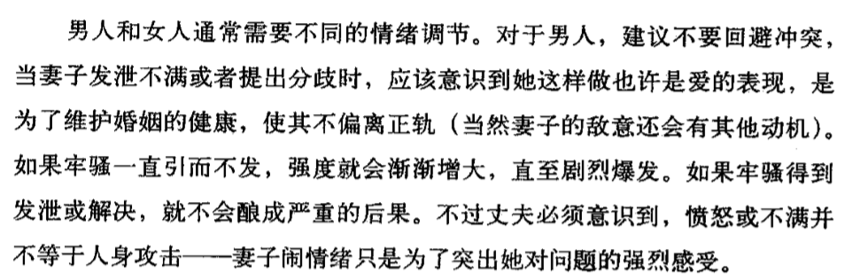

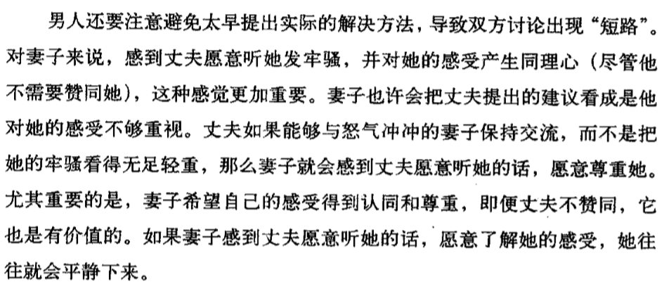

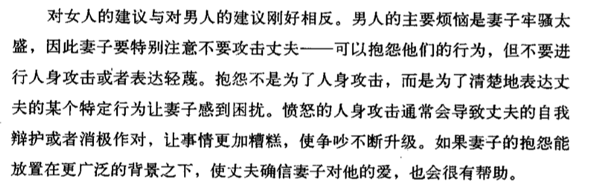

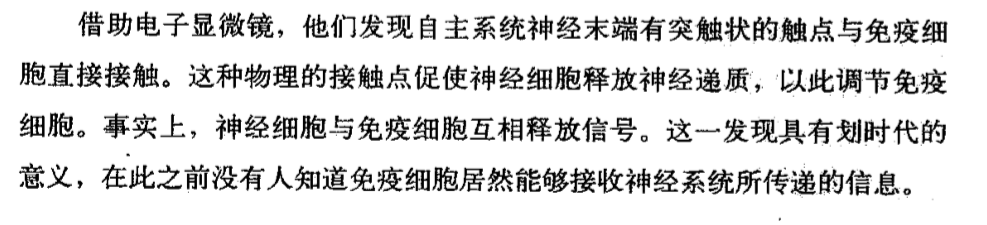

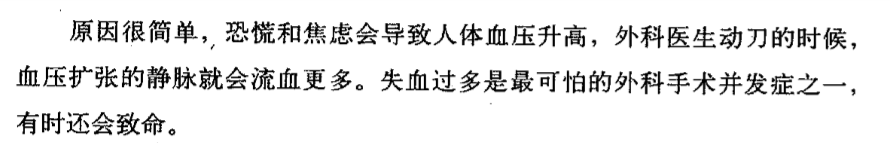

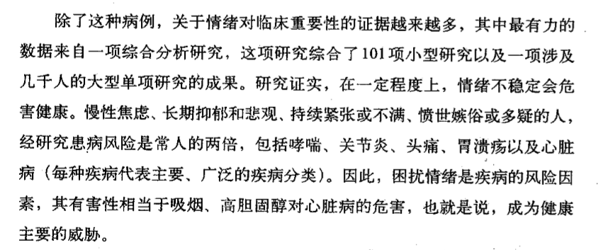

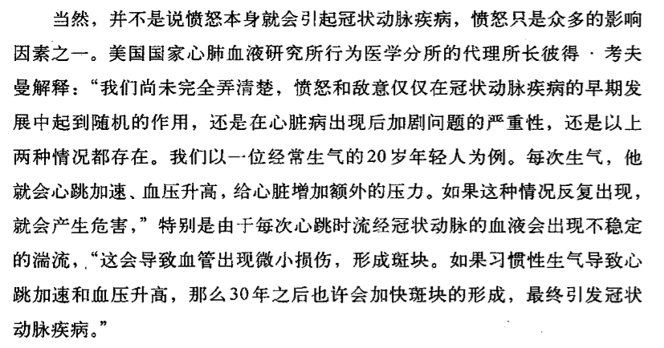

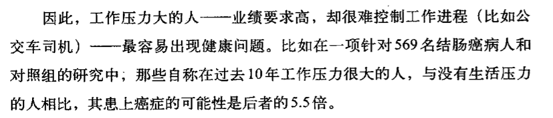

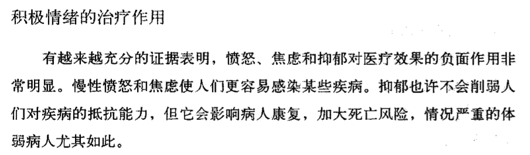

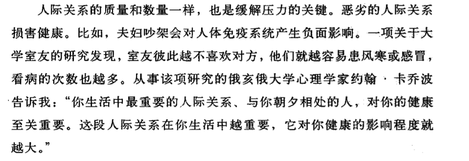

